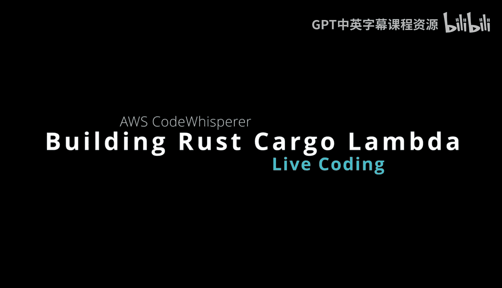

# 杜克大学《Rust编程4-5（Linux命令行工具、LLMOps）｜Rust programming》中英字幕 p145 57_04_01_AWS CodeWhisperer实时编码（第一部分）.zh_en -BV1Hy411q7Zm_p145-

Okay， I am live here with code whisperhi。 I'm going to be doing some live coding today。

 and I'm going to dive into using AWs code whisperhi alongside cargo Lambda。

 which allows you to have rust functions on AWS。 So I think this will be a very interesting combination of technologies。

 And I'm going do this in local visual studio code just to kind of mix things up a little bit。

 So let's go ahead and get started here。😊，To start with you can see that I've opened up something called simple browser。

 you can find this from the command palette。 you can put in website so it's kind of nice to be able to look at something while I'm coding maybe to look at documentation but keep it all on the same screen here and then if we go to CDk code whisperhisper you can see all these are part of the EWS developer tool set here and we can see that codeWhisper is actually enabled So what I would do really first to off is look at the getstar guide here and make sure that I've got all this working so let's go ahead and do this locally because i'm running OS 10 although this does actually work on Linux as well I've actually done this but we'll just say。

Here B tap。Cargo， lambmbda cargo。不明白。😔，There we go。 So we see that already there。

 And if I say brew install cargo lambmbda， it will actually not only check to see if it's installed but also updated if I needed to。

 but I'm all set so I don't need to do anything All right so now that I've got cargo Lambda what can we actually do well we can do this we can say cargo Lambda new Lambda project and then Cd into that So let's go ahead and do that I'm going say you know cargo Lambda。

You。😔，Let's call this one EWS。Or let's call it S3。Bet lister。And like that。

And now it's going to ask me some questions。 Is this function an HttP function， Yes or no。

 I'm going to go ahead and say no here and then go ahead and also say I don't want to receive any events。

 So this looks pretty good to， to start with。And then I'm going to seed into this。

 So I'm going to say new lambmbda。Or I'm going to go to。

The file system here to look at where I'm at and I have。If I refresh。A S3 bucket lister。

 so S3 bucket lister， Okay， great。AndNow all I need to do is take a look at what's inside of this code。

 so if we look at the main function here， you'll see that we've got some documentation which I'm going to remove so it's shorter so the code is less。

For both here and I can put it all on one screen so' go ahead and do that。

 So we've got the request in the response， which is part of what you would do with Lambda and then we've got the main body for the function which is right here and I can all also remove the comments just to make things super tight here so that I can I can。

Really look at it in almost one screen if possible let's go ahead and do that that looks good so yeah this is I mean this is really it there's there's a request there's a response and then there's the function handler that does all the work and then this is basically boilerp code so you don't really need to worry about it but let's even unment that or remove the commenting as well just to make it super tight here。

Now， one of the things that。What we would like to do is use make files and so I might as well just copy one I think I have probably a make file。

Laing around somewhere here。诶。So what I'll do is go to one of my other projects。

And pull one in real quick。 S the bread and grab it real quick。嗯。And。🤧。Let'sPll this in here。

 real quick。我 see cargo。😔，明白。Yeah。US slammed a rest this looks pretty good。嗯。

I've got one I can just grab here。And I'm going to paste it it。 Okay， so I'm going to。

 I'm going to go ahead and say touch。ileile。Now that I've got this listed。

 what I will do next here is just see the different you know features that are available in the make file。

 so like make rest version， let's just double check， you know， everything's working here。Actually。

Go I put that in the right location。😔，Make。Let's double check here。H。Or not。

Not sure why the make command is， oh， because I didn't save it。

That was the problem there we go make re verbs and there we go we got we got this thing working and then there's some commandtry like testing le etc cetera。

 and then if we go back here you can see the next steps here。

 which is you can do watch and this will actually run it。😊。

And you can see the changes as they're happening。 so so we could try that first。

 we could just say cargo lambmbda watch here。And we'll compile it and then again watch the code。

