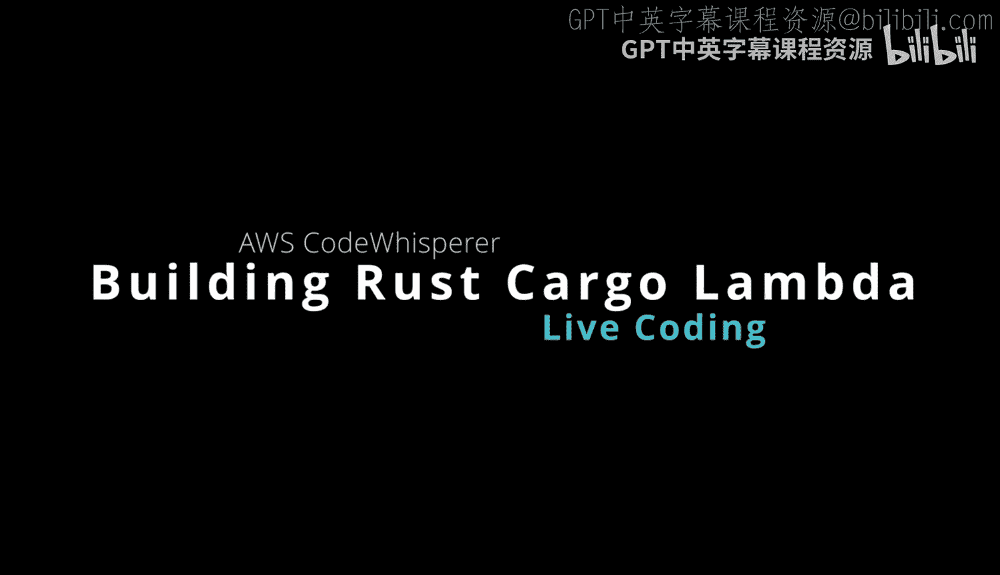
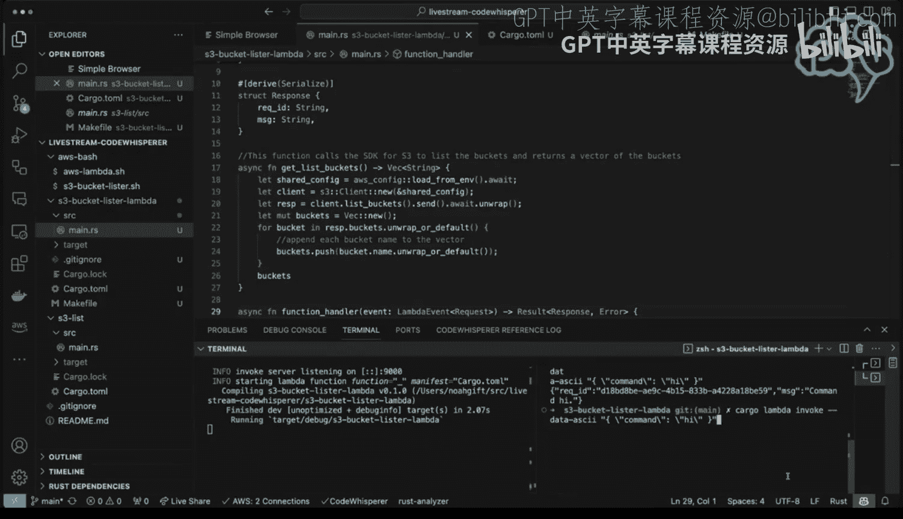

# 杜克大学《Rust编程4-5（Linux命令行工具、LLMOps）｜Rust programming》中英字幕 p146 58_04_02_AWS CodeWhisperer实时编码（第二部分）.zh_en -BV1Hy411q7Zm_p146-

So it is nice to have this simple browser here so I can look at it without needing to go anywhere else。

 And then if we go to next here， it's going to say test your function。

 And so because I didn't change anything。 this should work。

 which is I'm going to send in this payload right here， which is data ASI command high。

 So let's copy that I'm going to open up a split terminal。😊，And I'm going to do that command whoops。

On buffer here let's。That's actually。Maybe。😔，诶。Get rid of this。A terminalmin。那个。

Get rid of this terminal。Make a split。And then， I guess the copy didn't work。

 maybe that was the issue。Copy herehu yeah， the copy paste is having issues here for me， but。

Let let's just do it manually， so we'll say cargo， Lambda andvo。So gas data。A S C I I。And。

It's kind of annoying that the copy paste does not working。But。We'll deal with it。Comd。😔，And。😔。

Go here。😔，系。Here we go。 Fel looks pretty good。And。Command and I and if I scroll this over a little bit。

Command high。 There we go。 So everything， everything was able to be executed。 So we got this。

 we got this working locally here。 But now let's make it do something a little more interesting than just that we're evoking it。

 So so this is where the code whisper would come in so。😊。

I don't know exactly how well code whisper will understand this。

 but let's go ahead and just try some ideas out so i'm going to i'm going to try to。

Write something that is a bucket lister here。 And so I probably will need to look at my other examples。

 So I think I have an S3 list here。 And if we look at this cargo file， look what they've got。

 they've got。EWS SDK and S3， So I'm going to probably need to put that in there。

 So if I go back to this。I go to the。And。Hdencies here。

 you can see the the cargo Lambda tool put in Lambda runtime， Tokyo， Tracing， etc cetera。

 but I'm going to need to add a couple more。Which are these two， AWS config。And。SDK S3。

 those look pretty good。And then if I go ahead and I just say。Essentially， cargo build here。😔。

Maybe make this go over here for a second， cargo build， we can double check that those work。

So that's one of the most useful things you can do with Lambda， right is to。Combine。

Lambda with the SDK and there is a rust SDK。 And if I look at some other code I have here。

 you can see that。In order to list buckets。It's pretty easy。

 right like there's not a lot of code here to to list a bucket。 So I'm going to try that。

 So what I'm going to do is I'm going to build a helper function here and we can say list AWS buckets。

In count right and and so I could。I could actually。Look at the other example for the import。

 although I'm curious if it'll be smart enough to know it， let's let's see。

 let's see if I just put it up here is code whisper smart enough。To。To do anything， I don't see that。

嗯。So we'll just put it in there ourselves。And then we're going to say list buckets and account so we can build a function here so we can say function。

Well， there we go， so starting to wake up here。And it's going to say let's share config that looks good。

And re clientient that looks good。Let's list the buckets。And I guess， we would。Print the response。

Although I think I want to return back the response is Jason。And so I would want to change this。

 actually， to。嗯。Well， let's keep it simple to start with。

 but we actually want to return the response。We want to， we want to say return。Respon the。

Return a list of buckets。So this would be basically。😔，I think that's all we need to do， actually， is。

I think we can just do this。This buckets and account。 Let let's even。In return。The lists。

So we're going to have to change。The result， a little bit here。So we're going to say。For example。

Let buckets。Okay， buckets。Thats。That's printing that we want to do like a list， so we'll just say。

In fact， here。They lets。Bucket list。一个。And we would。I don't know what the type is of that。

 but would we would potentially just want to list。Right inside of here。Let's take this out。

 let's even start over again， let's just say let's get a better prompt， let's just say。This function。

ACa the SDK for S3。To list the bucket and returns。A vector。marketsets。Sre that out。

 So if we say function， this buckets， There we go。 vector strengths is what we want。

 Let's just share config with the client， let the response。Then。

We're going to make a new empty mutable vector， which is basically a list if you're a Python person。

 we're going to then push those items。To it。Print it， why not？There we go。

 and then we return back the buckets。There we go。 Now this does this seems like an error here because。

We。Don't actually want to return right there。Right。

 because that's there we want I guess it was out of it was out of the。It was out of the loop。

 so I don't really need to worry about it。What is this saying here。

 It says air a weight is only allowed， so we need to add。Async。Here。There aync。

I and get rest buckets。😔，F fix that。No method named Unwrap。So we now have another error here。

 So how would we fix this， We say send。Dot。Wt on wrap， okay， because we're all async now。And then。

Use of a moved value。😔，Consider calling as a reference ormable to borrow the。

 So I think what we need to do is do this， right， borrow it。That corrects。 But let's。

 let's try it again here， let's。Let's。Here。😔，And let's regenerate our code。This。Say。😔。

WeBing in buckets。Here go。En。Pet。Be the vector。Yeah。and then I think that's it。

 that's all we really care about and we need to close it out。So we need to go there。

But that's better。 Okay， we got， we got this。 So it's dead code because we're not calling it yet。

 So now we need to put this inside of here。And so。He would。Basically。

Just keep that empty payload for now。And we would。Getit the buckets。It buckets。At the buckets。

 you can list the buckets。And then。We want to。It return。Turn the response。嗯。

Which the formanning does look a little bit strange here， returned the buckets。It's as a string。

 how about that？So so well say。Here。😔，Yeah。What we need to do is。😔，I a string in the response。

We're going to have to format this string。So have to say let's buckets equal bucket that join does that work。

And then。😔，The command here。😔，We don't need this anymore。 We can just basically do this。

And we can say。Nig buckets。Essage is equal to it should it might even just be this。I what I think。

Tursponse。A keyword let。Well， do we even need to do that， Could we just say。Once。

See if we can ask it to regenerate it。Turn the bucket as a string in the response。Yeah。Yeah。

Let response。Equals this message， okay。And then I think we can just。😔，Close this out here。

 I don't think we need anything else。😔，SoNow what's， what's it？Oh， every。We have a。

Mismatch type here。😔，In terms of。What what we're getting， so buckets dot。

Found result found this expected result response。 So。

 so we might need to change the response type here。that you。

It looks like the issue is returning back。But what we could do just to get past。

This bug is I can keep， I can reverse all this。And。Like I do。😔，I basically just print the buckets。

 keep everything the same。Parily， so if I go here。Yeah。

 and what I could do is actually just keep everything the same。

But just call it inside of here temporarily to just get past that air so let's go to this。

We'll just say lit buckets and we can just say print buckets there we go。

 so let's see if this works so if I type in Lambda watch。Or I think what is the command？

It's cargo lamb to watch。Oh， we have an issue here。😔，Which is。Unclosed limititer on line 17。So。😔，Oh。

We didn't close it because I was undoing some things。Yeah， that's why I like to do a make Li。

 which I should have done， we can say make format， which just does cargogo format and I can do make Li there we go and then if I do cargo Lambda watch。

Build it。Okay， so to invoke this lister。What we can do is just run that same command， there we go。

 so it， it lists it all the buckets。

Not bad， that's actually reasonably good experience with Code whisperhisper。With。

A language I'm still getting better at and also the framework I'm still getting better at。

 it feels like a pretty good experience。

