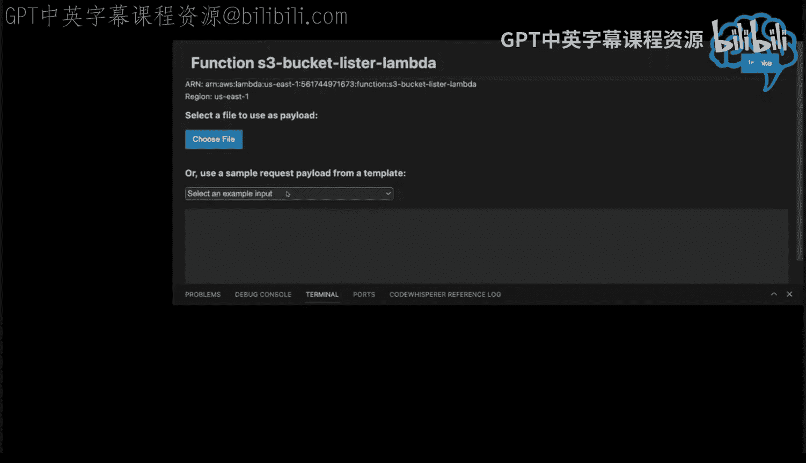

# 杜克大学《Rust编程4-5（Linux命令行工具、LLMOps）｜Rust programming》中英字幕 p147 59_04_03_AWS CodeWhisperer实时编码（第三部分）.zh_en -BV1Hy411q7Zm_p147-

So what I'm going to do next here is deploy this thing。Now to do that。

 let's just follow the instructions。 So what does it say so you can build it。

So let's go ahead and build a release here。So again， I'm not sure why I can't copy paste。

 but who cares will the cargo Ramda build dash dash release？You。It's good。Now。

 this is pretty cool that I can use the arm 64， which you know。

 is awesome because it's going to save me money。嗯。I think that is actually a pretty cool one。In fact。

Why don't I just do that？We wait till the build。Happens， and I'll do it again。

I guess what I would need to do is do a。Cargo clean。Or even I can remove the target directory。

 Actually， if I want to get really brutal， I can just say R D RF target。

And then I can do up arrow here。We can say dash arm 64 right。

 so why not let let's target Grviton because it saves us money， who doesn't like saving money。

Get this thing cooking here。Okay， so now that we've done that， we need to now push it to lambmbda。

To the AWS。 So we just type in cargo lambda deploy。 So pretty easy。 So cargo lambmbda deploy。

And it's ridiculous actually how fast it is to deploy because it's a binary。

And this is going to deploy that Lambda。Great， and then。We can evoke it。Remote， by。I have it in my。

My。😔，S 3 bucket lister Lambda。 I think that's going to be the name。

 So I think what we would do if I look at my make file， I think I have an example。Would be remote。

 Yeah， so you would say。嗯。Basically。Cargo， well， it's going to be easier if I just paste it in here because it's going to take command。

Ohello。And then this is going to be called。Let's see if it lets me paste it in there。

Yeah there we go。Remote S3 bucket lister Lambda。This will be make EWS invoke。Oh。I might have， oh。

 I didn't。 I didn't。I didn't put the payload in correctly， which is the issue。

Which is going to look like that。So let's do that。😔，There we go。

 here's the escaping where in practice delete that one。So let's do it again。Oh。Pickked， oh。

 I know what the issue is。So。Because we're calling the AWS。Ecostem。

 I would have to go to that Lambda。And give it some privileges in order to make it invoke it。

 So that that's a pretty easy one to fix。 I am kind of curious， though， if it。Inside of here。

 I guess you probably would need to do AWS CDK support if you're calling。

Something that lambda now another way to solve it。Would be that I could just go to my lambmbda function。

 which I should be able to find here。Which would be called the。

What would he be called Estri bucketet Lister Lambda。Hisory bucket lister lambmbda this one。

And if we look。I would have to to actually change the permission。

 So I think I have AWs already authenticated so we can just do that real quick。 Let me just。

Go to my AWF account in another terminal， just keep things simple。

I won't do different screen sharing。And I will log in。And I will go to that lambmbda。

And what I'm going to do is just change it so that it has the ability to make API calls。

 which is something you can do from the console。 So we'll type in。The S3。Bucket list or lambmbo。

 okay， I'm finding it in another terminal。I'm going to。L。😔，Configuration of it。

 and I'm going to permissions is what you would need to do。

And then you would just edit your permissions。So that there's a role that has privileges to do whatever it is you're wanting。

 So I think that they did that。 Now let's go back here。And if I go into this screen。So。😔，Oops。

I go if I just do the invoke。There we go。 So that that did work。 the difference， though， is that。

Because it's printing is not going to show it out。 Now， I am curious， though。

 if I went to this bucket lister here and I said invoke。

And I just say the invoking here， it might be easier， so let's just do command。

And we can say hi。And then I can sayvoke， I think it'll give me the output， Yeah， there we go。

 He gives me the output。There you go。 There's all of the buckets。 So I can。

 I can actually debug it remotely。 So pretty pretty good demo， I think it shows the capability。

 So I did this completely with code whisperhi。 I didn't have to do anything with copit and things。

 you know， had a couple missteps。 but basically， I think it went pretty well。

 So what I'm going to do now is just check this code in。 I was say get status。Go up at a level here。

 add this。😔，That's at the prego asked for the demo。Or doing cargo lambmbda， adding。An example。

So yeah， probably next week what I'll do is。Maybe build something slightly more complex with Lambda since this went reasonably well and I'll see you then。

