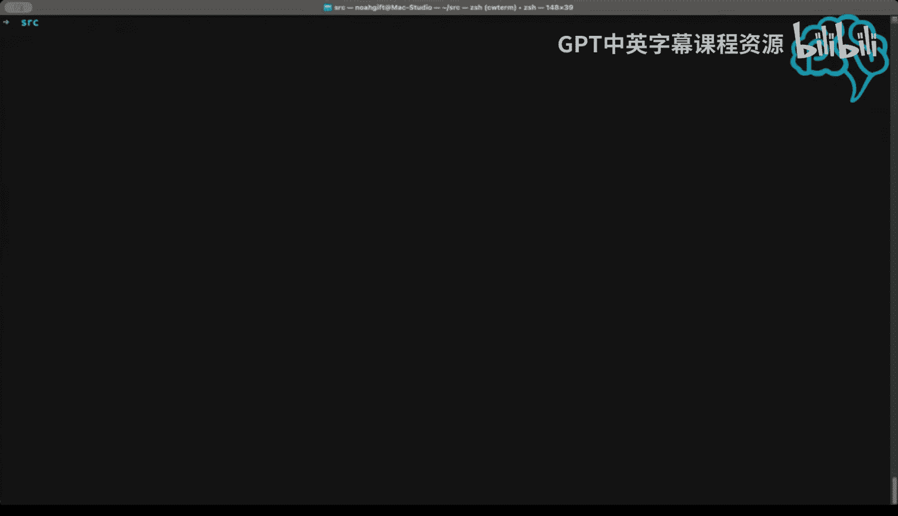

# 杜克大学《Rust编程4-5（Linux命令行工具、LLMOps）｜Rust programming》中英字幕 p148 60_04_04_使用AWS CodeWhisperer命令行工具.zh_en -BV1Hy411q7Zm_p148-

All right， hey， I wanted to share some stuff that I've been working on with AWS CodeWhisper。

 we're a couple days away from AWS reinvent and I think many people are not aware of how cool。

AWS code whisperhis is on the shell， and I think this is one of the still things that you should be doing today is to start playing around with AWS code whisperhis inside of your shell environment。

 So I'm on a Mac machine and I'm going switch over to it and you can see here we've got a source directory。

 This is where I keep a lot of my source code what I'm going to do is I'm actually going to ask it for a help in natural language on how to do some kind of query。

 So if I do the hash right here， the hashtag。And I type in， you know， let's see， counts all。

Of the files， recursively。In my current directory。Right so I ask a pretty complex command。

 what do we do do a return， it gives me a suggestion we can go ahead and say executes command。

 find all the files and do a word count so we can see here that there's 256 256。

000 files located inside of my current working directory and what's cool is that this is actually educational as well because。

What I could do actually is maybe create an alias。Inside of my Zhe so if I went into my Z shell environment here and you know I could I could potentially start to collect these and make aliases。

 which I think is pretty cool it's like a great way to learn you know how to do things so you can see here I have aliases inside like I want to list all the 24 frames per second files or know I could write a function and then I could I could create that into an alias here Similarlyly as you start doing code completions。

😊。

With this code whisper I could say like you know my find command here right we could we could start to piece them together and create these aliases so really not only is it ad hoc useful but it's also awesome because I can start to capture these things so if we go again back into this directory I could also use a different way of prompting it you can do CWAI。

And this is the longer form of asking the same question and I could say， you know。Find all。

Processes that。Exceed 10% CPU。Right it's gonna go through and it's gonna say here we go。

 here's a nice complex command for me。 Let's go ahead and execute it。 There we go。

 You can see here these are the current processes that are running。 So this is in my opinion。

 invaluable these are the kind of things that you would Google or you look at stack overflow for and I can just do it directly from my machine by just doing the hashtag here or doing the CWAI and it's a great way to actually incrementally build up your knowledge and learn things too So it's not just an assistant but it's a way to actually make yourself more productive。

 So if you get a chance here， definitely take a look at this AWs code whisperhi tool it's pretty awesome。

 the Ci， I think is potentially a stealth tool that many people need to be aware of。

 So go ahead and take it out。 it's free and you can install it with a native extension on OS 10。

 All right， talk to you later。😊。

