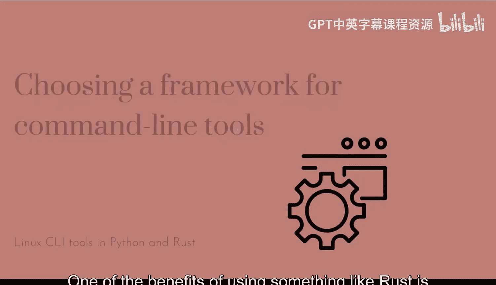
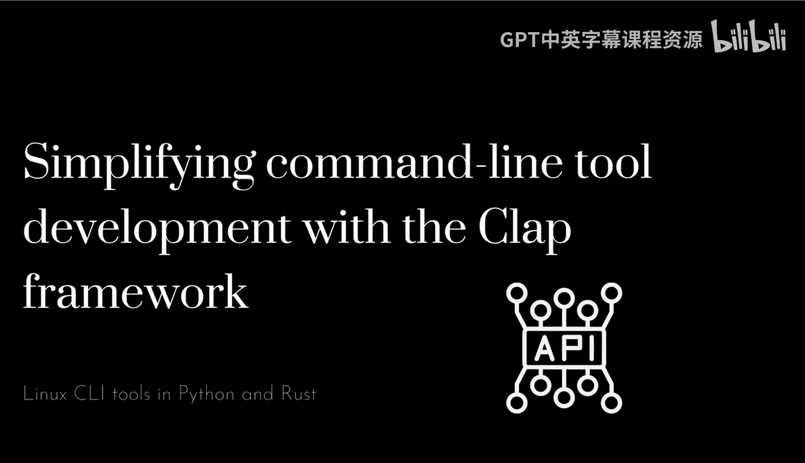
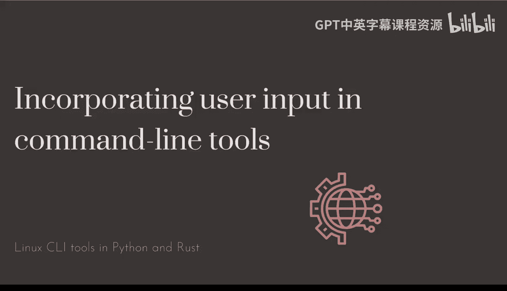
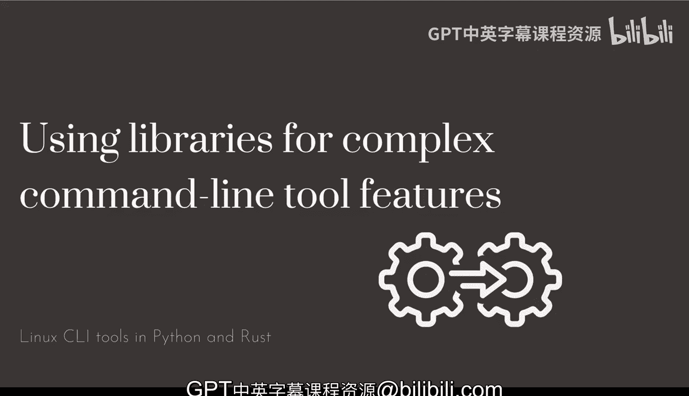

# 杜克大学《Rust编程4-5（Linux命令行工具、LLMOps）｜Rust programming》中英字幕 p17 17_01_09_优化命令行工具性能与最佳实践.zh_en -BV1Hy411q7Zm_p17-

Let's talk a little bit about the things that we've seen with rust and building CI command line tools with rust in the rust ecosystem and some of the best practices。

 some of the patterns that we've seen and some of the recommendations that I have building command line tools in rust is certainly very。

 very different from those doing with Python Python being an interpreter language and rust being a statically typed and compiled language that will allow you to create binaries。

 So unlike Python， you cannot just have like a single command and expect users to be running and executing these single not single command。

 but single file with。

Rust code inside of it， like kind of like a scripting language would do。 So certainly a。

Is something very， very different， but it comes with lots of positive aspects of it。

 which is essentially extremely， extremely fast。Not that very different from Python already and it will allow you to deploy these binary。

 these resulting binary that you're building anywhere without having users or systems having to require the rust toolcha to be installed which is one of the drawbacks in Python Now there's definitely multiple different frameworks as well in in rust that you can use four command line tools we saw we got started at the very beginning with no framework at all。

 and we just used the last argument in the command line to take that as the argument to be to process that is fine。

 but the things that using something like a command line tool framework definitely has its benefits as we've seen already there are multiple options available for rust and although we've been。

Uing clap and it is definitely what I recommend for building command line tools and rusters。

 some others that you might want to take a look like struck up and quick CLI or quickly which is Q UICLI and those are definitely are tools and frameworks that you can poke around and try them out if the clap framework sounds too much or too complex for what you want to try to build one of the benefits of using something like rust is that using dependencies is not a problem unlike Python where you might want to well you're required to have installation pulling all of those dependencies and build them up and make sure that even in some cases where dependencies have to be compiled that you're compiling against the correct architecture and those are being pulled in every single time when you're installing the。

In rust the dependencies and the libraries are not going to be a problem because they're going to be part of the binary。

 the resulting binary will have everything in their dependencies included with clap and using the framework you will get all of the benefits of having a framework do the heavy lifting for you including the error and the error reporting when things don't quite work。

 so input validation parsing of arguments， setting up flags。

 setting up some arguments and even the help menu generation are those benefits that you get by using command line to framework like clap Now some of the things that we saw that are worth repeating and and worth going over is that you need to avoid calling panic everywhere if you're coming from other languages where raising exceptions and basically dealing with。

With errors in an abrupt way， those don't necessarily translate very well to a language like rust where you have many different ways on dealing with errors。

Especially even though you have the ability to use panic and call it like again。

 it is useful for examples or short demo so you want to try and panicking is a good way to break but is not necessarily something you may want to use for programs like we've seen in this case now we did do a lot of error reporting。

 we change one panic and we were able to guard against panics and deal with errors in our rust code which allows us to provide more context to a user and still be able to function somewhat correctly because like commands can fail but when when those commands fail your users or your systems as well we want to know why did this fail。

 what is the actual problem in as much context that we can provide the better for the tools。

Now practicing rust development， best practices and some of the things that we covered using cargo format。

 cargo Cpy cargo check and running them as frequently as possible。

 it is definitely something that you must get used to and installing the right extensions or plugins for the text data or of choice in this case we've used Vicious Studio code and we're using the rust analyzer extension。

 it provides very quick feedback that you can incorporate incorporate in your development workflow when you're writing where you're producing useful code that you want to later build and compile and release the more of these tools that you have available and the more use you are to having them give you feedback to improve your code definitely the better Now the difference from just consuming a single argument in the command line。

To using something like a framework well is that you have you will be dealing with user input and having more options on your tool will allow you to become more flexible and more robust as well because you will guard against common errors and it is definitely something that we'll see later on how useful it is to continue to be flexible and improve and add on to the tool。

 give more options while still being a robust a solid command line tool Now when you start looking into expanding your tool with more modules and and more functionality really not only you have the option to go with modules we just skim the surface there with some of the options you have with adding just one single file which was Lib RRS。

You can definitely add more dependencies we are using a couple one is the framework which is clap and the other one is third Jason。

 which is serializing the Jason that we're producing from a command line from a command call to the system and then we're producing we're also keeping that as Jason so pretty straightforward doing that with cargo and we' go into more advanced things that you can do with cargo and dependencies in rust later on but definitely something that you shouldn't shy upon again very different from Python where you have to pick and choose your dependencies in in a very thorough way and making sure that those will work for the target systems that you'll be going be working with so again using libraries for complex command line tool features is great you saw that I wasn't using coloring clap has support for coloring out。

And it's definitely something that you can use， but again。

 if you want to expand and you want to do more complex things。

 definitely using more libraries or external libraries is something that is very straightforward and highly recommended Now the more external libraries that you have。

 the more time it will take to check and build and release your tools so something to take taking into consideration if you're adding a highly complex command line tool especially but not something that you should be worry about at the time of releasing and building deploying those or distributing those tools to your systems those the resulting binaries are usually not tremendously huge and is definitely one of the main advantages of rust。

