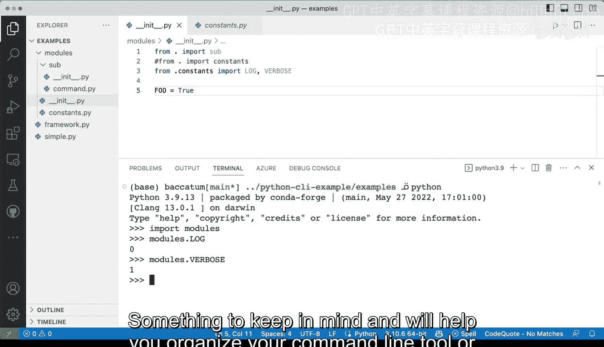

# 杜克大学《Rust编程4-5（Linux命令行工具、LLMOps）｜Rust programming》中英字幕 p19 19_01_02_使用模块和包组织Python项目.zh_en -BV1Hy411q7Zm_p19-

We've seen a little bit of how to add modules which are Python files and in our tools when we were building。

 but we haven't seen anything more complex。 So what I wanted to do is actually look at a very well established command line tool that has grown a lot。

 you can see there's a lot of files here， a lot of subdirecties So this is a good example on some of the things that you should consider when you want to grow。

 So this is an actual command line tool it's a production grade is a production code for a Python very large Python project that has several different things。

 So there's tremendous amount of subdirecties and quite a few Python modules that we can see here。

 So some of the ideas that you can borrow from here in implementing your。own tool。

 even if you don't have a super large command line tool to work with。

 it is a good solid example that we can use。 so let's let's start here So when I look at exceptions exceptions is a good a good module to have whenever you have more than one exception and whenever you have exceptions that other modules can use so let's let's take a quick look at what we have here with exceptions。

So in here。You can see some of these exceptions。 there's one for configuration error that looks like something that may happen if things are not quite right and these can provide a useful useful message right there so you can see here configuration error configuration section error key air six parsing error super user error and size allocation error。

 So that's a good way of organizing So if you have many of these it makes sense because this file is 63 lines long and allows you to basically see what's going on with little effort and just parsing through looking through 60 lines of Python is not very very bad and you can see just a single important there at the top so pretty pretty straightforward。

 So one of the things that you can definitely do without much effort， let's go back here。

 an hour one I want to show you。I decorators if you start building decorators。

 it's kind of like a slightly more advanced feature of Python but definitely you can see how this project is separating some of the needs of the project into separate module so in this case needs looks like a good one so it seems like it checks if you're a super user like if you're a root user and if you're not it will raise a you can see here a super user error so one of the things that we saw was that we had the exceptions right so we see that the module gets imported here and then it gets used the exceptions now is very nice raising that super user error right there so a pretty interesting way of organizing and definitely something that you can try to do so again this is probably no more than 100 lines。

Of Python， lots of documentation like you have here and that is fine so those are things that you can do and always exploring all command line tools and all projects and see how they're organizing our code is definitely something to keep in mind Now let's jump onto some more practical examples on how we can deal with some of these imports and how we can make absolute imports like this one or relative imports So what we have here just in order that the framework up and simple files are here。

 we're only going to be concentrating in these modules directory so let's just assume that this is your project and then you have like one underscore in it。

 were gonna to have a constants file there's some stuff in there that seems useful and we're gonna have a subdirecty here with in it and a command up。

Pi has a single function。 So let's explore some of the things that you would run into。

 like if you're trying to work with a Python project。 So in here at the very top， again。

 we're going to work with these modules。 So in modules， we have。

We have the under in it and the up and the constant。 So let's see what happens if we import modules。

So once I import modules one thing that you can do is actually call in modules and see where that is coming from So that's pretty interesting。

 I get an actual full path so this is really neat and it's something that you can use and I wass like where is this module coming from where does it exist that's something you can do another thing that you can do is actually print it out。

And you can you can get that as well。 now， because I mean the interactive terminal。

 then you will get the output like that。 Alright， so you are in modules if important modules and you want to get to this run function。

 So let's try it out。 So I want to say modules do sub and what is these modules has no attribute sub So what is the problem here。

 if I have the subdirecty here， it has an an underscore in it。 Well。

 now they're like these underscore in it。 it should actually work， right。

 like why can' I just do something like model modules that sub command。

run like that should definitely work。 So the problem here is that we haven't imported。

 like there's two ways of well several ways of dealing this with two primary ways of dealing with this。

 we can say import modules sub and then we can say modules sub and then that will work So the import system has now put sub as part of modules whereas before it wasn't working。

 So lets let's keep digging through modules。 sub and now let's do that command and again we no longer have command。

 So this is getting kind of annoying if if you're not sure where to go next on how to make this happen and if you're not doing something like the full import statement。

 So let's try this out import modules sub command and now modules sub command run will work and we have our。

Function there if we so， so there this is kind of like can get very annoying if you。

 if you don't want to keep typing the whole thing。 So what are some of the things that we can。

 we can do to allev these。 Well， we can add some of the import statements into these underscore in file。

 So let's go to modules and then go to in and we can say import。Imports up。

 And let's see what happens there。 I'm going to save that。And now I need to restart these shells。

 so I'm going to clear that out。And。Get Python going and then say import modules。 And。

 let's see what happens。 Oh， we get a module not found there。 Why why is that Like why。

 why is this not really working if sub exists right there。 What is the problem。 Well。

 the problem is that we're attempting to do an absolute import。

 What does that mean that this sub should be is is considered like like a library。

 like a module like an absolute thing that exists in the namespace。

 But that doesn't exist as as a standalone module， It is it exists as part of this directory。

 this project called modules， So how do we go around that， We are going to use a relative import。

 So the way we're going to do that is we to say from dot import sub。

 And what that means is that from。FromHere from this path， from this directory import sub。 So again。

 let's get rid of these。 Let's start Python again and then say。Import。

Modules and now import modules work。 and now let's see if modules does subworks and modules does sub now works perfectly。

 So this is something to definitely keep in mind and you can play a little bit with what you want to have as part of your modules so and I know name name these modules。

 but it could be your project command line tool it could be a library。 it could be a sub module。

 it could be a directory。 it doesn't matter as the many things that you want here。

 you can put in there。 So we can expand these we can say， for example。

 full equals true and that would be fine， but also you may have things like in this case I have some constants here and we have vervos and log。

 you can have like you know 100 of these and that might be fine and can you may want to have some of these at the very top level and not necessarily here here for organization is fine in constant tab pi but。

Not necessarily， you know， but you want to have them also as part of your library at the top level。

 so you can definitely go in here to here and we can say from Conss。We want to import。

What are some of the things we set verbos and log， lets say verbos and log。

 so I'm going to say these and you can see these are grayed out in just because I'm not using them。

Right， so， so that's fine。 And now let's quit again。

 And the reason I need to quit the terminal and run the Python interpreter again。

 it is because it is had the files have been loaded previously because I'm modifying them on the fly。

 then those need to be reloaded。 Okay， so now let's do import import modules and see what happens。

 Oh， we have a problem because again， I used I used an absolute import and we need to do this same。

Same construct here， so from here import， you can do something like this。

We can do something like this， but we will have constants， but I don't want to have constants。

 I want to have the actual values of those constants。

 which is one is a log and the other one is vervo。 So how do I do that？ definitely。

 definitely not with this line。 So what I need to do， I'm going to leave this as a reference。

 I'm going to say from that constants。Import Fu and will actually not log and veryvo。So there you go。

 so that's the way you do it you can see that that dot will definitely be something that is useful。

 so let's try this again and we can say import modules and now it works。

 let's try modules that log and that will work。So those are things and verbos。

 of course works as well。 So those are the things that you can do with further with directories and modules and adding these imports relative and absolutely something to keep in mind and will help you organize your command line tool or your other modules as well as you move forward。

