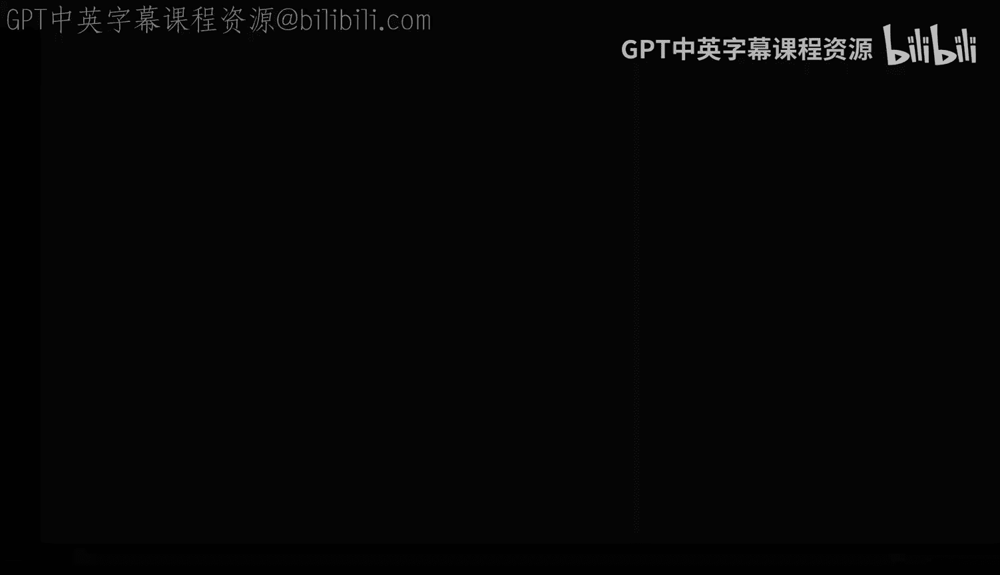

# 杜克大学《Rust编程4-5（Linux命令行工具、LLMOps）｜Rust programming》中英字幕 p20 20_01_03_处理Python依赖项与库.zh_en -BV1Hy411q7Zm_p20-

We've gone a little bit into set of the pie and requirements that text。

 but there's a couple of more things that we we can。

 we can dive into and make it more clear when working with these files。

 One of the things and I'm back here with Python Ci example project。

 which is block pi and we have our requirements that text file here that only has a single dependency when the dependencies are declared in this way where you say click。

And then the actual number， which is 7。1。2 what you're doing is you are pinning that's pinning the dependency。

 That means that these click framework library will be will always try to install 7。1。

2 now this is great， but sometimes you want to have a little bit more flexibility and not necessarily get that exact exact version so some of the things that you can do is you can actually relax these a little bit and get rid of these two numbers and just do a seven that would mean that anything that is seven but is not above or greater than or lesser than7 will get installed Now the important part here is that we can say so we're going to import click and see where click is coming from so there's no click。

So how is that possible again， remember that we have to have a virtual environment。

 So before I was using the global Python interpreter， the system Python interpreter。

 now I want to source my previously created。virtualirtual environment。

 which will be here and I've activated。 And now if I do Python and import click。

 that should be there。 So we say print， click， and it will come from that virtual environment that you can see right there。

 which is in in this path here。 So perfect。 So that is there。 So let's go and make some changes。

 I'm going to clear these。 I'm gonna take a look at the requirements。 and I'm going to pi andinstall。

Click and it's going to promise me if I want to confirm。 Yes， so click is no longer installed。

 I'm going to go ahead and try that out so we can actually。

 without modifying our requirements that text， we can actually play around with this a little bit so。

Another way that before I do this， another way that you can verify things is with Pip freeze and that will give me a whole list of things that are installed in this environment in this environment。

 the only thing that I have is my Python Ci example， which is fine。 remember we didn't install it。

 we did Python setup up that P develop。 this is the exact command。

 So I could actually just pass this whole command to Pip and it would do the same thing as Python setup a P develop。

 So P freezeze will list absolutely everything that is installed and we'll use it to verify how this is working。

 So let's just go ahead and do Pip install。Click， and I'm going to use quotes here so that the shell doesn't。

Doesn't get bothered。 So I'm going to say。Click double equal sign 7 and let's see what happened。

 What is going on here。 I did Pip install click 7， and we have something and we have an error。

 You have click 7 which is incompatible。 Why is this happening Well。

 because I mean in a virtual environment and I've declared that my my dependencies。

 my project the Python C example wants to have a click 7。1。2 So let's get rid of our project here。

 So I'm gonna say Pip uninstall block pie dash demo and we'll say do you are you sure yes。

 now if I do Pip freeze nothing is installed other than click 7 So kind of like a notbehaor there。

 let's go ahead and uninstall， click。And yes， I want to do that。 Pip freeze again。

 Nothing is installed perfect。 So what I did there with uninstalling block by demo was that block by demo was previously installed。

 That was a hard dependency and Pip is refusing to create a problem for me because block by demo says that it won 7。

1。2。 Alright， so I'm gonna clear this and start from the top。 make it clean。

 And now let's do this again。 Pip install， click。 and I'm going to say 7。 And so you will see that。

That now we are saying I won version 7。 it actually uses the first， the first match there。

 So there's a couple more things that we can try here so we can say something like let's make sure that click is no longer installed。

 I'm going to remove that。 I'm gonna to clear back again and I'm going to say pip install。

And I'm I'm going to say click again， but I want to say something bigger。Or equal to 7。1。2。

So I can do these。 and you can see that 7。1。2 was。Was considered and then it said hm。

 I'm going to just pick 8。1。3 but we can say oh well， I don't want version 8。

 what what can I do so let's once again uninstall click and add a constraint so we can say pe installall click bigger equal than 7。

1。2 but lesser than 8。

So now you can see that it matches on 7。2。 So this will give you flexibility。

 and there's definitely all kinds of different variations that you can try。 And if I do pre freeze。

 P freeze will pin it to 7。1。2。 So that those are some of the things that you can definitely try and do when you're using Pip and you're using requirements and you are trying to do a little bit more flexibility。

 The other thing that you can do is you can create de requirements that text in these de requirements that text。

 you can add other。 So say for example， I want to add click。Let's say， version。

I want to I want to add click straight out to the requirements and now want to say pep install dash R the requirements that text。

 which that the way that we reference the requirements that text and let's actually remove。

Remove once again， P， uninstall。And I say yes， and let's install the dev requirements so the dev requirements be because I didn't specify any pinning any double equal signs。

 it will just get the absolute latest version， which is in this case， 8。1。3。

Those are some of the things that you can consider when you' doing development when you want to try other libraries or different versions that you don't want to conflict with your production grade or your release grade command line tool and when using requirements and some of the techniques here that you can do also behind peep freeze or pinning your dependencies to be a little bit more relaxed。

