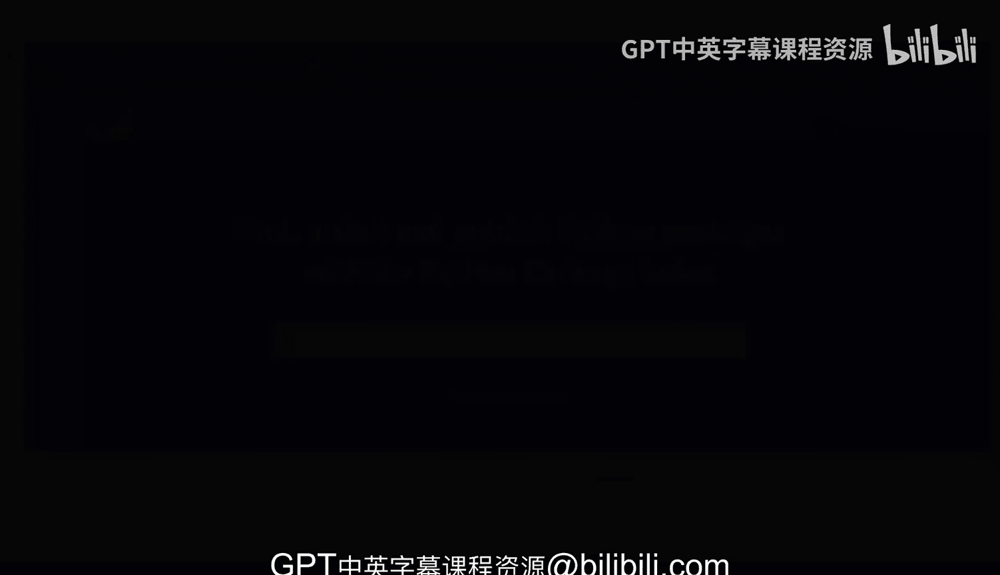
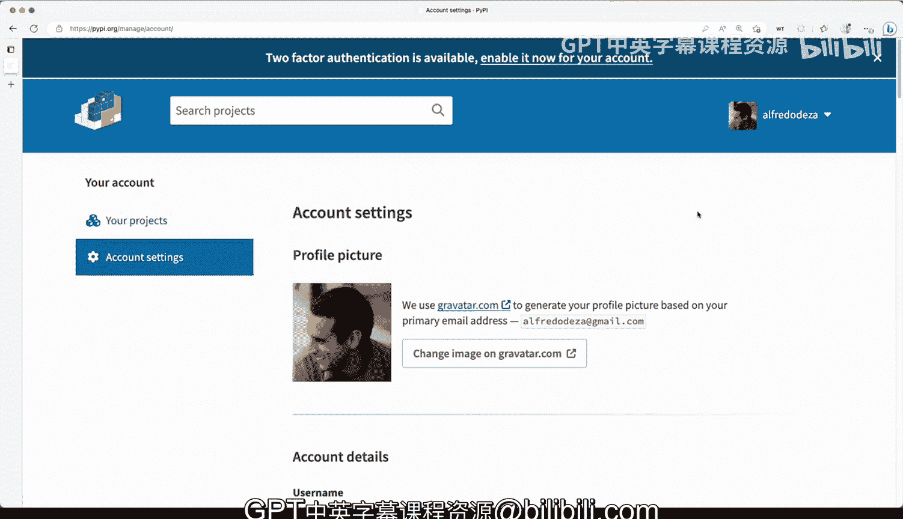

# 杜克大学《Rust编程4-5（Linux命令行工具、LLMOps）｜Rust programming》中英字幕 p21 21_01_04_Python包索引(PyPI).zh_en -BV1Hy411q7Zm_p21-

We have been installing dependencies uninstalling dependencies but where are those coming from Well those are coming from the Python package index a Python package。

 the Python package index allows you to by default。

 go to this package registry and get those packages from there So that's by default you can of course have internal indexes that you want to point your tool set。

 like if you don't want to polish them， but by default fault。

 this is where all of these will go if I come here and search projects and I say for example click which is the framework that we've been using。

Several different things will come up like there's a lot of things that will show up but the framework that we want to take a look is definitely well there's clickate and click you can see sometimes they do this this name in convention if they want to separate and avoid problems for backwards compatibility this is the one that we want so project description it has a lot of these things and all of this comes from the packaging which we've just skim through the surface there on packaging Python I mean I know it's very complicated but we're trying to stay very straightforward here and you can see that the installation is again straightforward there with with PIip the dash you means it's a flag for PIP that will allow you to update your click installation or your whatever library or framework you're installing the dash you will say hey just update this to the new。

And I want to so that effectively means uninstall the previous one， install the newest one。

 and move on。So why is this useful Well once you publish to the index you'll have the ability to collaborate to distribute your project with anyone else so once it's here anyone from anywhere in the world can install sos that's very。

 very very cool and you can see the release history the current version was released April 28th of 2022 so that's very solid It's been quite a while though you can see here that there were some pre-releases you can definitely get some pre-reles out so very extensive history here for click of course it one of the major command line tool frameworks for Python and you can see here there's a bunch of project links that we can take a look like homepage。

 the page here for the documentation All right let's go back and another thing I want to show you I have my account here you can see I've created an account you have to create an account if you want to publish to the Python package。

Index and I want to show you some of my projects here and let's take a look at some of my demo command line tools I have like a CSB Li so this is kind of like the view that you would get as an owner youd have your account settings over there but let's see manage my demo CSB Li tool and you can see I only have one version I released on 2022。

Te files for security history collaborators， if you want others to contribute to your projects you can also do maintain your owner。

 you can see that's me I have I have everything already there set up for myself and where some of the project roles I mean basic basic information you can have certain settings if you want to have like an API token。

 all kinds of different things and you can have two factor authentication as well and you can enable it and you can even go ahead and delete the project and understand that these can be well this can be pretty dangerous because it can be hard to recover and you know these things will cease to exist so again create an account definitely for the things that we're gonna cover is going to be useful because we are going to be able to try to set up tokens and。

We'll see how we can do that once we want to try to publish some of the packages to the Python package index。

 which we'll be doing in this course for sure。

