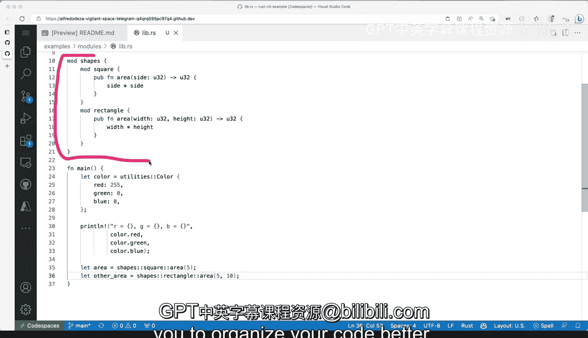

# 杜克大学《Rust编程4-5（Linux命令行工具、LLMOps）｜Rust programming》中英字幕 p22 22_01_07_在Rust中创建和使用模块.zh_en -BV1Hy411q7Zm_p22-

We've already seen in rust how to extract things and put them somewhere else in a different module One thing that we haven't explored。

 however， is using the keyword mod the mod keyword here the mod statement allows you to define create a definition of a rust module so when I want to explore with you a little bit of the options that you have and why that makes sense。

 so in this case I created a mod utilities you might notice that I'm in a Lib that RRS file it doesn't matter because what these allows us to do is define create a definition of our module with certain constraints so in this case we have let's just concentrate on mod utilities here and inside that mod utilities I have astruct which is publicly available So one thing that mod。

All you to do is to control the visibility。 you can have public things like destruct or private items in there as well that shouldn't be exposed and cannot be changed。

 So if I were to remove these。Pub， then this will make it private。 but let's leave it like that。

 And now let's see how you will use it。 I have a main function here。

 So utilities is the module that I created that I define by using the mod keyword and then the double colon is the separator saying from from the utilities module I want to interact with color So that's that's what we want to do。

 that's how you can how you can actually interact like define some of these modules。

 So this is pretty straightforward。 And then we you know we're accessing accessing the color red。

 green and blue and then printing those out from the struct。So that's straightforward。

What are some other things that we can do with the module keyword here。

 this organization will allow us to do things like what I'm trying to do here。

 so I'm creating a module called shapes and I can define sub modules like square and rectangle。

So within those nested modules， what we can do is also create public functions as you can see here。

 the important thing to remember is that mod allows us to define and organize code and submods as well while controlling visibility This might be slightly confusing because we're defining we're defining the module like that。

 but sometimes it can be confusing if you're coming from other languages because we also have the use keyword that allows you to use some modules and bring them into the scope module definitions allow you to define a new module that can contain code types functions and and manual items likestruct as we're seen right here So the main difference with use would be that use allows you to bring the code into scope without having to use its items to。

Qualify them with the module names instead of like having to type the whole absolute name。

 So use would allow us to say， for example， if we wanted to just say color and not have utilities double call and color。

 then you would be using use。 Alright， so that is that is the the simple， the simple use case。 Now。

 let's take a look at how it would look for。For the nested modules。

 how would that look so we can say let。How about we say area and we say shape square area 5 sounds correct to me。

 We can do something else like。嗯。Let's try these other area and we can say shapes。

We can see rectangle。And you can see that things are slightly different right like we're because we're having these nested modules。

 we can we can add a little bit there and help us organize our code even further。

 so beyond beyond separating beyond separating things into other files。

 it is important that to understand that you can also use mod in a way that allows you to organize your code better。

