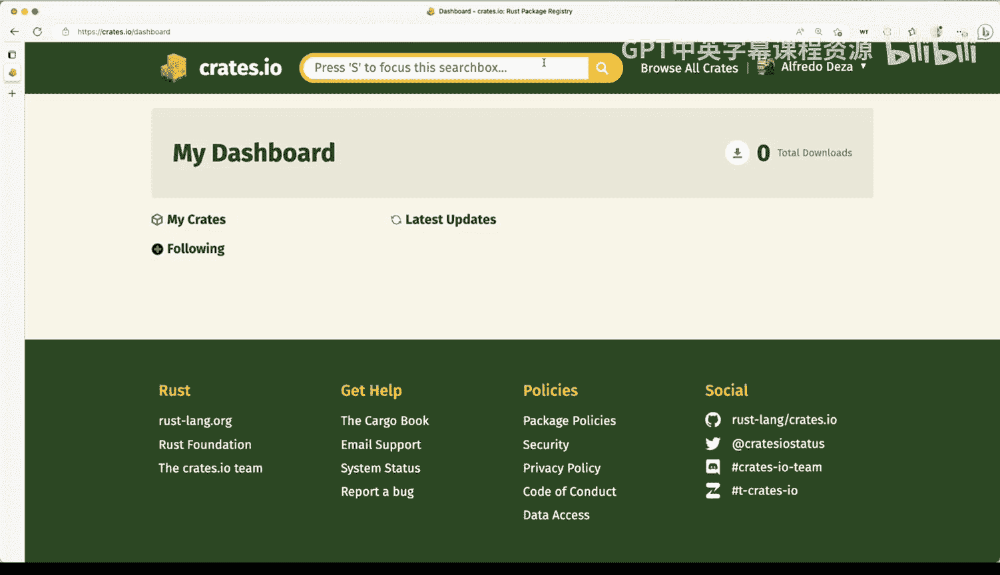

# 杜克大学《Rust编程4-5（Linux命令行工具、LLMOps）｜Rust programming》中英字幕 p25 25_01_10_使用Crates.io管理Rust包.zh_en -BV1Hy411q7Zm_p25-

Similarly to the Python package index， we have creates that IO for rust。

 It's a place where you can publish crates， you can publish your libraries either commandline tools or actual library packages like this one right here and you can also download your code we've seen before the definitions in cargo that Tail where you can define what is it that you want and then cargo will pull those from basically creates that IO so it is very straightforward。

 it works similarly as as we've seen with the Python package index and we can actually look here for one of the frameworks that we've been using which is clap so we can search for clap and we'll have several different things here so wrapper for。

Like we don't want that。 It seems like this is the one that we want simple to use efficient and full featuredatured command line argument parser so it has plenty of the downloads 115 million so that's pretty pretty outstanding number of downloads so let's take a quick look and how does this work So click in here we get a little bit of the readme so that gets slured in。

 we get some of the information here for how to install it。

 what's the latest version that we can do another thing 343 versions outstanding really you can also take a quick look at the dependencies And from here you can actually jump to these other places So let's see development dependencies actual dependencies what's this one cells let's see these one cell and click here so it takes you to this or one so you can still go and explore all of the。

That are related to that package and do some investigation。 So this is pretty nifty。 It's using 1。17。

1。 That's great。 but you know it's a good way it's a good way to kind of like find out more about this。

 So let's go back to the readme and here another thing that I want to show you is that we have the documentation right here and the reason why this is important is because you might be saying well。

 I'm not sure about some module in clap。 the other I was looking for the coloring on the terminal that had change and I wanted to find more about that。

 So if I click here on the documentation this let me go and zoom in a little bit this is the documentation and it takes me to docs that R。

 So I'm no longer on crs that I owe it takes me to hear So if I say coloring。And I search for that。

 no results。 How about color Well， I'm misspelling this coloring。 No color is there。

 Col choice is definitely one of the things that I was looking for auto always never I'm exploring here I'm looking at the variance。

 so we have auto always never so those are those are pretty good it's an inum and gives you like three choices there。

 So you know pretty good way to find out more about about these library that you want to use And here we have like a different platform study supports。

 So there's definitely builds for all of them。 then I can go back and here select perhaps a different version I say well 4。

2。4 is not what I'm looking for。 I'm doing three。2。5 and I'll get this go to the latest version。

 So that's fine that's stocks that are S separate from。Great Staio， I'm going to keep going back。

And the way you log in is with GitHub， so if you have an account and I do have an account here。

 I'm going to say yes， I'm going to continue， I'm going to make an authorization to rust dash L to access my GiHub repositories and I'm going to be logged in som now I'm fully logged in and I have account settings and I have a dashboard if I have creates they will be they will be showing here。

 I don't have latest updates， I have serial total downloads because I haven't publish anything yet。

 which is something that I plan to fix sometime soon when I start publishing some libraries that I've been working on。

So there you go that's a very straightforward way of looking at creates。 Io。

 you can definitely search for things that you want to find out more about and you can verify the packages that you've declared in dependencies and even jump to docs that R if you're looking for documentation on those。

