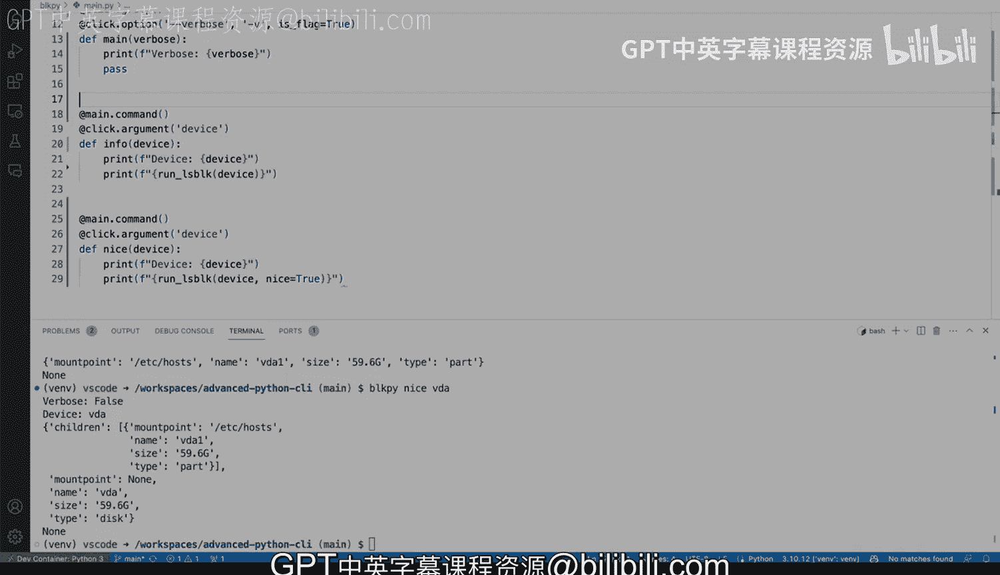

# 杜克大学《Rust编程4-5（Linux命令行工具、LLMOps）｜Rust programming》中英字幕 p28 28_02_04_在Python中创建带子命令的命令行工具.zh_en -BV1Hy411q7Zm_p28-

Let's see how we can add a subcom to this piece of code here。

 if you remember we've been working with the LS block command that we've be importing it to Python LS block rather and we're going to make sure and see if this actually works here on the terminal and we're going to run block Pi。

Just like that and we will this is our command line tool when I runhel and this is going to be using consuming the output from Ls block。

 So L block is our Linux command line tool and we have the output here and again we want to take a look at VD1。

 So if we say Ls block Vda1， you'll say not a block device and we want to prevent that that is why we have this block pi over here。

 So if we do block by Vda1， we'll still get that very useful output right there so let me close close very quickly and get back to the code right here and this right here is the the main command we get the help menu we are receiving a device is a positional argument this right here is what we pass in VD1。

In the last example。 So how do we add a subcom， We want to add a subcom。

 So I think one thing that is reasonable is to perhaps try to separate that device right so say for example。

 I'm going add this as a comment for example right now we have example， let's say example usage。

 we have something like block pie and then we say something like V1。

So perhaps you know a requirement could be the requirement could be something like adding block by and we can say info Vda1 So info will be a subcom and VD1 will still be the positional argument So how do we do this Well remember we're using the clicks click click framework here and using the click framework well this becomes kind of straightforward let's again most everything with decorators and we're going to start here and'm going to say we're going to create a group so click that group and we're going to call these main。

And right now， yes， we'm gonna pass and not going do anything。 So right away。

 I'm gonna get into trouble because that main function right here is also the main function right there。

 So we need to make some changes right， this is not going to redefin of un use main。

 This is going to cause problems。 Python doesn't like that。 So let's leave this here as main。

 And here on line 18 team， we're going rename this main。 and let's call it。

Let's call the info and save that。 so then that goes away。

And now we I think we're good to go and we have now a main function， an info function。

 Nothing else has changed， but there's one thing that needs to change and it's very easy to forget about that one and that's the click that command well it is no longer a click that command。

 So this has to change specifically this click portion here needs to be now main So what is going on this might be a little bit confusing。

 So you have main and behind the scenes click is creating a group called main。

 So the main the name of the function in this case。

 main is the name of the group and that group in this case is going to be this main So that's just saying that is grouping grouping it together。

 So now this is whole part of the main command。 So now you're creating making this a a subcom we can quickly see that if we say if we clear。

Here we call blockpi helpp again。 we will see now that we have a subcom called info。

 Click custom commands， but in this case， it is a subcom and we say block pie info dash help we will get the actual help from the block info subcom。

 So now this should allow us to say block by info B the a1 and get the actual output。

 So that is exactly what we want and that looks good。

 let let's try a couple more changes here that could be useful。 So in this case。

 we have this flag that is the verbose flag that perhaps maybe a thing that we could add globally and not only for just the info subcom。

 So we may want it to have it right here and we can add it there。 and then we have that going。

 So that's good。 And now we say block pie here。Very bottom and say dash help。

 And now we'll have these options like vervos right at the top。 Like if I scroll here。

 you will see that before it wasn't showing us the options for global options。

 So so that is a good way of separating that and adding a subcom which is pretty pretty straightforward and you could keep adding more subcoms。

 you could add something like say for example， like if you wanted some specific J or for nice command。

 we could say an arm main command here， we could say click that argument that we're going to call also the device and we're gonna get a little bit repetitive here so only to demonstrating we're going to say。

Instead of instead of formatting or anything when I say nice and when I call this the argument is going to the beta device it's just essentially the same the same thing as before now for the run L block we're going to pass in a nice equals true and then that means we need to change this change here let me close these let's go to u that pi remember this is where we have all of our us and run underscore L block we require a nice so we can say。

Nice is going to be false。 And now we can say if the nice is true。 we can。

 and I'm going to force this。 I'm gonna， it's not going be super nice。 We're going to import P print。

 P print is a module in Python will allow me to pretty print the output。

 So I'm going say from P print import。P print you'll see in a second here。 I'm not using it。

 but I will use it in a second。 now。 this is not going to be very nicely damp。

 but just to demonstrate how we can do this so we can say if， if nice。Return， p print， parent。

So when I say the sink here for the child。嗯。I'm going to do right there， if nice， and I say pep。

Not return， but we're going to say， well， yeah， return preprint。Actually。

 that returning is needed or was this is a loop。 we will get into trouble。 Allright。

 so let's try it out and let's see if getting these in the terminal would work。

 So block by dash dash help。 We should have now two commands and you can see nice is there and info there is as well。

 There's a couple more things that we need to change。 Do you see that we have a vervose here。

 that no longer is getting past in。 We were using it there。

 now that exists in main so let's quickly fix that。 And actually。

 I'll toggle the terminal so that you can see what happens。

 block by nice Vda1 and we'll get a keyword argument vervose。

 So let's quickly fix that is's good to see some error so that you're where that things may happen like this one and you're not feeling overwhelmed by the amount of errors。

 So let's just get rid of vervos because it's no longer needed at least not there。

 We can even actually。Put it over here and then we can close that and we can remove that new line。

 We can add a new line here， make the li very happy。 And I think that should work now well。

 It's clear here in the bottom at the bottom with the terminal and let's try this again。😊，All right。

 so block Pi nice V now works pretty good if we say just V， we get these very nice formatting。

 we're getting these done that we should get rid of。

 but now you get you get like kind of like a sense of what's going on and we get the subcoms and that is effectively how you do these with the click framework by adding some subcoms。

