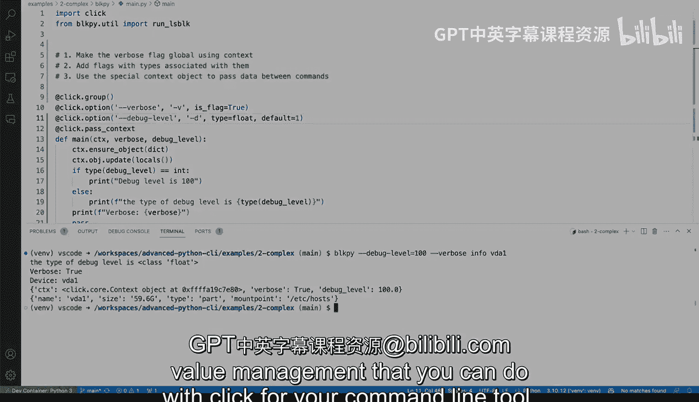

# 杜克大学《Rust编程4-5（Linux命令行工具、LLMOps）｜Rust programming》中英字幕 p30 30_02_06_在Python中解析复杂命令行参数.zh_en -BV1Hy411q7Zm_p30-

Let's try to address some of the complexity of command line tools by looking at these three options here that we have and we are going to try to comply with all of them like we're going to try to make the verbo flag global using context and we'll see what context looks like in why that's important and we'll add some flags with associated types。

And we'll see why that's important and then we'll use the special context object to pass data between commands and this is actually kind of associated with the first one and we'll see how those look like but before we do。

We have the device， this device argument into the infofo subcom and let's actually call that toggle in the terminal and we'll see how that looks like this would be。

Block pie and its info if we do it like these we'll get this error that says hey error we have a missing argument device so that device is because we're acquiring it here So one quick thing that you can do here and start playing around with required arguments or not required we can say required equals false and we can save that and run again and then we get that different a slightly different behavior right like you're getting vervose false and then we are not getting anything because runll block device will give a none so that is something very easy that you can tweak around and play with for now let's leave it as device only and let's start let's start by making the verbose flag global so right now when the verbose flag is said that is only available for domain function right so you can see that vervose is false。

But if you are doing work right here， how do you， how can you tell what the reverse flag is， right。

 like so if you want to have some global flags like this one。

How can you make sure that that's available to other commands like the subcom So say， for example。

 you want to do something here， you want to say if burbos you know print vers Yeah， sure。

 but burbose right now is' going to cause this syntax error。

 let's see what the Li says is not defined right it's it's undefined。

 How do you know how can you make that happen right。

 So let's actually make that happen and click makes this very easy by allowing us to pass a context and the context Im want to say。

Like the ad， the context is a special type of decorator that allows us to inject an object called and by by convention that's called CTX and if you look at the documentation you willll be CTX for context and what we can do here is something something like this。

 we can actually say context。The ensure underscore object diic is a good way of ensuring that there's always going to be a dictionary so behind the scenes the object can be a dictionary so we can say CTX objects verbos verbo so we're creating a dictionary。

 that's that object right there is going to be a dictionary and we can start populating that with stuff so when we're back in info we can say past the context again and we're going to do the CTX thing right here。

And then we can actually let's do something let's do something nifty。

 we are going to say we're going to print actually the cX， cx that object itself。

And the object itself should give us the ability to poke around what's going on we can actually call string。

And I will cast it as a string will force the contents and we will see。

 So let's just run this again missing error device， of course， let's do BD1。

And we will get just ignore that this and the actual output。

 Let's just focus on this little piece of output right there。 So we're getting that vervoful。

 So we get， we get that verbosity。 So what what are some of the things that we can do where we can say。

Let's say vervo equals cx objects and so what we're doing we're retrieving the value of ourvos from the object which is a dictionary because that is set here and that is possible because we're calling pass underscore context which is populated or injected through the cx So the cx is that cx right there。

 So now we can say things like。If verbos， right， we can say print the eyes and we can actually take this guy out and put it right there。

 So now we're passing verbos verbos or in verbosity option， we we can conditionalize that。

 So we say these。We don't get because the verbose is false。

 then we don't we're not getting that right so let's pass pass the verbose and see what happens so verbose。

And now we're getting all of this extra content， which is coming from there because we can check on vervasity so pretty cool that we can conditionalize that and pass the context。

And we're using the special context object to pass data between command as well。

 so context that object is not limited to these and there's actually a quick way like imagine you have like 20 different flags。

 you can actually do these easy like a straightforward thing here instead of like doing this one for every single flag that you have。

 you can say CTX， that object。That update。 and you can say locals。

 and locals in Python is a way of retrieving all of the local variables for this function and inject that into objects。

 So let's try to save this and run again。And we will get a little bit of extra stuff here。

 Do you see that click context object。 We're injecting tons of different things there。

 And so that would allow us to put more things into it。

 So now let's take a look at another flag that we can have like win a passing click that option and and now we're going to do something slightly little different。

 when I say debug level。And then we're going to do something that has a type associated with it。

 so this is slightly more complex and we'll see why this is important。

 So we're going to say debug level， this suggestion by copal seems okay to me we're going this is the long the long type the long flag is debug dash level we're going make a short shorthand for dash D and we're going to say a type and we're going to say it's a range。

So what is what is the deal here， Well， we're going to specify that we're only passing in a range from 0 to3 by default fault is0 and we need to also pass these here right so I'm going to say debug level right there。

So now let's call in the terminal。 Let's toggle the terminal。 Well。

 let's clear this so we can have a little bit of a little bit of room there。

 And now we're running that without passing the debug level。

 And now we are getting the debug level right here。 Do you see that default equals0。

 that is coming from right here。 So if we change this to one， save it and running it again。

We will get that one right there， see that that one is coming from right here。

 so and the range 0 to 3 means that I can only pass values that are 0 all the way to3。

 so let's try that again if we say log dash dash log level or actually debug level。

That's a very bad name， I should have called it log level， but let's just go ahead with debug level。

And say debug level is going to be 100。 and let's see what happens。

 So the nice thing about using the framework is that you'll get a very nice message here error in value value for debug level 100 is not be valid range of 0 to 3 So that is something that definitely you can do now you can do simpler stuff here as well。

 you can say int type is int like a plain int， which is a type in Python and you can say 100。

 and then that will work because you're not setting the constraints。

 Now I did say like this is this is nifty， this is nice。

 but like why is this useful because right here， you can say。

You can you can do stuff with type because behind the scenes click will take that type and will coerce into that type itself so in this case it will be an integer so say for example you say if debug level is 100 then print debug level is 100 otherwise else we can say you know it's not 100 so now we're doing a check right there by assuming the debug level is going to be an integer。

 this operation this expression right here it's only possible if debug level is an integer and that's about 100 is definitely an integer right so with that comparison is only possible if we do it like that。

And you get that debug level is 100 right there。 that wouldn't be possible if this was a string。

 for example， if we change that， but will' not get an exception because that comparison that comparison is is not okay。

 but we could actually do type some type checking if we can say type debug level is。Is int。St。

 actually let's just keep it as int and then do that and and then we can actually say here let's put an F string and this will wrap it up。

 we'll say the type of debug level is this one and we'll check it out so let's clear here n run this again what is the type we have a string right it's squareer into a string because we if we change it here to an int and we do this again。

 we'll get the debug level is one kind of an integer we can actually do lots of different things we can do a float。

So we can say that and then we'll say class is float so you can actually set the type for every single value as well so there you go。

 those are some of the advanced flag and value management that you can do with click for your command line tool。

