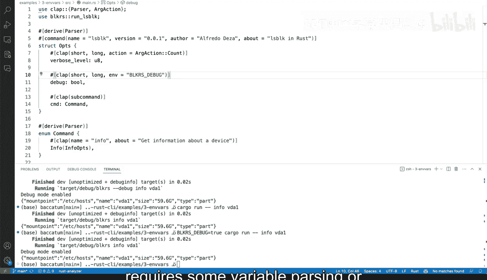

# 杜克大学《Rust编程4-5（Linux命令行工具、LLMOps）｜Rust programming》中英字幕 p31 31_02_08_在Rust命令行工具中添加环境变量.zh_en -BV1Hy411q7Zm_p31-

So we've seen how to add some flags to our Els blog rust wrapper command line tool。

 but one thing I want to show you is how to add environment variable support and we do have the ability to have support for environment variable environment variables however。

 if I go here one thing that you will need to know is that cargo。el will need to be updated。

 So the features that we've been working so far include derived only and now we're adding end。

 So these are extra features that will be required in this case。

 Otherwise native support for environment variables in this framework will not will not work without that So going back to our main that arrest the way the way it works is actually pretty nifty when we need to do we're not going to add here。

 but we're going to add it to our de。Dbug2 or flag rather and we're going to say here we' going to say n and we're going to do a string and instead of Alice block we're going to do。

BLK RRS underscore Dbug looks correct to me， and I'm going to remove that one。Okay。

 so that looks correct to me。 So this support， this native support looks exactly what we want Otherwise what you will need to do will be something like add。

An environmentviron。Check here for that and then we will have to use the standard library and then and set you know。

 it will not set， but we want to retrieve it， retrieve the value。

And then we would use something like that。 So， you know I went away。

So there you go let's try that so these would allow you to set it to look for block a SDDbug unwrap or elses means like hey。

 just like if if that doesn't exist get this string and then put it to string well now the STR and then put it to string but that would be without the native support。

 we want to have the native support it is really need to have the native support so let's go ahead and do that it will require you as I told you to update your cargo thatamel and then add the Peis looks much。

 much better so I'm going save it， let's toggle the terminal let's run the help menu。

And the help menu， you will see that we are able to get that get that going。 So now if we say。

If we say debug， let's say debug debug right here。Info VD1， we can see the debug mode is enabled。

 So if we， however， remove these and run that， no debug mode is up。

 Now let's try with our environment variable again， we can do it like this。

 and we can say something like true。 and then we can say cargo run， dash dash info VD 1。

And we have debug mode enabled。 So this is working correctly thanks to our environment variable support。

 And again， this is native native environment variable support from clap。

 especially when you add that feature on cargo that Otherwise you would need to have to do em manually。

 So this is a very powerful pattern that you can to make it easier really on users they want to use an environment variable。

 like more flexibility on how they're passing things， perhaps you want to do some automation。

 build some system automation that require some variable variable parsing or input to make it easier on on these tools。

