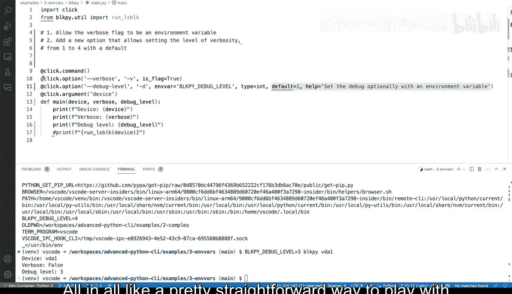
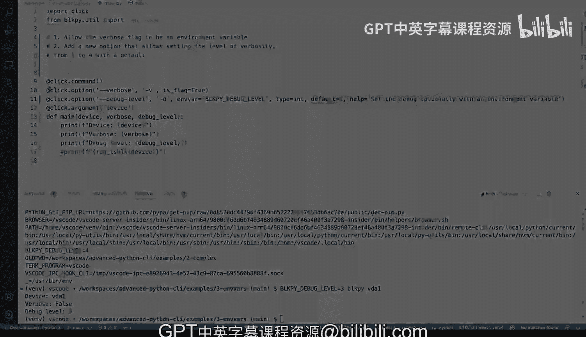

# 杜克大学《Rust编程4-5（Linux命令行工具、LLMOps）｜Rust programming》中英字幕 p32 32_02_11_在Python命令行工具中添加环境变量.zh_en -BV1Hy411q7Zm_p32-

Environment variables is a useful way to enhance command line tools in here。

 We've added our block pie command line tool that we've been working with and we have these debug level shorthand for dash。

 it's an integer and the false to one perfect。 But what if we wanted to make it a little bit more helpful for our tools so that users could pass in an environment variable And again。

 environment variables， I'm to toggle here the terminal， So you could say for example。

 if I do and do end get all of these environment variables right So you have Python path let's see what are some like remote containers。

 virtual environment。 So there's a lot of things here。

 and it's useful when you want to source a file and passsum values and you want to make sure that those are available So someone might want to do something like that and we want to allow that instead of like passing multiple different options actually if you've ever use。

Docker containers you will see that some of the Docker commands allows to pass in several different options as environment variables and inject them into the containers and environment variables now that's fine but like in this case what we want to do is we want to see if Im say block pie dash dash help and see you can see dash D debug level integer so we want to pass in an environment variable that signals that that's possible so how do we do this with click and very easy we pass another。

Aret you in here， we're going to say。Keyword argument right actually， when it's Nbar。And when I say。

 what's the name of these， we could say block by。Undercore。

 we could do something like this where we say。呃。Debug level， I mean， this is a slightly verbal both。

 but seems seems fine。 So I'm going say that it seems that there's a problem here。

 let's check line too long。 that's that's fine。 let's keep it like that。 And now let's run。

 let's run the help again。Now we don't， which is unfortunate， we don't get anything that tells us。

 so we can always enhance these by passing a help here。Right， we can say， set the debug level。

Optally， with。Andvi variableable。 Yeah， sure。 we save that。 Let's make， let's make that。 okay。

 And all right， like I I know this line is super long。 And， but for the sake of demonstration。

 that seems fine。 And we can see that our help menu right there。 Okay， perfect。 So that's good。

 that's coming from there， let's run this and actually see it in action。

 But before we see it in action。We need to have debug level passed in here or we're going to get into trouble。

We're going to say debug underscore level and let's comment out run El blog for now I'm going to say print debug level。

 what's the debug level so by default is one so let's run it and see what happens。

So we're missing a device， of course， VD 1。 Okay， so now we're getting somewhere we're gonna get debug level is1。

 That's fine because that is the fault Vervo is fault device is VD 1 this don't really matter What matters is the debug level。

 So how can we change that。 Well we can say。Let's try first with a flag verifying that this works as intended is the first step。

 we can say debug level3。 and now debug level looks like three there。 All right。

 now with an environment variable how do we do this Well。

 there's a couple of ways we can play withmer variables。

 So first one and the easiest way to do this is block pi underscore debug underscore level and we can say know4 and then run block pi a Vda1 and see what happens So you can see that because I set it to4 here。

 this is actually an environment variable， that was set to4 the other way is exporting like you can export an environment variable if you if you're familiar with environment variables。

 you can do export and then that becomes a thing that like that setting in stone。

 Now block pi Vda1 and it will say four， why does it say4 because because you exported it it's now part of the。

System， if I do N。You can see it right there， see it see that block by debug level 4 that's part that's part of the environment variables now so if I wanted to change that on the fly I could apply this strategy that we've done before and now we change it to three so again very straightforward and you can play around with the required like if well not required because this is an option is kind of like a flag but you can play around with the type in this case we set an integer where defaulting to one we're setting the help menu oh in all like a pretty straightforward way to play with environment variables and click and adding those to your command line tool in Python。

