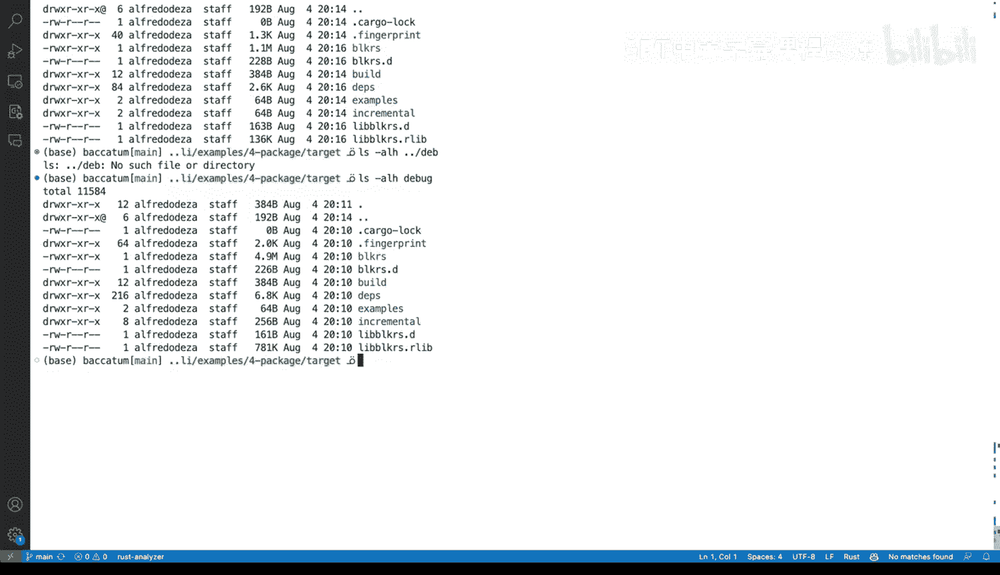

# 杜克大学《Rust编程4-5（Linux命令行工具、LLMOps）｜Rust programming》中英字幕 p34 34_02_02_为Rust命令行工具创建包.zh_en -BV1Hy411q7Zm_p34-

We've been working with rust and the command line tool and our package and all of our code so far doing a few things mainly with SRC。

 Lib RRS， mains doing everything that we have for our tool that is a else block wrapper in rust which we've called block Rs。

 Now it's time to actually try to understand what it entails to build a package。

 Now so far we've done and I'm going to close these and make the terminal a little bit bigger and so far we've done things like cargo actually cargo run and we've done things like that and we've seen this familiar output with compiling and then we get some output Sos that's cargo run So how do we get a packages let's inspect us what。

We have， and'm going to have a target。And kind of like the things that cargo run does is two things at once。

 it will build and then run your CLI tool round your tool actually。

So if we were to I'm going to clear this LS and you can see that there there's a target。

 target is where we'll find everything that has been built and if we look at all of the massive output that gets produced。

 this is everything that entails all of the libraries， all of its dependencies。

 everything really likeency，Dpenencies， let's see a little bit of Uniiccode。

Clap is listed over here so there's a lot of stuff。Let's take a look very quickly at cargo build。

 If I run that， Well， I didn't make any changes so that didn't do much。 So there's cargo build。

 which actually cargo run will do that。 And then cargo build will。

Let's take a look at target here so that you can understand a little bit better。 So when I say Dbug。

And in here we have block arrest。 That is our debug build so we can actually go and do block arrest dash help。

 and in a word， that's our command line tool。 Let's take a very quick look at what we have here and what's the size and it's 5 megabytes。

 So block arrest。 our tool is5 megaby mites。 we're not going take take too much attention into the other files that are right here。

 but that's fine。 we're just concentrating in dealing with block r and trying to find out more what's going on there so。

We are doing cargo run and that means cargo build and then cargo run will come here and run our parameters in this case。

 if I'm doing dash dash help to will run that that's good what is to deal with releasing releasing our tool and what will we be doing there so the way to release to actually build a package。

 a commandline tool ready for release will be cargo build dash dash release。And before I run that。

 I want to show you what happens if I do cargo build D dash help there's a lot of different options。

 But you can see here that we will have。We will have release right there。

 so building an artifact in release mode with optimizations will mean a couple things。

 numberumber one， the package will probably be slightly bigger。Those optimizations。

 well its not necessarily bigger， but it will come with optimizations ready for a release like if you're doing tests or you're including certain files。

 those will be stripped out actually those like tests that are coming in if you're doing anything in optional tests are coming outside of the tool those will not be included。

But it will take longer because doing that processing and doing that figuring out on how to have everything it needs。

 it will come at the expense of time being built， so the main difference。

By using Dd release and not using D release， just using cargo run or cargoBuild and and running your tool is speed with optimizations。

 it will take longer to create a build and we'll see with a Dt release。

 so let's take a look at what happens if I do release。

We will you will notice right away that I did cargo build without dash D release and that was immediate。

And now we are getting into dash dash release and that's taking a while。

 So the main difference is that it will pull everything it needs together to produce a production ready tool that will actually go and be able to get released and the reason the rust team has done this separation is so that we can do faster development and slower releases like once we are ready with the development and you're good to release a tool。

 well， you can probably take a second and we'll wait until that that complete so that completed。

 it took a minute and a few seconds in my machine going at full speed。

And now if we are looking at our target， we no longer have just debug， we also have release。

 and let's take a look at the total size of release is 69 megawalittes。

 Let's talk around what the size is for debug。For debug we do have a little more files and more things going on。

 but it is definitely way， way faster。 just out of curiosity。

 let's take a look at release and take a look at the size of the size of block R and it's just 1。

1 mebyte。 So so you can see that there's a few differences there。

 we like a look at debug we'll see that block R is 4。9 meby So a few differences there。

 block R or two is slightly bigger but faster to build on when we're doing debug but we're ready for a package slightly slightly less and takes a way way longer to build for getting all of those optimizations。

 So there you go。 that's how you build a package ready for release with rust and cargo。

