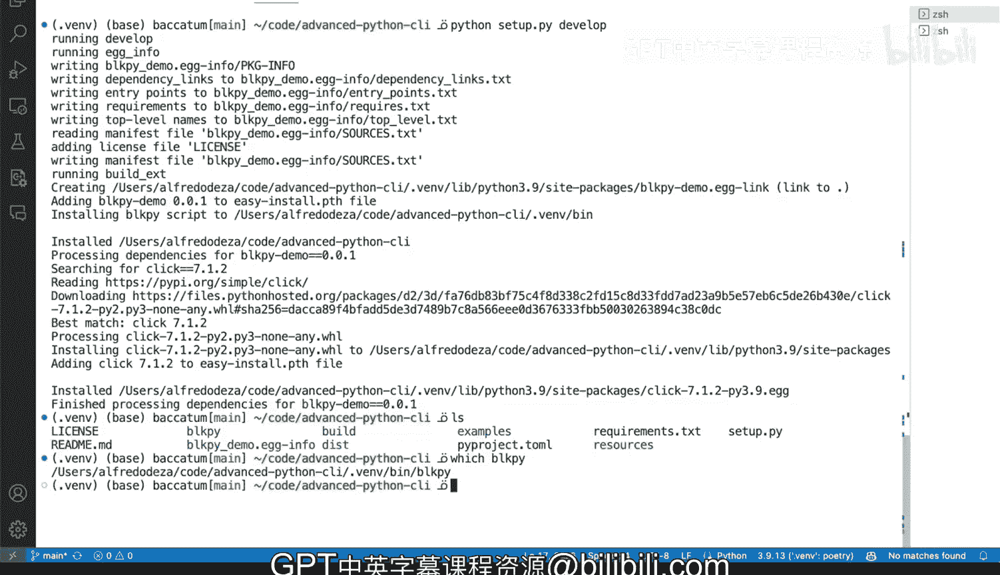

# 杜克大学《Rust编程4-5（Linux命令行工具、LLMOps）｜Rust programming》中英字幕 p35 35_02_03_为Python命令行工具创建包.zh_en -BV1Hy411q7Zm_p35-

Creating a Python package involves Well a little bit beyond the basic structure that we've seen。

 this is our set of the P file， but our structure starts here with our block pie or wrappper in Python for LS block and will have a directory with a D in it and in this case I mean the pie and a utility modules and this is essentially already a package。

 but when people and folks and Python developers often talks about packages。

 they don't necessarily will be describing packages as directories with coding them。

 although that's perfectly correct and definitely something that does happen most of the time packages are talked in the context of packaging themselves and putting things together that will work once you want to release them so that is why。

We have this file over here and the setup uppi file which is what we have here describes accurately one of the things that we want to do now the Python packaging ecosystem has several difficulties and one of those is that it is quite possible that the setup tools team will no longer at some point one to continue supporting these type of interaction which is basically create a set of thepi file that has all of the things needed for these to be packaged there are several alternatives that we we will be looking at later and those alternatives provide some capacity to do several things that I'm going to demonstrate right now so first off I'm going to open up the terminal and as always and we can actually make these go bigger as always the first point to start is we're going to create a virtual environment。

A dot VM is a good convention to have， although you can put it also on your home directory now VS code has detected that and I'm going to select that as my workspace interpreter what that does behind the scenes is that VS code will now understand that like if I open up a new terminal you will see that it activates the virtual environment。

 so there's a difference now you can see that dot VM appears there and here it doesn't in the way to activate it if't if you don't remember well it is dot VM bin activate。

And then VM will appear sorry it will appear right here so why is that important because then we can do Python set of the pie and we can take a look at all of the different options that we have。

 including the commands and for help commands we can actually see some of the things that we have here。

And for H commands， these are the commands that are interesting for extras。

 but we also have building commands， and I'll show you how to create a binary a binary package here with the Python CLI and settle that pie and the way that you create that like the first thing you need to do is to make sure that you have a wheel package。

Python binaries or binary distributions require us to do P install wheel that will install in the virtual environment if you don't have the pipe install wheel。

 then the commands that I'm going to run are not going to work so in order to create and we're going to clear this to all the way to the top in order to create that we're going to go to set that pie and we are going to see if the wheel appears。

So that doesn't appear because well we need these help dash dash commands。嗯。

And then we are going to get that sub right there。 So it's create a will distribution。 Again。

 that's a binary distribution。 so we can do Python。Set up that pie and then we're going to say。

Bist wheel， which basically means a binary distribution wheel。AndThen if we run that。

 it will create that binary， like it will create all of that process。

 and it will definitely put it right there so that we can actually publish it later。

That binary distribution is it's essentially a grouping of all of the files made as a binary。

 so that is how you would go ahead and build that so let's poke around what we have here I'm going go to the file Exper and we will see that build has produced and you will definitely see that you have certain things that look different this MacOS 1011 and arm64。

 The reason why those those tags exist， those portions of that file exist is because I am on an OS 10 I am on an OS 10 machine and it's an arm 64 processor now is why is this useful well because if I want to distribute my tool for a different types of operating systems so that they don't need to install and compile and do anything on Python。

Doest compile or doesn't have a compiler， rather it has a different mechanism to bitete compile files。

But without getting into details like if you have to have certain things that are going to work per this system。

 an operating system and architecture， then you do it you would do it this way。

 so that's definitely one way you can do that and it definitely hinges on the fact that we have to have a working setup of the pie or some other mechanism that for now set the pie works well and a virtual environment allows you to create all of these dependencies and install them and build them。

And one last thing that I want to show you， which I think I've done before。

 is the ability of doing Python setup up the pi develop。

 and this allows us to again make changes to our2 and inspect that change right away because it's going to。

Put a command line tool that is going to be in our path。

 and if we say which block pie it will come from this one。

 which will be ase to our project so that way when we were making changes in a development mode。

 we are seeing those reflected or unless we were installing it and if we were installing it。

 this will be a more permanent solution， which if you're developing。

 you don't want something permanent。 you want something that allows you to make changes and then inspect them later。

