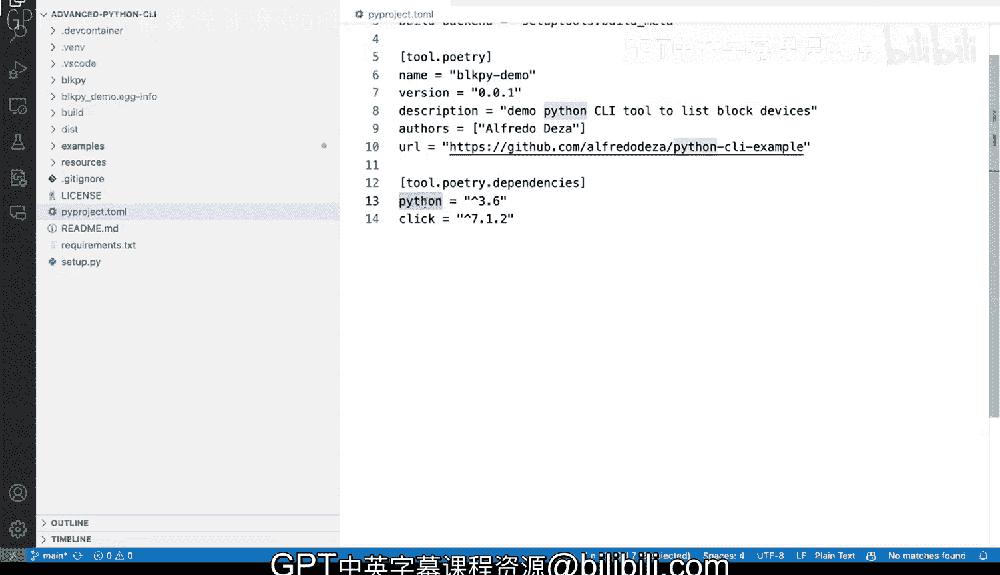

# 杜克大学《Rust编程4-5（Linux命令行工具、LLMOps）｜Rust programming》中英字幕 p36 36_02_04_Python打包替代方案.zh_en -BV1Hy411q7Zm_p36-

All right， so what are some of the alternatives we mentioned that Python packaging is kind of problematic and it has many different things to accomplish the same way of packaging and we fat our binary。

 our will that we've created before。And we do have a set of the Pi that allows us to basically do several different things that we want to at the time of packaging。

 but the new tool that for now is being offered as a potential substitute for set the Pi once it is no longer support it is the build tool so before we do anything we of course we will need to install it and when I say Pep installt build。

 that's the name of the tool and once we do that， we will be able to do things like Python。

Dash and build。 And when I remove the file Explorer。 So we have more room here， Python dash M build。

And with that we can say things like， well， let's take a look at the help menu。

 you definitely have the ability to take a look at what's offered。

 but this is definitely a commandly tool that allows you to build So if we wanted to make to build a wheel we would actually do it with bidest which is the same command as set of tools。

 but with a different tool。 So if we wanted to build a wheel we would have to do Python dashm build and then dash dash wheel。

And that would do something slightly different you see there that is creating a virtual M for us。

 like if we do。If we if we run that， it's creating a VM isolated environment and it's installing the packages there。

 including both setup tools and wheel and it's getting the dependencies and it does everything that is required So before we required to install the wheel package but this doesn't and once it completes。

 it puts everything in the same place you can see there that creating the build on a bid Mac 1011 arm 64 slash wheel。

 which is the subdirecty and then it will put there what we want to half all of our packages and all the things。

 So that is definitely an alternative Now in the past we've also done things like Python setup up pi develop and that's definitely usable and it works。

 but you can do the same thing or an alternative with Python install our Pip install rather dash E。

And if we take a look at the help menu and we look at what dash E does is wow。

 it seems like we found a problem here with Pip help。

Let's let's do dash dash help therefore install and find the dash E flag by ourselves。

 So I think that's going to be the problem with this approach is that。

 of course there is a lot of flags here but there it is is the dash E editable path install a project in editable mode。

 which is the same thing set tools develop mode from a local project path or VcS URL。

 So it allows you to pass in a URL as well。 So we do P install dash。

Dot and that means install an edit package right here。

 it will build dependencies and allow me to do the same thing， have that same behavior from before。

 So those are some alternatives and things that you want to take into account Oh in one last one is the project the Pi project that Tail which allows you to and I'm gonna to click here。

 remove that it allows you to have the same thing as before on a set of the pie but in a configuration file。

 Now the Tail looks。Very similar to a config file。It is actually not unexecutable。

 but if we didn't have a set of the pie， it would still allow us to just have with a T file。

 we have the ability to install those dependencies and make sure that we're good to go including here where we're describing exactly what we need in this case Python。

 we're able to describe what Python version we want to work with and the packages in this case click。

 so not only our libraries， sorry for the scrolling， not only the libraries。

 but also the Python version。

