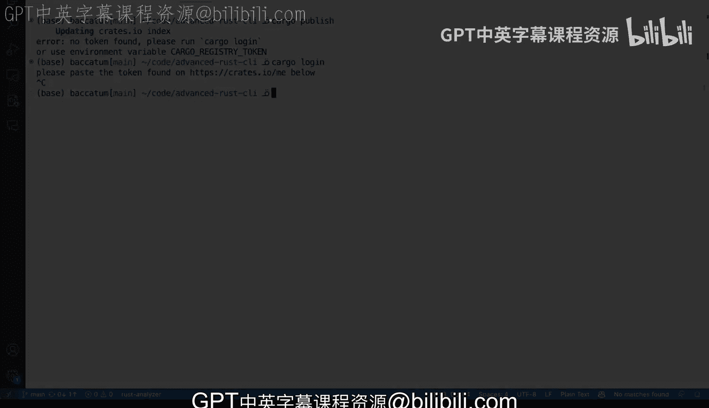

# 杜克大学《Rust编程4-5（Linux命令行工具、LLMOps）｜Rust programming》中英字幕 p37 37_02_05_将Rust应用发布到Crates.io.zh_en -BV1Hy411q7Zm_p37-

Let's go ahead and try to release our command line tool with rust。

 This has many not many but like a few moving parts like this is our rust Ci let's take a quick look at our cargo that Tail unlike other tools in other languages in our processes in our programming languages there's nothing that we really need to do here in our configuration file we still have our dependencies like search Jason and clap and some of the features like the Rfe and N which we've been using and we're actually describing what the version of our block Rs our LS block wrapper tool here So that's all good but we're mostly going to be working in the command line so I'm going to go ahead and remove the Exper and I'm going to make the command line a little bit bigger and this is going to allow us to try。

Work here for all of the things that we're going now have to do。 Now。

 what is it that we're going to use， We're going to use cargo and we're going to do publish and that publish subcom has everything we need to know in order to publish our2。

 and we're going to be using crs that Io and creates that Io is the main website where we're going to be releasing our packages so。

Actually here it doesn't mention grades that I owe but it says a registry now a registry can be something different like you might have like a different destination。

 a different destination for a registry for your package to be published might be useful if you're like in a locked environment I've been working in situations before where packages and libraries would be those would be published on a private registry that was not publicly available it was behind the VPN only in the En。

Environment， so so that's definitely a possibility。

 and you have several several different options like your token and verification and whatnot。

 So before continuing there on the command line let's take a quick a very quick look at crs that I owe So crs that I owe is the website is the community website where all of the packages go has like an outstanding number of downloads and over 100000 crs available。

 so you can see there's there's plenty of libraries here and what you need to do here to get started to use these private or public registry rather is you're gonna be able to log in with Github。

 So if you have a Github account you come in here it will ask me to continue here going through my account with Github and you can see there that my name is now there So if I go there I can see my。

Dashboard and all of my tools and everything thatve that I've done so that is what you need you will be you'll have to go and make sure that your API tokens are there you have to generate one so that when you do cargo logging which we'll see in a second you will be able to authenticate and publish your your tool now you can actually go and put that token in your home directory and use the cargo that cargo slash credentials and put it there or you can also use the environment variable cargo underscore registry token and then be able to to authenticate so that you can publish there your packages so now let's go back to Vicious Studio code to or terminal and I'm going to clear these and I am going to try and do cargo publish and I'm going to use a flag here that will allow me to see。

What happens without actually doing anything， which is the dry run。 So I'm gonna do the dry run。

 things are going to be downloading and you will do perform several different checks to try to upload my tool。

 So not only the checks， but it will also do will package my tool。

 you can see here the version is there and it will compile all of the different dependencies and once it finishes once it finishes。

 it will it will start the uploading process。 Now， the warning is that it's a boarding upload due to the dry run。

 Now， let me show you something interesting right So we have here， we have a readme。

 we have a license， less temporarily move that license。To say something else， I'm going to say。

Bad license。 So let's try again， the dry run。And let's see what happens and you're gonna get a warning So this is something really cool that cargo allows you to have for free without any special configuration。

 it will it will contain checks where you can say hey， like you have some files here。

 there are not committed now this is very good because it allows you to prevent publishing things by mistake and gives you the option as well to continue and publish those even if you have certain things that you're okay with like if you have changes that are not committed like you would pass these flag and everything will be fine now that's fine and then the other thing is that it tells you。

 hey， you don't have a description license file documentation homepage or repository and so if we take a look at what。

We have here we do have our file here like our cardigo the Tamo， but we don't have a license。

 so if we were to say license， I believe license goes here and we say MIT。

 we tried to run this again。We will we will no longer get that warning about a license。

 So description， we could actually add the description。 Let's try to comply with that。

 So description， and this is also very good for us because it allows us to make sure that everything's good so we can say documentation that is usually published on docs that RRS。

 so we can just pretend that docs that RRS has our documentation for block R and then we have to pass in a repository。

 So in this case， it will be on Github and that's my account and this is the advanced rust Ci page。

 So I think that should allow us to get us pretty close。

 Let's see two files in the working directory contain changes。

 Of course I've updated cargo doel and I have a bad license。

 So let's move our bad license back to license and let's see。What happens if we do a dry run。 Well。

 of course， now we have changes in our cargo the Tael。 we can say， we can add those， right。

 We can say get add。Cargo thatil and we can say commit。

 and I'm gonna to say that we've updated missing fields。 and now we can try to run this again。

 cargo published dry run And then again， it try to tries to build everything pretty good and aorts the actual upload over to to crates that Iio。

 But how would that look if we remove the dry run if I remove the dry run。

 And I'm going clear that and make this a little bit bigger。

 I will get a an  error because my token is not found。

 Remember I was showing you the token on the crates that Iio website。 well， that's not there。

 So if we say， you know cargo login。Then I will it will take me。

 it will ask me like this is interactive， it will ask me to go here and then get that token。

 paste it here and continue now I'm not going to do that because I don want to actually publish。

 but that is kind of like the workflow that you would follow in order to publish your package to create that Io。

