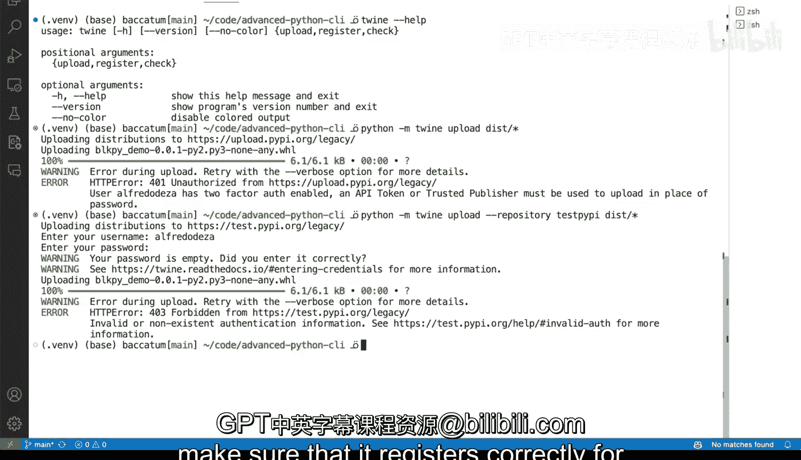

# 杜克大学《Rust编程4-5（Linux命令行工具、LLMOps）｜Rust programming》中英字幕 p38 38_02_08_发布到Python包索引(PyPI).zh_en -BV1Hy411q7Zm_p38-

Once you are ready to publish your tool， you will need to make sure that you have a specific special purpose tool in Python。

To do that a while ago。 and if you run and if you run into articles or older articles or older help menus and and tooling。

 you might see something like Python set of the pie thatll pi upload。And。Well， actually。

 we can actually run this correctly is as this to upload and we will get a4 or3。

 which is basically the way of doing these from before it is now fully 100% deprecated and is's not allowed。

 So and as this stands for source distribution it doesn't matter what you're building it will not it will not allowed。

 This is not correct。 it says symbol or non existing authentication information that is kind of fine it is actually correct that I don't have the right authentication information。

 but it is no longer allowed。 So if even if I was able to properly do this。

 it is deprecated So the way to do this is with twine。 and I'm gonna to clear this output put。

 I'm gonna to say pip install。Twine， and it's going to， I'm already in my virtual environment。

 that's signaled by this right here on my prompt。 So I'm going do pi in twine。

 So once you've once you've installed twine， you can do， let's take a look。Once you install Te。

 this is a help menu will allow you to upload register or check and allows you to publish your repository so you can do it with the Twine CLI or you can do it with PythonM twinwine and you can say upload and there is even a you have the repository part where you can point to a repository。

 but in my case is PpiI is the actual repository and this is the way you would pass it in。

So I'm unauthorized because I haven't logged in and I have two factory enabled， yes， an API。

 token or trusted publisher must be used to upload in place of a password。

So that is correct and you can see here that we were getting a lot of information here as to what's going on so how does that API token work so let's go over to the P website so this is the P that org website and the way will work is you log in you'll have to create an account。

 this is not tied to GiHub like other places like the crates that I owe for Ru projects and you will go to your account settings and inside your account settings and inside of your account settings you will have to scroll all the way until you create your API token you will have to go ahead and do these and once you do once you create an API token you can give it a name select a scope for what is it that you want to do for what packages and that would help you authentic。

correctlyectly for uploading your tool so let's go back to our our project here and what we we will do is like you can actually also do the same thing if you wanted to test it out。

 test out your project for uploading and publishing you could actually use a repository which is a test by P and then we could say this。

That and then it would allow me to go ahead so it would enter my username and my password。

 and this way is a good nice solid way of testing out。

Uploading and basically getting everything ready。 Now this is fine。

 I'm gonna to get a4 or three forbidden because I didn't use my password。

 but you should expect this to work correctly when testing out。

 So this is how you would basically upload the first thing you would need to do for a new package you would need to go ahead and register and the register subcom would be basically the same the same thing。

 it would provide your your credentials and you would build everything and it would make sure that it registers correctly for Ppi or the Python package index。

