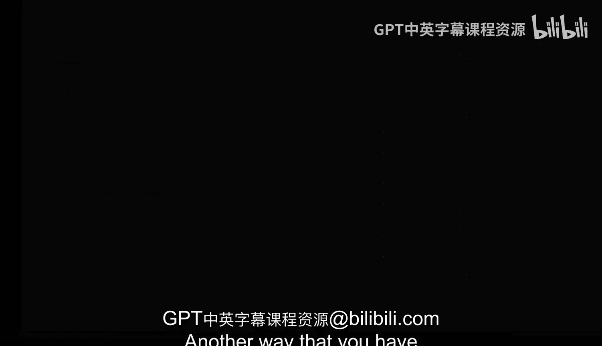
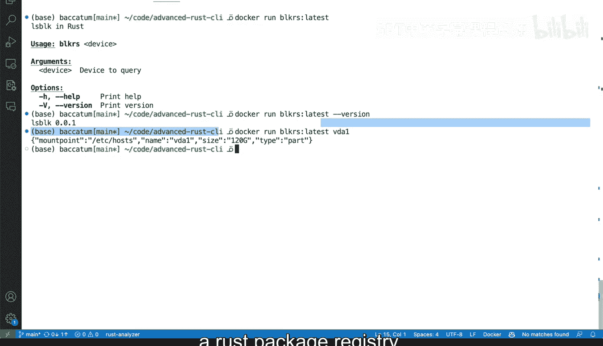

# 杜克大学《Rust编程4-5（Linux命令行工具、LLMOps）｜Rust programming》中英字幕 p39 39_02_09_容器化你的应用.zh_en -BV1Hy411q7Zm_p39-

Another way that you have to package and distribute your tool is using a Docker file and a containerized application and you can definitely containerize your rust Ci and make that container work as a command line tool so let's very quickly take a quick look here at this Docker file which will package everything that we know for this rust application to work this command line tool this block R。

 this L block rust wrapper So first we start by saying we're going to start as the basis from this rustbased image which will have the latest version optionally。

 of course you can specify a distinct tag， which paints it to a specific rust version in this case for simplicity and example which is using latest and then I change the working directory to slash app that means inside the container we'll go to slash app then we'll copy the cargo。

The Tael and the cargo that log files over to the container and that will push it actually inside slash app and we'll start doing the same for all of the other portions so we first start copying the cargoammil and cargo log then we copy the contents like actually everything from source to the source inside the container。

 then we run cargo build dash dash release。 remember dash dash release will' ensure that this is this is a very fast very complete build of our tool so that we can continue moving continue using it and releasing it later on。

 Now it seems that here I have both of these repeat it so let's clean that up and finally we have this entry point which is the path to our tool this allows Docker to say how like if someone wants to run this container。

 what will execute well。Itll execute our block Rs file。

 which will be built after cargo build release on target release block arrest。 And then finally。

 we get a default command。 why is that command useful because if no arguments are passed then we're gonna get a dash help。

 So that's it for the Docker file and now onto the terminal So we're going to toggle the terminal and we're going to do a Docker build。

 I have I have Docker in my system， I'm going to be able to do Docker build and I'm going to pass a tag and I'm going to say I'm going to call this block R and I'm going to say latest latest is a tag block R is a container and the context is going to be dot。

 So this means build what I have here where the Docker file is present。

 this is the tag and you're going to build it and off we go I'm going to run that I'm going to make these slightly bigger and I'm going to wait until that that complete Okay so that completed。

Cl my screen here and we have our Docker image。 So now we can call it and we see what happens block r latest。

 I want to say Docker run block rs latest and see what happens。

 So when we run that we'll get the output of help。 remember we have that command that print the help many well that's what we're gonna get。

 So we can actually passing arguments just as if that Docker image was our Ci tool and we'll gett version and you can see thats that0 that 0。

1。 and then that's fine and we can say Vda1 these version of our tool doesn't have everything that we've changed before。

 but we do get we do get V1 back and that's exactly what we want。

 So there you go this is how you would package everything and then make it a container that can。

Actually work very well and then you can actually put this in a container registry。

 publish it to like Docker Hub or some other internal container registry that you may want and all of it using the Docker tool chain so definitely is something to consider if you want to distribute tool in a different way that doesn't involve a rust package registry。

