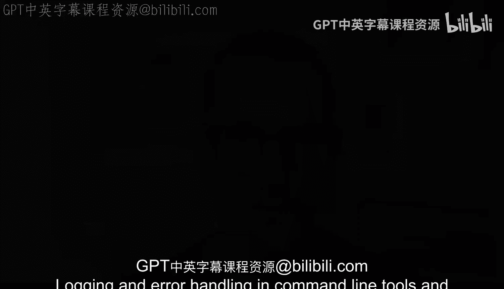

# 杜克大学《Rust编程4-5（Linux命令行工具、LLMOps）｜Rust programming》中英字幕 p40 40_02_01_引言_6.zh_en -BV1Hy411q7Zm_p40-

Logging and error handling in command line tools and in other applications is essential there are some ways that whenever you're new to a programming language you will see well how can I deal with this errors so that it just goes away but something that is very important is to deal with errors and handle those errors gracefully but also have a way that you can take a look at what those errors are if you've ever used the command line tool that said hey I had like an unexpected error and then that's it and that's a message well you know it can be very frustrating to try to make sense like what did I do wrong。

What can I do different and how can I achieve my goal and that is in essence what we're going to take a look at next。

 we're going to not only look at error handling itself。

 but also see how we can use login to help us out and we'll go through the basis of login and how we can implement and add those login statements and configurations to our command tools but then we will see how we can make changes to the login facility in the tools so that we can tweak either the levels or the verbosity and how we can work with that so that our tools can actually be more robust and the other thing I want to mention is that in addition to having login being in the terminal as output we'll see other types of different login as well that you can do and implement and one of those is file login login。

File in the past， I've had to build applications command and tools from the ground app and a good strategy is to keep highly vervoose logging on a file that is away from the user facingcing login that you want to provide so that you can have the ability to have that highly vervo output when you want to debug a problem look into the file which is much。

 much cleaner because it allows you to have the interface on the terminal in a way that is more succinct and allows you to have better better messages there so that is a very solid way to make these tools more robust and it will allow you to take these tools to a much better place。

