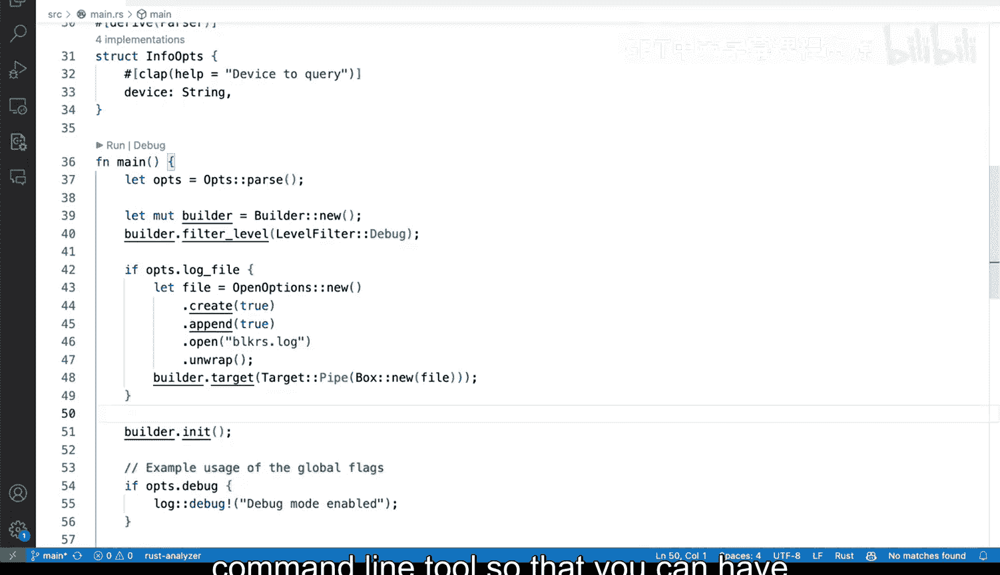
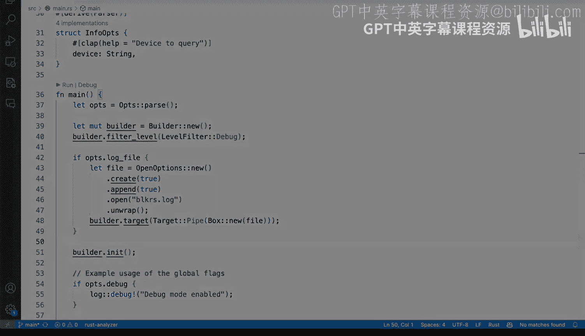

# 杜克大学《Rust编程4-5（Linux命令行工具、LLMOps）｜Rust programming》中英字幕 p43 43_02_04_在Rust中使用不同类型的日志.zh_en -BV1Hy411q7Zm_p43-

There are situations where adding a log file might be useful。

 so let's go ahead and add a an option to enable log creating a log file instead of like by creating by default and that way we can tweak how we how we want to enable that behavior。

 So we're going to say。Clap as a always waste， I'm going to say both short。

Well actually just keep it long so that we don't add confusion here， and'm when I say help enable。

Loin to a file， I mean， let's just make it a boolean instead of like actually taking a value。

 of course you can take a value at some other point in time if you want to tweak what the name is。

 I'm going to say this is going to be a boolean。And I'm going save that。

 So this will basically enable or disable and is by default default is false。

 So this is going to be true if it's being passed and similar to this one right here。 Alright。

 so we have the log file。 What do we have to do next。 Well， we have to。

Go ahead and implement it right here in our main function。 So instead of doing it all the way here。

 just just after before actually the builder that in it。

 we need to start making some changes to how this builder in it is going to be created。

 so let's add a few lines here our level is not going to be affected so let's start saying if opts log file。

And we're going to open the curly brackets。 This is not exactly what we want to do。

 We need to create a file here。 and we' going to say open options。

And open options is going to come from standard the standard library， from the file system modules。

 and I'm going to say open options right there， and we're going to say new and I'll tell you everything that we need to do here so first。

 yes we want to create it， then we want to append to it and then open it and then unwrap。

So instead of like accepting everything that Co is giving me， let's go ahead one by one。

 but I wanted to do one by one， but I guess tap accepts everything we don't want bright。

 We want a pen， so let's get remove that。 A pen is fine。And then let's call it just。Blocks is fine。

 so let's call it block。 that is correct and unwrap。And before we finish。

 we're going to need to say builder。When I target these two。A target， which is going to be a pipe。

 Now， we have the， the target is where the logging is going。 So it could be send rest standard error。

 And in this case， we're going to say it's going to a pipe。 So we're going to say box new file。

And boxing is going to allow us to pass in that option。

 Now we're getting some cur underscores and that is because we need to get these coming from。

We need to define these at the very top。 So actually， when to do this one and open options as well。

 So these two are things that I need to declare all the way at the top。

 And so let's go ahead and do that。 So I'm going to start with end logger here。

 and I'm going to say builder and then target。 and again target is what it will allow you to get that output to either standard L standard error by the fault is standard error or in this case we want to use we want to use definitely a file。

 And then yes， we're going to get open options working。 So good， we have those two defined。

Now let's just review very quickly what we have right here。

 when' gonna scroll the way down and make sure that this is correct。

 So we have if the log file options are correct then build these file and then the target will go to that which is a pipe it will go to that file with box。

 So perfect let's save this and toggle the terminal once again al right so this is the terminal。

 let's do cargo run dash dash and let's see if our new option comes in。

 our new option is right there， log file and log into a file。

 which you know is block arrest that log so first off let's make sure that cargo run dash and then info V1 will still produce the output to the terminal so that's it So now if we enable log file。

 we shouldn't see info。We should just see the output and then we should get a log file so let's see let's actually reset these。

 we don't have a file we don't have a block arrest file so we're going gonna say cargo run dash dash and then log dash file and then info video1 and we no longer we no longer get our debug message there now if we say a less now we get the block arrest the log file right here so if we take a look at what that says we get our info message login is enabled so again this is a very straightforward way of adding logging to tweak login if it goes to a file or if it's going to the terminal in this case standard standard error as it's the default so you can start tweaking and playing around with flags and how this is。

This looks very straightforward now if your main function starts getting wild with lots of different setups。

 you can start extracting all of these setups elsewhere so that it looks much nicer and again you can start adding more log statements as as you build more your command line tool so that you can have more flexibility there in the types of messaging that you want to convey for your user。

