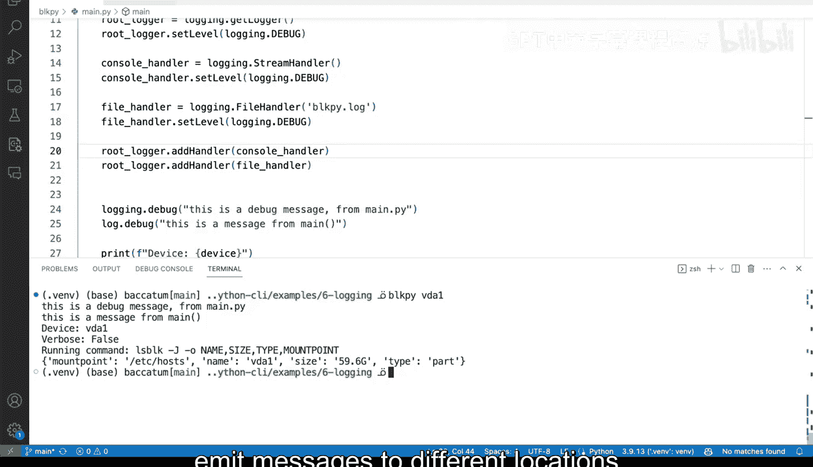

# 杜克大学《Rust编程4-5（Linux命令行工具、LLMOps）｜Rust programming》中英字幕 p44 44_02_05_在Python中使用不同类型的日志.zh_en -BV1Hy411q7Zm_p44-

Although you can keep using basic config as we've done before in Python to add login and continue to configure that what we think what I think that we can do here is instead of doing these and actually let me show you very quickly how that would look you basically youd basically start configuring using basic config again to add a 500 in this case we want to we want to add a file log。

 but I don't want to show you or I don't want to do it that way because basic config has its limitations and I want to do it in a slightly longer way that will allow you to build on later so the first thing we need to do is to add define the root logger remember we've talked about the root logger in Python before and we're going to assign it as a variable so yes。

 this is login that get Logged。

Despite the fault gives you the root logger， the parent logger of all of the loggers and we're going to use these to basically try to set all of the configuration and all of the handlers that we want so I'm going to say root logger and you will see here how this is this is useful I'm going to set the level to log in the debug so all of the loggers are going to have debug by the fault now。

What I can do here is now I can set the console the console handler so when I have one logger and several handlers in the handler。

 we can have the stream handler， which is going to go to the terminal and by default that is going to standard error Now the console handler might still have debug here but it allows you to also say you know I don't want it on debug I want this on info and then you can have a file handler and yes we can actually call it block by that log and we can say file handler set level to log in the debug so we're setting the levels different differently one for the file system and the R01 for the terminal this might be useful if you want to have a debug log file that has tons of information but you want to keep things streamlight for the user and just use info right there in a way that you can tweak it and you can。

Harcode these and make these configurable with flag。 Now we've added。

 Let's take a quick look at what we've done here。 We've added the root logger。' not added。

 but like defined that variable。 We've set the level to log in the debug。

 We've created a console handler， which is not a logger。 It's a handler。

 It's going to handle everything that goes to the terminal。 We've said that to info。

 We've created or defined a file handler， which is going to handle all of the logs that are going to go to a file。

 And we've said that handler to have a log in that debug。 Now， the last piece here。

 is that we need to add these handlers to the root logger。

 And this is why the root logger is going to it needs to be defined。

 Now definitely you can have like custom formatting。 and this is this is perfect。

 If you only want to have something and not something else or extra information。

 I'm not going do anything with formatting yet， but there you can get a hint as to how that would look。

 Now， I'm gonna say root logger。And I'm going to call。Add a handler。

 And I'm going to add the both a console handler， as well as the file handler。

 So these two are going to make sure that everything is configure right and everything will work correctly。

 So let me go to the terminal。And in the terminal I'm going to say blockpi V1。

 and I'm not going to get any messages whatsoever here。

 Why do you think is that Well we have log in the debug here。

 but we set the stream handle to have info， however。

 if I take a look at blockpi that log you will see that we have all of that information already there so all of these messages getting populated actually it can remove blockpi that log。

And clear these， run run block Py Vda1 and take a look at block Python log and you will see that this get populated again。

 So if we change the stream handler to be debug and I save that and I run these I clear and I run this again block P Vda1。

 you will see that now I get my messages， but one thing that you probably catch is that I'm no longer getting those formatted where is it coming from。

 what's the timestamp， that is because we are no longer using basic config and you can 100% be able to configure that later So that is something to take into account and this is how you build on handlers on the root logger from the rulelogger after you add those handlers to the rule logger to produce and emit messages to different locations in the Python application。

