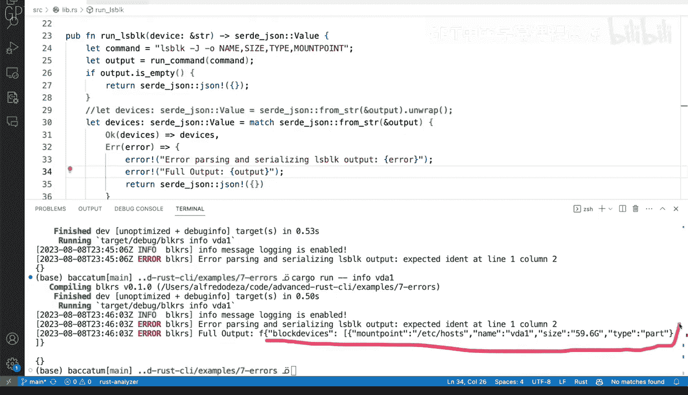
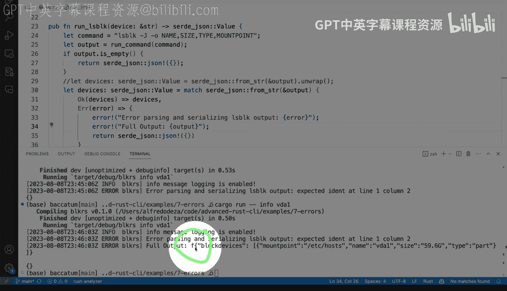
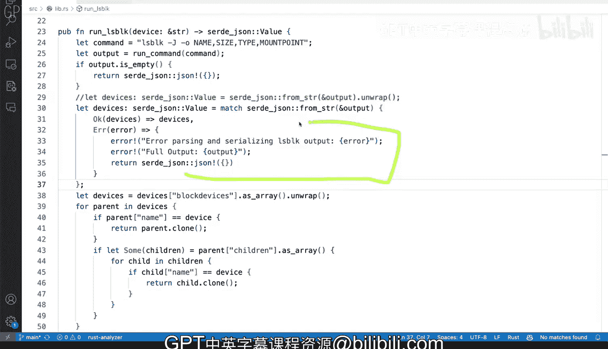

# 杜克大学《Rust编程4-5（Linux命令行工具、LLMOps）｜Rust programming》中英字幕 p45 45_02_06_在Rust中处理错误.zh_en -BV1Hy411q7Zm_p45-

Our tool has now login and flags and all kinds of different good stuff here。

 and we're parsing arguments and it's behaving quite quite well。

 I really like that we've just had a login， but one of the things that we haven't done even though that now we have the ability to log to an actual file right there is the fact that we're not using login to deal with error。

 So that is something that I want to explore right now。

 So I'm going to force and I'm going to show you here on LibarRS which is where we're going to be doing some work。

 I'm going to force a panic。And specifically that's going to happen right here， these Nraps。

 these unrap calls can be wild if you are using them and not necessarily caring about what's going on you might get into trouble。

 so I'm going to force I'm going to force a panic here because I'm going to force L block in my system to cause an error。

 so let's toggle the terminal。And let's see how that let's see how that looks。

 So let me run cargo run dash info VD1 and this should trigger an error so there we go。

 we still have login， you can see that our login is working and we have the info right there but is getting into a panic we're getting this result unrap is causing a problem right there。

 we can see that the value is error expected indent or iddent line 1 column2 so what this basically means and it is a very poor error reporting from Jason that's usually what you get regardless of the programming language is that there's an invalidbal Jason and this is problematic it does happen on line1 and it does happen on column number two Now we don't know what it is if I was a user and I see this I would be very。

Said that I don't think I can figure out what's going on there。

 Now one hint is that we it does point to lid NRS line 28 line 28 and column 68 so let me close this and let's see what we have here So line 28 it is exactly this one which I was telling on you that might be causing the problem maybe like the originating problem comes from this unwrap I know for a fact that the output is invalid balance because I'm forcing behind the scenes I'm forcing that L block to generate that。

The particularities of that doesn't matter it's just that we have an error and we're not dealing with it。

 So how can we how can we go ahead and deal with these and well。We can use we can use login now。

 because this is Lib that S and in main that rest， we've already。

Done the builder and we've set up the whole login， the application understands that this is going to work for all of the other parts and all of the other files and modules for our rest application。

How does this look， well， we need to no longer deal with this and I mean。

 no longer call this andrap right here。And we need to deal with with a possibility of an error So the first I'm going to comment these out so you can see the surgery that we're going to be performing on these files as we move forward right off the bat copities being helpful and giving us almost exactly what we want it is not quite there。

 so the suggestion is to keep typing so I'm going to do devices。

And here third underscore J value means that I'm assigning a type。To the device variable。

And I'm going to say equals and I'm going to say match， third， underscore underscore yasen。

 and I'm going to say from string， and this looks almost correct。

 I'm going to say1 percent output because that's going to get modified。And then。

I am going to open curly brackets。And here I have two options。 So I'm going to say， okay。

 and I'm going to say devices is devices， or actually。Yeah， I think that looks， that looks good。

 I'm still getting a lot of red curly underlines and that's fine because I haven't finished writing what I want is just that the rust check is being so fast that it tells me right away that I'm messing up。

 but like I still have stuff to do here。 So one possibility is that this works。 So if that works。

 then devices， that's what we're going do。 that's fine。 If we get an error。

 So I'm going to say error and then we are going to say we have a couple of things that we want to do first。

 I don't want to use print print line， I want to say the error error macro。

Whi comes from the log error now I haven't said that I want to use use log error。

 we'll have to fix that in a second so that that comes from the log crate。

 So error is a macro from the log crate that is the helper that we're using let's let's address that after we finished we finished fixing this so when I say。

Arero parsing El block output。Actually parsing and how about serializing。

 serializing because we're serializing to to Jason and then we're going to say。

That that is going to be error。 So one way that you can do this is by using curly brackets and passing the variable。

 you can do it that way or you can do it， you can do it this way both both will work but let's try this way which is kind of like a new new way for new way for rust All right。

 so we have that and then we're going to do a semicolon there。

And then the other thing that I want to do and we're going to get the curly red curly because we haven't imported。

 but the other thing that I want to do is。In that case。

 I want to not only do that like compilepiot is suggesting。But I want to return it。

 and the reason I want to return it is because I want to stop。

 I want to stop execution at at this line。 So let me， let me go ahead and do that and say， return。

 Sir， Jason。And an empty and empty object。 All right， so then I'm missing a semi semico here。

 and now the only thing that we have is this error that needs to go away that。That underline。

 and we're going to use， use log。And that's going to be like that。

 let's scroll down and see and check if this is okay。

 so now this is okay and I think we're good to go and we can toggle the terminal again。

 remember we were panicking before so let's see what happens if we run it again Okay so we run this again。

And we get info that we were getting before， but now we're getting an error and what's the error error parsing and serializing LS block output expected I then at line 1 column 2。

 so this is not exactly putting in all of the output that was coming from the LS block output。

We can definitely try let's see we actually have access to that to that output。

 so you can see here that output is right there and then it tries to do the output so we can actually even do more here right so error we can say full output is that。

And do this。 And we can say let's let's try to be useful， right with with with logging。

 we have that capacity of trying to do more。 So let's try to run this again。

And now we get error parsing and serializing L block output expected I then at line 1 co2 full output。

 Do you see do you see that what I added， So I'm forcing that F， which is completely valid。

 of course， this is valid Jason， but that that F right here， this thing right there。

 that is not okay and that's what's causing everything where I'm forcing that behind the scenes in my system I mess messed up my path so that else block would return always the same output。

 So there you go。 that is how you can deal with errors。

 I'm gonna close these with with login so you just make sure that you have you have the logging the log cr。

 and then you can use these  error macros well you can also passing info debug I mean I think this is definitely an error。

 So using error here is the right call。

And returning the empty Jason object is optional。 Of course。

 you could have some other business logic that you want to comply with， but for me。

 for these purposes looks looks fine。 So very straightforward， I'm using match and with match。

 I'm able to say if it's okay， then devices is fine， Otherwise the air should behave this way。

