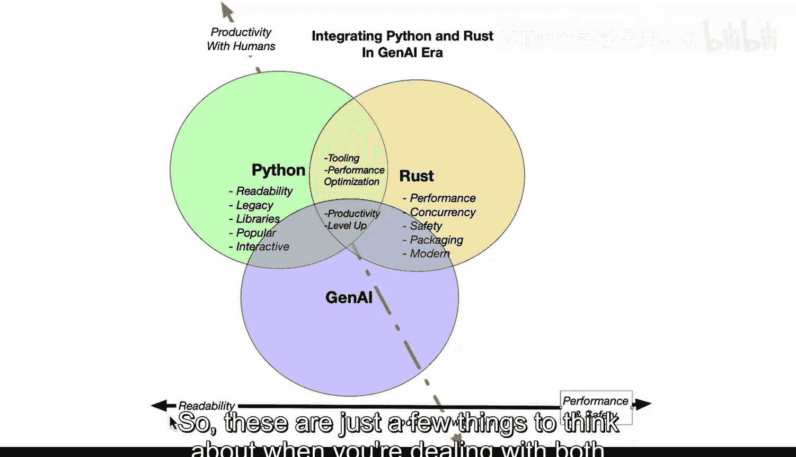

# 杜克大学《Rust编程4-5（Linux命令行工具、LLMOps）｜Rust programming》中英字幕 p47 47_03_01_Rust与Python集成导论：时机与意义.zh_en -BV1Hy411q7Zm_p47-

Integrating Python and rust in the Gen AI era is a very interesting proposition because it takes looking at the strengths of both languages and deciding what are the integration points。

 as well as when is it best to use Python and when is it best to use rust。

 and how does generative AI in particular， enhance both languages。 So first up。

 let's take a look at Python here on the left。 We have readability legacy， you know。

 support libraries。 is's very popular。 It's， in fact， one of the most popular languages in the world。

 and it has a great interactive feedback loop。 So what Python is designed for historically is for the human。

 So Python is very productive for people。 that's why they like it。

 And if you're going to build a web app or Cammelan tool or build some kind of scripts。

 It's hard to be Python for that initial productivity in that feedback loop。On the other hand。

 there are some limitations that rust solves in that rust is a newer language so it has a modern based story for it and it has support for things that are not available in Python Python doesn't have true threads but rust does have true threads and the concurrency techniques in the compiler are also very advanced and that they check for race conditions and other known errors so that you get very robust code and also the performances one of the best languages in the world。

 it has machine level type performance and also has the ability to have low energy and also has a lot of safety features。

 so really rust has this ability to go past the legacy issues that Python has because it was built in a different era where multico systems really were a common occurrence and also safety it become a bigger and bigger issue。

Also， likewise with Python， it's gone through many different iterations of packaging systems there's many competing solutions with rust。

 there's actually one solution which is cargo and it's extremely robust， very simple。

 So there's some pros and costs of both languages so the intersection here is where we see people doing things with tooling with performance optimization。

 a good example is if you were using a Linting tool that was pure Python。

 the performance is just very slow but you could rewrite that lynting tool like in the case of rough where the performance could be10 times or better。

 and on a large code base， this could be substantial in terms of performance Also if you had something that was a inference server or a web server or some kind of server of any kind you really don't want to write that on Python so people will wrap something that you do in rust with Python。

And you have the ability to do both now。The， the curve ball here is generative AI in that。

It is really going to enhance the core features of both of the languages because of the fact that it can be up to 80% of the code that you write。

 So again Python is designed for humans so the productivity with humans is very high。

 but in the terms of rust， which is also has a pretty good story for being productive but it is able to work at a lower level。

 you can see that generative AI has in many cases a stronger impact on the rust performance and the Python performance because of the fact that the rust language is closer to performance level type of code and so generative AI is very good combination with rust because the compiler will catch many of the issues that are hallucination issues with generative AI Python doesn't have the concept of a compiler doesn't have the concept of runtime error checking or safety features built into it。

It's not designed for that。 It's designed for productivity with humans。

 So with the new era of generative AI， I think what we're seeing is that it actually is a very good fit for building out rust code because rust itself is so robust against error。

 So we can see here on the left。 we have the readability。

 which is the productivity with generative AI put on the right， we have performance and safety here。

 And so the intersection。showshows that we have a slight tilt here towards if you are going to be using generative AI to write code。

 and I believe most people are， there starts to become a more compelling story for using more rust in your code base。

 So these are just a few things to think about when you're dealing with both Python rust and the integration of them in the generative AI era。

