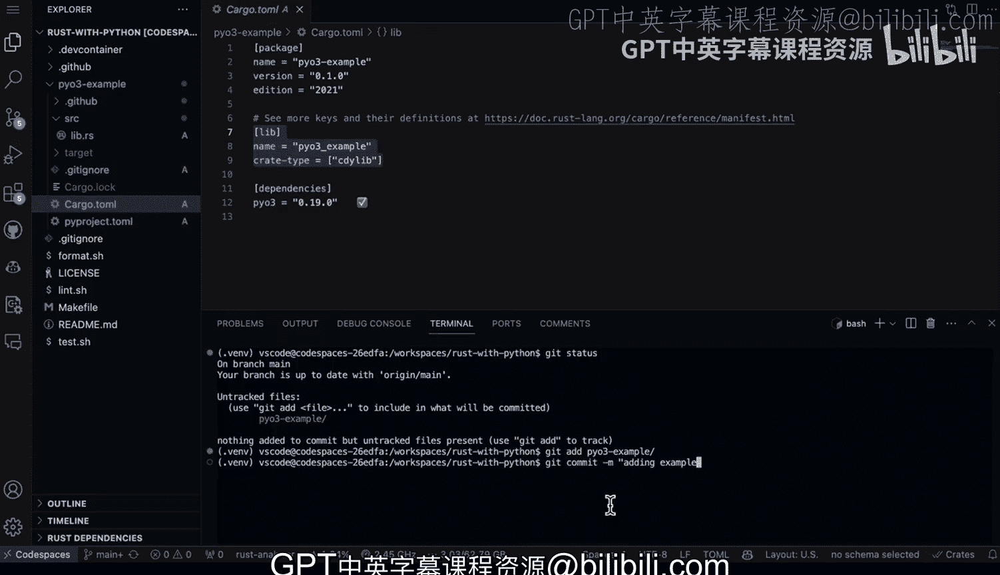

# 杜克大学《Rust编程4-5（Linux命令行工具、LLMOps）｜Rust programming》中英字幕 p48 48_03_02_PyO3入门：安装与配置.zh_en -BV1Hy411q7Zm_p48-

Here we have Po3 user guide with a Po3 user guide。 you can see that there's a rust tool chain。

 a Python environment and then a way to build。 So first up here， you need to make sure you have rust。

 you need to have Python and you also need to have some sort of virtual environment。

 So let's go ahead and get that all set up here。 So first up here。

 let's just make sure that I have Python There we go we see I have Python 3 great Also let's make sure we have rust and we can see that we can do dash version。

If you go to the rust up web page， if you don't have rust， you can actually install rest。

 So all right， now we can go ahead and create a virtual environment。

 So we'll go ahead and say Python 3 M V E and V Tilde V E And V。

 So this is one of the little hacks I like to do is put the virtual environment in a home directory that way it's kind of easy to remember。

 in this case， I actually don't have it。 She'll have to install it， which is not a big deal。

 There we go。There we go。 And then it's pretty easy to actually source this。

 I can just say source tilde dot V E and V then activate。 And if you want to be really lazy。

 you could actually put that in your bash orRC so you always source this virtual environment anytime you code。

 which can be a helpful thing to do depending on what it is you're doing Now the other thing we're going to need to do here is we're going to need to do a Pip install of the mature。

 So we'll type in M A T U R I in。And that will actually go ahead and put that package into the virtual environment。

And then we'll also need to now create a new project。 So let's go ahead and make a new project。

 We'll follow the tutorial here and say pi03 example， and this will create a directory right inside。

 and I'll go ahead and see the into there。 Now， once I'm inside of here， I can type in matin。And it。

We're actually going to do the PO 3 here。 we're going to use the default setup。Great。

 now we've got that set up。 the next thing that we can do is actually build out something。

 So all we need to do is check out the source code right here and we see that we've got a Lib do Rs。

 and what's kind of cool about this is you can see the structure of a basic project。

 And then I have a function here that goes inside and then here's the Python module that's implemented in rust and you can see here that I've got this Python module that's integrated in R。

 So we've got basically everything all set up here to have a bridge from Python to rust。

 And then if we go to the cargo file you can see what it's set up is it installs Pio3 and it also allows the library to be set up here as well。

 really， the only other thing we need to do here is actually get this thing to run。

 And so in order to do that， we just go through here and we say maten。

And that's going to go ahead and compile the project。Perfect。And then we just type in Python。

And now we can just type in import example。Perfect， and then we can type in pi。

03 example dot sum S string and something together。There we go。

 We're able to actually use Python code from rust， which gives us some great performance enhancement。

 So pretty straightforward， actually， to get started with the Pio3 bridge here。

 And I'm going to go ahead and check this in。 And that will be the last thing that I need to do。

 So we'll go ahead and say get status。😊，And there's a gi addd here， by3 example。

 and we'll go ahead and commit this。Adding example。

