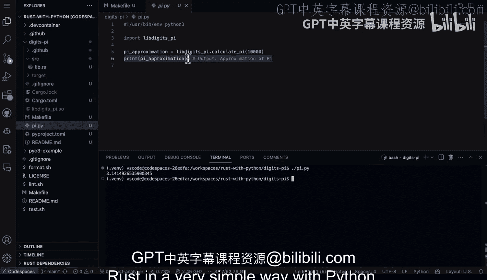

# 杜克大学《Rust编程4-5（Linux命令行工具、LLMOps）｜Rust programming》中英字幕 p49 49_03_03_使用PyO3创建基础Rust库.zh_en -BV1Hy411q7Zm_p49-

Here we have a project that mixes Python and rust。 I'm using P03 here And the basic structure is that you have a source that's created here automatically when you do in an it。

 and it creates a library file for you。 So it's really set up for you to build something in rust and then exporting that into Python。

 So let's go ahead and first take a look at the function here。

 So why would we want to do something like this。 if you needed to build some really computational expensive or maybe memory expensive code。

 this would be a great way to do it is to build it in rust and export it into Python。

 we can see here that we're using p function， And then there's a rust function using fn and calculate a pi。

 So what happens here is you can pass in how many digits of pi you want。

 And it shows you that it returns back a pi result F 64。 So we say let mute pi。 So there's a。

Meetable variable defined。 And then basically for every one of the iterations。

 So essentially the count of iterations that you need。

 let's go ahead and do the formula here to calculate pi。 Finally， pi is actually returned。 Now。

 if we look at a Python module implemented in rust Next， This is where the pi module comes in。

 and you can see here that Lib digigit do pi is going to be the name of the shared object file that will be created。

 And this is something that will need to be placed near the Python file。

 unless you want it to do some kind of fancy environmental things so that I can actually use it and import it in a script。

 And then finally， we just say， look， let's go ahead and wrap this function together。

 the 1 I defined earlier。 and actually make this into a shared object module。

That's really all we need to do。 It's also good to just pay attention to look at the cargo file。

 This is where all of the key definitions are in the project。 like， for example。

 if there was some kind of third party dependency。 But here we go。 we've got everything。

Inside of this directory here。 So what I've done to make things a little bit easier is I created a make file。

 And I like to use make files because a lot of times I have multiple steps together and it makes it really simple。

 So all we need to do to run this is we need to say make build。 Now。

 if you already had the project build here。 It's not a bad idea to actually go through here and say make clean。

 So we'll go ahead and say make clean。 perfect。 And notice how that actually removed that shared object file。

 typicallyy not a great idea to check that into your source control either。

 So that's often a good way to clean it up and maybe even in your get ignore to actually add ignore for the dot S file。

 But first， let's clean it up。 great。 now， I'm going to go ahead and say make build。😊。

Perfect and now it went through and it build it， builds this directly in this project directory。

 and I have a dataso file here， right， so that's the Lib digits pi dota。 So finally。

 the only other thing I need to do is somehow call it from Python。

 Now I could open up an interpreter or in this particular scenario。

 I'm going to write a small little Python script And what I like to do when I'm writing a small little Python script is do chamod。

Plus X， the name of the script， in this case， this would be pid up P Y。 And that makes it executable。

 So then it'll look at this line here， which is called the shebang line。 And this says， look。

Go ahead and launch this in Python now all I need to do to launch it on Python is just do dot slash so that way you don't have to do as much work or even call out a specific Python interpreter。

 you just do dot slash Pi。 P Finally I import the file which is going be lib digits underscore pi so it's going import this Sso file here and then I go ahead and I calculate to this approximation and then finally here's my final result here so let's go ahead and run this there we go we can see3 do14149 etctera。

 etc ce right so this is a great way to build again computationally or memory intensive code mix it into a Python script here and again as long as it's in the same directory here and however you wanted to package this app maybe with Docker etc you're able to actually leverage the power of rust。

In a very simple way with Python。

