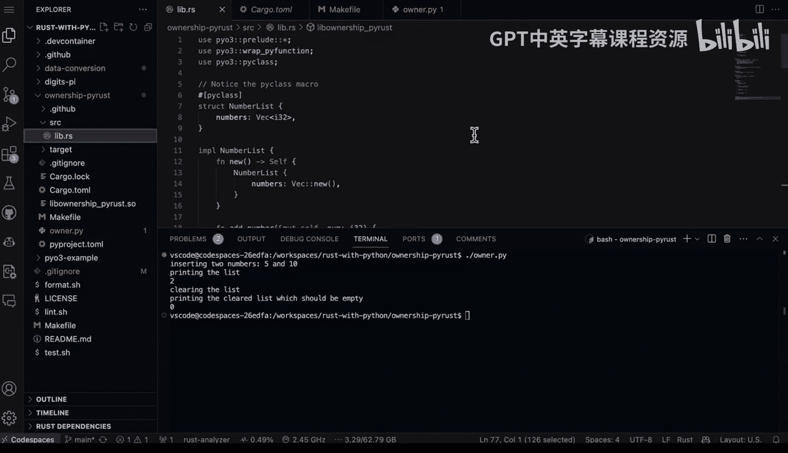

# 杜克大学《Rust编程4-5（Linux命令行工具、LLMOps）｜Rust programming》中英字幕 p51 51_03_05_理解PyO3中的Rust所有权模型.zh_en -BV1Hy411q7Zm_p51-

Yeah。

Rust has a unique way of dealing with ownership。 And in this example。

 I'm going to show how to mix the rust ownership model alongside Python using P03。 So first。

 let's take a look at the structure here， we have this ownership P rust project。

 And if we go into the source director inside of Lib do Rs。

 You can see that we have some code here that goes through and integrates a example of how to use the ownership properties in Python。

 So first up here， we have the P class macro。 So this is a struct that actually includes a Vec 32 numbers。

 We then implement that by allowing that number list implementation which then includes an add number method and also a L method and also a clear method。

Right here。 Now notice in rust here， you're explicitly allowing things to be mutable。

 and this is one of the features of rust that's not available in Python， Python。

 Everything is essentially mutable but in rust， it's explicit that you say that something is mutable。

 Now when we get down to the module here。 What happens is that we have a function called rust list。

 and this goes through and it takes in all of the different properties of these operations and rust。

 So this is essentially exposing parts of rust in Python including ways to operate on those data structures in Python。

 And then finally we have the p function here， which adds numbers together， it accepts a list。

 and then from this component here we have the list add numbers and then we also have the p function as well L and then we have the py function clear right here and then。

Finally， we put it all together with pi methods， and we implement the numbers list and we say new object。

Function add。Function link。And then clear list。 And then finally。

 we can put it all together into a module。 And so this is the classic way to do this with Pio3 is to allow someone to use this functionality by exposing it as a module that you can import inside of a Python script or inside the terminal。

 Now that we've got this the next step here is to take a look at the cargo2 Ml to just get a feel for what this looks like。

 you can see that this library is called ownership Py rustt。 Now， if we go to the make file。

You can see here that I have a build step。And this says cargo build release and this will copy that data so into the current working directory so that I can use it in my script。

 Next step， we have owner do py as well。 So this is importing the ownership module here and notice what I do。

 So first step， I say let's go ahead and make an instance of this and we have list instance。

 Then I insert two numbers inside right because this is one of the things that we're exposing as we're exposing the ability to do mutation of the data structure in rust in Python。

 So we say list instance add list instance add So we add to inside we then use that custom method that was exposed here。

 which is the length and we show that there are two items inside finally， we then clear it。

And then we verify that， in fact， that instance is cleared。 So we're able to essentially。

Do core operations。 And this would be like an integration test of potentially a library that that you would write and expose for Python。

 So let's go ahead and run this so we can type in Python owner do P dot py。 That's one way to do it。

 or we can also do a dot slash。 Now I need to change into that directory。

 So let's go in and change to ownership And again， you can just type in owner Py。

And we can see here that it runs inserting into two numbers。

5 and10 printing the list to clearing the list， so this really does show how it's very straightforward to take some of the strong functionality of rust。

 which is that is built for safety and immutability and actually expose those features inside a Python by having strict control over how that's exposed in a Python script so this could be valuable for maybe security features that you're building in a particular library or some other aspect of it where you want to expose those features into a script and this integration is a very straightforward way to test it out。

