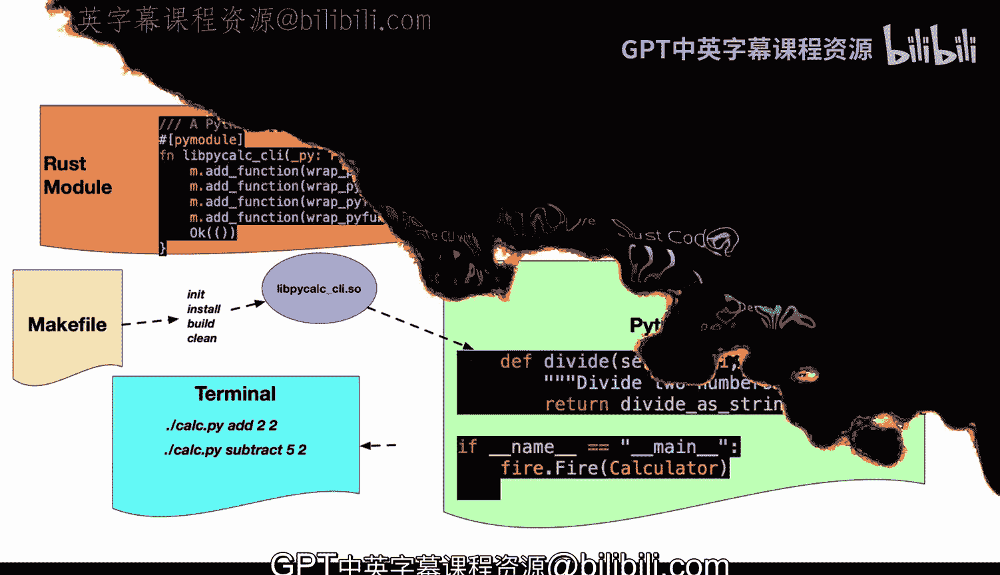
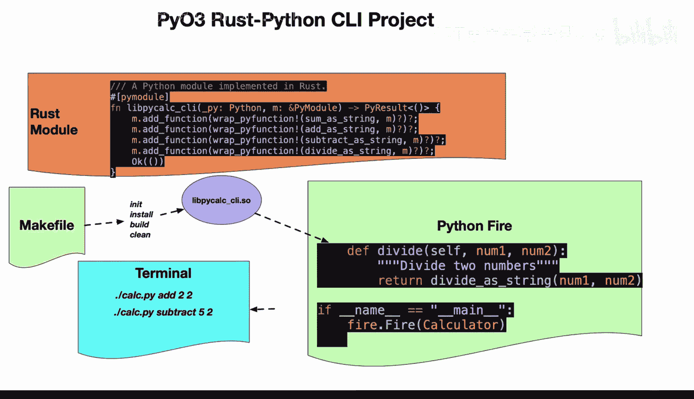
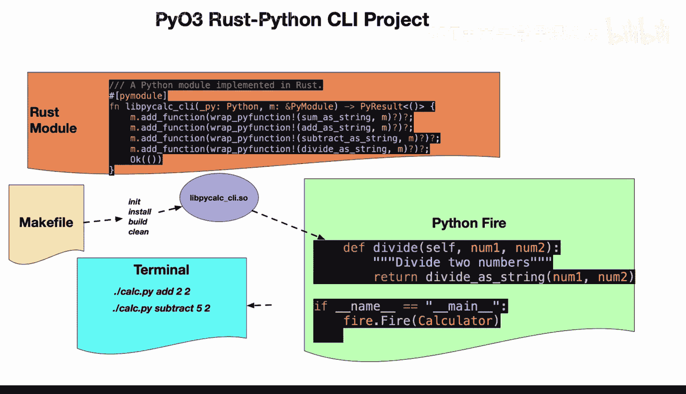

# 杜克大学《Rust编程4-5（Linux命令行工具、LLMOps）｜Rust programming》中英字幕 p53 53_03_10_使用Python Fire和Rust编写计算器CLI.zh_en -BV1Hy411q7Zm_p53-

Here's a P03 rust Python Ci project that shows the diagram of how this would work in the real world。

 First up， you would build the parts that you need to build in rust。 In this case。

 it could be the computation。 So this could be anything from using thirdpart libraries or doing ML ops code or doing some kind of custom algorithm that would be really efficient in rust。

 And then in this section here， you would put that into the ad function and wrap those all inside。

 So once you've got that I like to have a make file here that builds out the So into the correct directory and then one of my recommended best practices would be to use a library like Python Fire to just wrap it up。

 So you have to write really almost nothing to get your code working And then you can use that rust code from the terminal。

 So you're really combining the best of both Python and rust。 So okay that's enough theory。

 Let's get into the demo。

Now， if we get into this example here， we see here the pcalc Ci。

 the first step thing that we want to look at is the source。 So if I go to lib here。

 what I've got here is a calculator function。 So I first use pio3 and then I wrap up a bunch of rust code。

 So this is just a traditional rust function， but I put this on top pi function so that it's able to be used by piio3。

 notice I do the same thing for add string， same thing subtract string divide S string and then finally this is the part where you expose it in the dotsoo when I build it。

 Now let's go ahead and look at the make file。 If I go to the make file here。

 What I do here as I say build and what's nice about this is that these are really cumbersome commands。

 and I don't have to remember them。 I just type make build So I say cargo build release next up。

 I do C target release Lib pcalal underscore。I do and then I copy that into my current working directory Once I've got all that set up。

 the only other thing I need to do is go over to the Cal directory， which is right here。

And I need to actually use the Python Fire library。 Now。

 let's go ahead and take a look at the requirements。

 You can see here I've pinned it to Python Fire version 0。 50。 Always a good idea to pin it。

 So you know you're gonna to create reproducible examples if we go back to the cal here。

 I then import those rust functions inside of here。 So this is really straightforward to do。

 It's like any other regular python import。 And then finally what I do is I leverage the power of the Python fire Cli library。

 which really is a sophisticated library because all I need to do is create a class here called calculator。

 and then I use those rust functions as methods inside of this calculator。

 So I create a nice abstracts in here。 So I say add subtract multii divide and then the beautiful thing is that once I've put this into fire fire。

 the calculator is exposed via the term。So I think this is really a sweet spot for rust Python integration and you can see here I've used it。

 but let's go ahead and do it again just for fun， there we go CalC add2 and 2。

 and then we do a subtract here， for example， five and2。Really， if we go back here to。

The diagram， and we take a look at， you know what's happening。 This is。

 I think one of the more sophisticated ways to integrate rust in Python is to leverage what rust is good at。

 computation， energy efficiency， safety and leverage what Python is good at。

 which is building nice abstractions。 and by combining those two together I think we're going to see many emerging data engineering and MLOps workflows。

