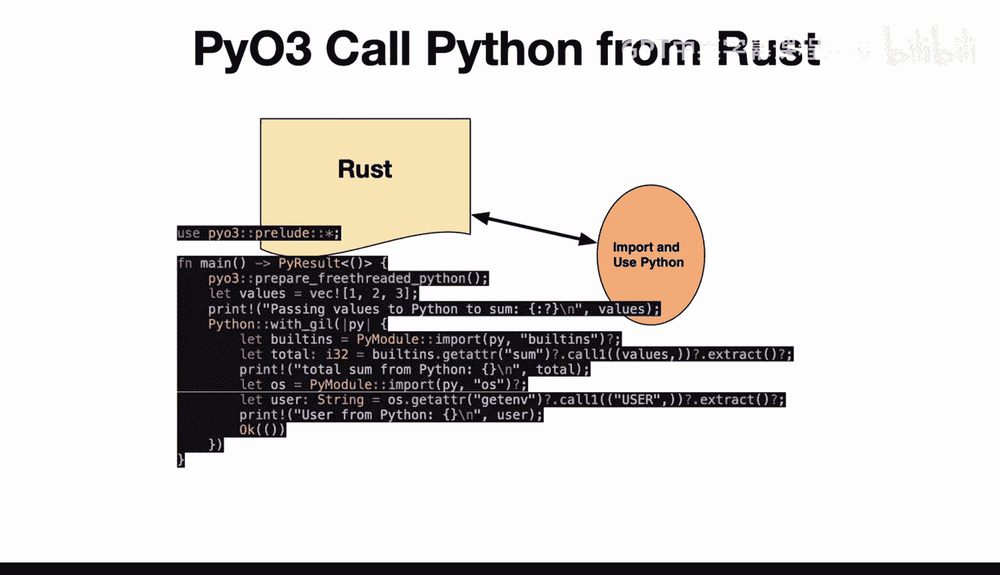
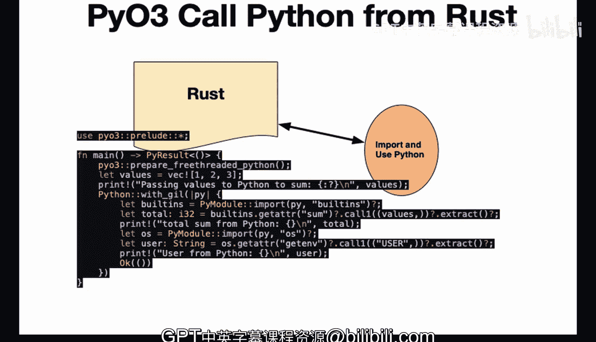

# 杜克大学《Rust编程4-5（Linux命令行工具、LLMOps）｜Rust programming》中英字幕 p56 56_03_03_从Rust调用Python.zh_en -BV1Hy411q7Zm_p56-

One of the more interesting ways to use the rust in Python bridge Py03 is to actually import Python inside of rust project and use whatever libraries you need to use directly in rust So you get the leverage of the rust ecosystem。

 the great packaging， the great kullan tool story， safety performance。

 but you also get to use the Python code that maybe has some logic that you need。

 So let's take a look here at how you do this like highle you use Pyo3。

 you go through and prepare free3 of the Python and then walk through the code step by step。

 So what we can do here is actually dive into the project and you can see here the structure I have P call and also have a main doRS。

 So in this particular project， very tiny amount of code here and in terms of the import。

 I have a Po3 imported right here in the project。 if we take a look here at the code itself。

First step， we have under P03 here， Prelude。 This is going to use the Po3 library to interact with the Python interpreter。

 And this line is going to import all of the modules that you need。

 The main function in rust is going to be the thing that's necessary to run a rust a script in general。

You need to actually run things with the main in rust and then the pi result here is basically the result that's actually returned here。

 And then this is the line that actually lets us use Python so we prepare free threadreaded Python so we're essentially going to release the gill and then we set up some values so I first go through here and I create a vector which is like a Python list and then I print a message that says we're going to pass these values to Python to sum Next up here we have Python with gill。

And then under this， we have builtin， so these builtins are going to be what's you know generally available from Python。

 So they have lots of builtin functions。 In this case。

 we're going to use the sum and we're going to actually pass those values in that were defined earlier and then use Python sum to actually do a sum and then we go through and we print this out Now next up the other thing we can do that's pretty fun is that if there's any builtin libraries inside of Python。

 the standard library is pretty big， you can actually just say import and then the name of the library。

In this case， we're going to use the OS module， which has really a ton of different features that have been developed for decades。

 In this case， we're going to use the get E V user。

 So we're going to look at this user value right here。

 So essentially this is going to tell us who's logged into the machine as and who's actually running this particular program。

 which is actually very useful。 And I don't have to write anything myself。

 I just go ahead and use Python And then finally we go ahead and print out who that user is。

 So to run it also mention a few things here first up。Whenever I'm doing something with rust。

 I like to actually go through and create the different steps inside of a make file。

 So here we have the build process。 If I needed to build a release。 I have the li。

 which always is a good idea to lynch your code。 So I just say make L， oh， we have some issues here。

Where maybe we would need to fix those for a production system。 In fact。

 we see that really the main issue that they' they're describing here is that instead of doing print with the exclamation point。

 they'd actually like it。 if I did print L in。 So let's go ahead and fix that。

 Let's go ahead and fix the Li， which is a good best practice here。

 never let your code have a you know essentially a li that's not passing。 So we'll go L in。

And then we'll do the exclamation point， same thing。 We'll go print L N and then go through here。

 print L N。 Great。 Now， if I go ahead and I say make L。We've been able to actually make it pass。

 So this is really critical because when you're working with rust。

 it's such a safe language that it's a good idea to not only let it compile。

 but also make sure that the limb passes and again。

 I make it easy because of the make file also it's important to format your code。

 So if we go through here and we go ahead and say you know make format。

 it's also a good idea to just make sure that it's formatted correctly， for example。

 if I added a bunch of spaces here。And we said。Maybe added a bunch of spaces here。

 and then I say make format， this should format it for me。There we go。

 So there's actually set up the way that I want。 Now。

 the other thing to be aware of as well is that we also could either run cargo run or do make run。

 It's essentially the same thing。 So we'll just go ahead and say cargo run。

It goes through it compiles it and then we can see here that in fact。

 we have passing values to Python to sum。 We're going pass in that vector。

 and we go through here and we do the sum， which is6。

 And then finally because I'm using Github codespaces。

 it finds out that I'm actually using a user called VS code。

 which is actually pretty useful because sometimes you're not aware that you're using a particular user and I'm actually showing that Python is using this user。

 So very useful and actually extremely short example here to call rust from Python and in this particular example here we've been able to really get everything working in a very simple way。

 and you can see here that calling Python and rust together is a very straightforward forward thing to do when you're actually building out a integration。

