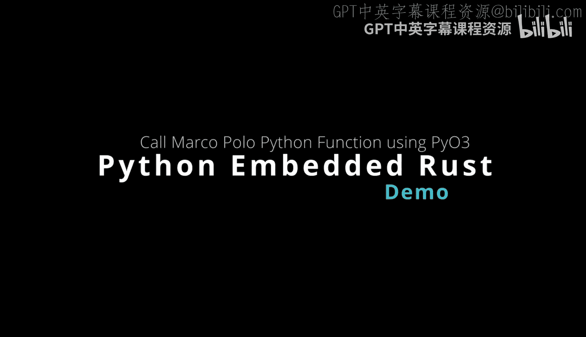
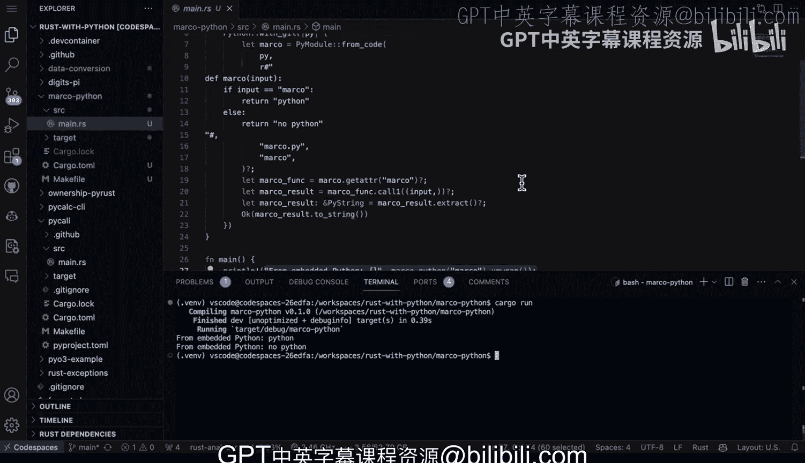

# 杜克大学《Rust编程4-5（Linux命令行工具、LLMOps）｜Rust programming》中英字幕 p57 57_03_04_在Rust中嵌入Python.zh_en -BV1Hy411q7Zm_p57-

Pyio3 also can use embedded Python from rust。 And this is very powerful because if you already have scripts。

 for example， or library code in Python， or maybe you have some little bits of algorithms or custom logic。

 business logic。 and you want to use it within the confines of rust， do command line tools。

 microservices， serverless functions。 a great way to think about this would be to put that piece of Python as a full script。

 Maybe it's already tested。 you're really confident about the ability of this Python code。

 and leverage the rust ecosystem。 So you can see here pretty straightforward， build out a function。

 use this Pyo3， Pre free threaded Python， use Python with the gill。

 So you release the gill and then put your code inside。 Now。

 what's interesting as well is that Pyo3 can interact with functions and even call them and send input。

 which is pretty exciting。 So let's go ahead and take a look at。😊。

How that would work。 All right， here we have a layout for Marco Python。

 This is the embedded Python script and if we take a look at what's the structure first up。

 we have a main dos here。 This is where I have all the heavy lifting I also have a cargo2Ml file notice I've used po3 is a dependency and pinned it this is nothing fancy。

 there's no extra tools you just get these kind of dependency management ecosystems inside of cargo do2ml and then I have a make file。

 which I believe is a great feature of know working with rust is you can put make commands and and I actually use these commands quite frequently build linked format run so that I can have this robust feedback loop and leverage how strict a language like rust is which is in my opinion。

 one of the best fits for generative AI So once we have this ecosystem here a lot of times you'll you'll see me doing you make format after I get a suggestion。

From generative AI where I'll go make L to make sure that my code is able to pass L。

 then I'll do the cargo run。 So now that I have that feedback loop down。

 what I'll do next is explain the code。 So first up we have the types that I'm going to use so I have po3 types pi string we also have the pyo3 prelude and p module。

 This is the ecosystem I'm going to use from Pyo3。 and then this is I would say kind of a common stanza that you would include if you're going to build something that has embedded Python is first you define a function in this case notice that I'm going actually call that python from another function。

 So I want to actually pass in a string here。 and then I'm going to return back a p result。

 And then this is really kind of boiler play code here。

 but basically you say prepare free threadreaded python so basically you're releasing the gill so you can run multithreaded code if you needed to。

And then from here we say Marco。 So I say p module from code。

 and then I just put in a snippet of Python code here。 Now notice what it does is I say input。

 in this case， this would be the string that gets passed in and I say if it matches Marco then return back Python otherwise return back no Python。

 So this is something I do a lot just to kind of test out code or whatever it is I'm going to do Now what we do as well from rust is we say。

 look， let's get the attribute Marco， which is the name of the function and actually now let's essentially eval this so that I can actually execute it。

 and I'll put in the input that's come through here and then I'll extract that input and then I'll return that back to rust now to call it。

 it's only a couple lines of code， I just call the main function here and rust and I say from embedded Python let's go ahead and try the word Marco。

 which we know will return back Python and if we put Pollo will know it'll return back no。

So how do we run this pretty easy， let's just go ahead and do Carval run。

And you can see here we've got it working。 So actually very powerful workflow for Python developers is to maybe even get started with Ru this way is to take your existing code。

 put it inside of rust and use the makefi system along with thelin and the formatter to really leverage how powerful rust is in terms of strictness。

 You really want strictness in a generative AI world。

 And that's why I think mixing Python in an embedded way with rust is a new technique that many Python developers should look at。

😊。

