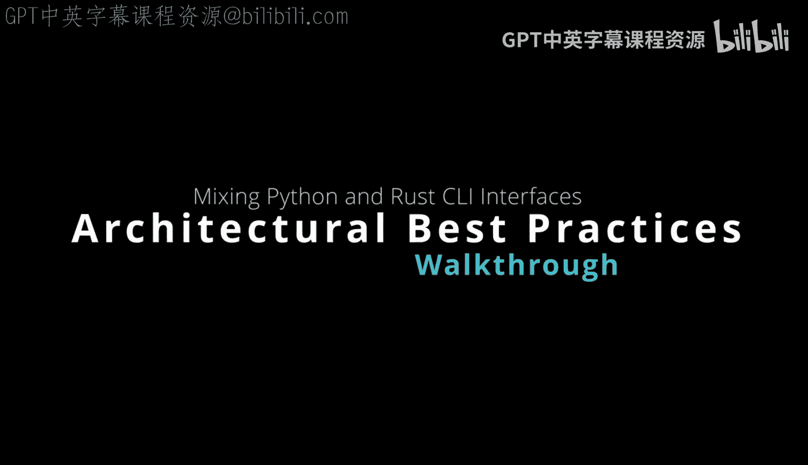

# 杜克大学《Rust编程4-5（Linux命令行工具、LLMOps）｜Rust programming》中英字幕 p58 58_03_05_基于Clap的嵌入式Python Rust CLI架构图解.zh_en -BV1Hy411q7Zm_p58-

Okay。Here we have a po3 embedded Python CI tool here that uses rust as the main framework to invoke Python。

 and you can see here that I have an embedded python function that takes an input。

 a very simple input that if the string matches Marco returns back Python。 if it doesn't。

 it returns back no Python。 So it's pretty simple bit of code here， but it's wrapped up with p03。

 So that part is， in some ways， the straightforward part。

 But the next question that many people that are working in production environmentments may want to think about is one of the next steps that make this a realw production tool。

 So the next step in my opinion， for most interfaces is to start with a commandan interface。

 and with the rust language there are many excellent command line tool frameworks。 In fact。

 they allow you to do a very sophisticated things like binary deploy。

 which is one of my favorite ways to deploy a。Since you don't have to tell anybody about how to package the tool you just give them a binary and it allows you to execute so this really in a sense。

 takes over some of the limitations of Python which is limited in the sense that it cannot do binary deploy it's a scripting language that requires an interpreter so in this scenario here if I wrapped it up using a CLI framework。

 for example， I use clLap。What happens is that I can actually pass in the input when I'm doing it in an interactive manner here and pass in the word Marco。

 What's nice then is that I can actually get this feedback loop。

 and this is a great way to develop since I'm leveraging the power of the cargo system with rust。

 which is really one of the strengths of the language packaging and it takes over some of the weaknesses of Python。

 which there are many competing packaging solutions。

 Now the next step after getting the CI interface， would be also to think about what about testing your application。

 So is's very typical to have some form of testing both functional and also unit level testing。

 this is a good idea so that you can actually ensure that the business logic is appropriate。

 So even if rust itself has amazing attributes of safety。

 you also want to make sure that the business logic is correct。

 And that's why a functional test for a CI tool is often a very good idea。😊。

Also though once you've got those tests set up， you want to do this in an automated fashion so that every time you make a change。

 it tries to compile Ly format and if all those passed。

 then you could create the deliverable and that would be the continuous delivery aspect of it and the deliverable could be a binary artifact that you give to other people。

 So this workflow I think is one of the more I would say recommended workflows for mixing Python and rust is to quickly put it into a CLI test it out。

 then go ahead and write a test and then finally automate the testing so that you can give an artifact to the other people you work with or if you're working at a startup or enterprise company that needs to deliver your product you can quickly deliver an artifact for example。

 in let's say GiHub and those GiHub artifacts can then be delivered to any user or even packaged into let's say a package management system like RPM or Debian and people can use your product。

