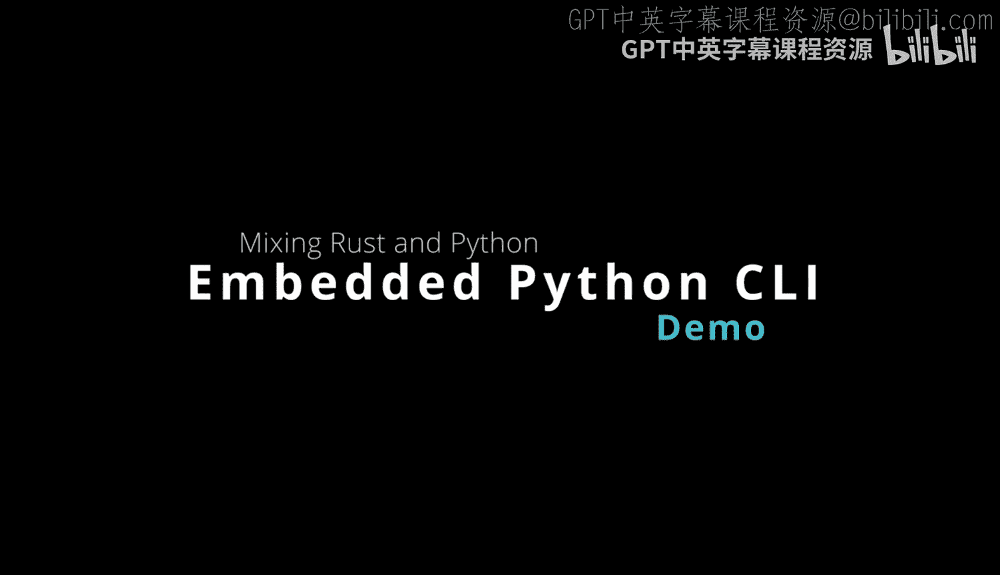
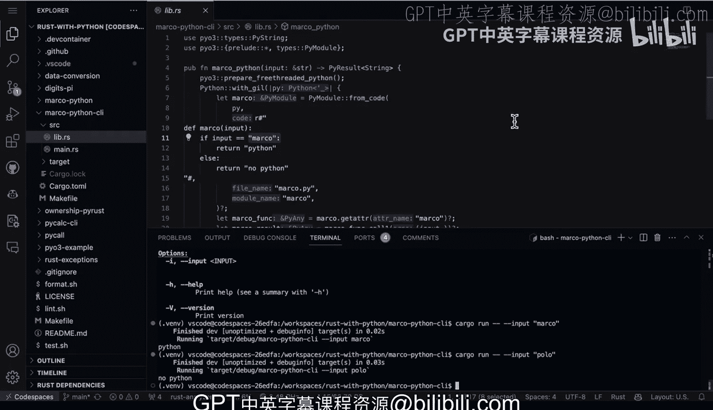

# 杜克大学《Rust编程4-5（Linux命令行工具、LLMOps）｜Rust programming》中英字幕 p59 59_03_06_基于Clap的嵌入式Python Rust CLI实现.zh_en -BV1Hy411q7Zm_p59-

Here's a rust project that I have embedded Python inside。

 and I'm also going to make it into a command line tool here。

 And let's go ahead and look at the structure here without any build artifacts。

 I have the cargo files here， I have a make file， and then I have two files inside of S。

 So I have a Lib do RRS and a main do R S。 as a side note here。

 This is a great command tree dash capital I target to find exactly the structure of a rust project without having to look at the target build。

 Now， if we go ahead and look inside of the Lib file first， we can take a look at what's happening。

 So first up here， I have some library code that embeds Python。

 So this is where there is some Python code that accepts an input。 in this case。

 the input is Marco and it returns back Python if there's Marco。 Next。

 what we do here is we have the Python。Interface here， we also have the gill that is being released。

 and then we're able to talk to that function， capture it。

 and then put input into it and then return back ultimately， a string。

 So this is all set up for us to then leverage it。Into a more sophisticated chaan tool。 So next up。

 what do we do， Well， we go to Ma。Inside the main here。

 we have a CI tool that wraps embedded Python code。 we use the clap tool for this。

 And if we go to the cargo2l file notice that I've got it inside of the dependencies that's all I need to do。

 and if we go back here it's fairly intuitive you would go through here and set up the structure of your chameleion tool。

 this will add whatever information you needed to add to it。

And we also have some help menu that says a CI tool that wraps pyio3 embedded Python code。

 Then this is where I would then pass that string from the commandlan tool all the way into rust which then in turn captures it into Python。

 So what we do is we have args here we then have the input which is something I again set up in the struct right here and then finally we have the output and then we're able to print it out。

 So it's a great way to wrap a python wrapped rust tool is to put a commandlan interface around it。

 and then what that allows us to do is actually interrogate the code and and play around with it。

 So I think this is really a best practice for working with Python and rust together is to use a CI interface So all we need to do is type in cargo。

Run and if we do dash dash， this will then allow us to directly interface with a code。

 So I usually start off with dash dash and then dash dash helpp so we can look at the help menu。

It's going to go through， and it's going to compile the code。

 And if we bring it up a little bit more。 you can see here that says a CI tool that wraps Py3 embedded Python code。

 So that's that message right here。 And notice it also is able to do all this really fancy stuff like show you the usage and show you exactly what it's going to do。

 So in this case， this is what we want to call。 So to interrogate it when it's not fully released。

 If it's just an interactive build mode here。I would just go through here and just say input。Perfect。

 and then we can say Marco。And we should be able to take a look at what it returns and it says it returns back Python。

 So how do we know it's going to return back Python again。

 we go back to Lib and if we do lowercase Marco， we could probably do some string substitution and figure out capital or lowercase。

 but basically if it uses the word Marcoll return back Python。

 So if we go back again to the input and we turn in， let's say polo。

 this is going to return back no Python。There we go。

 So this is a great way to interface with Python and rust together。

 wrap it up into command line tool。 Also it allows you to deliver， for example。

 a binary based release that is often very difficult with Python without using other techniques like containers or some kind of fancy hack in the case of rust you can easily deliver a binary that embed some Python code and you also get the power and safety of rust。

