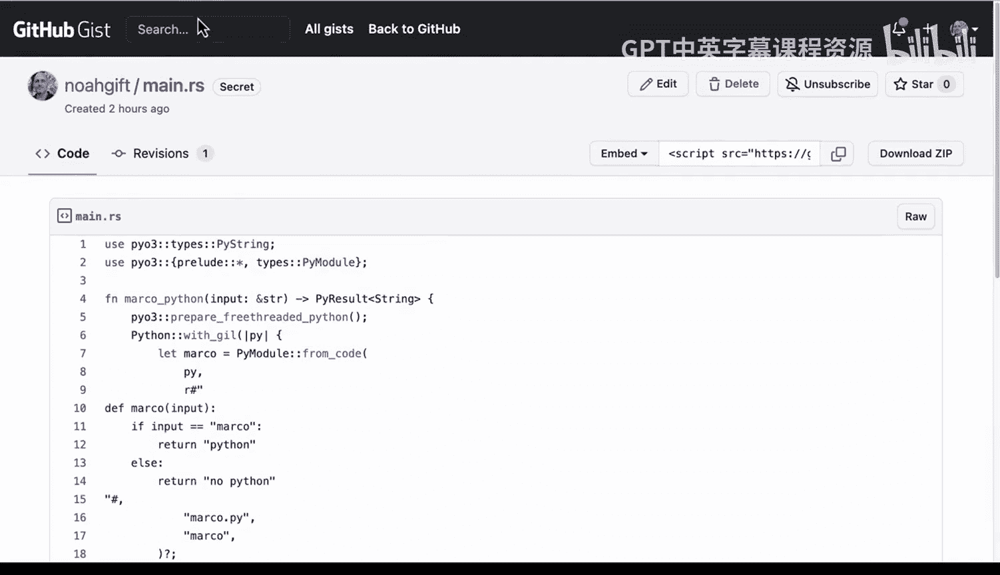

# 杜克大学《Rust编程4-5（Linux命令行工具、LLMOps）｜Rust programming》中英字幕 p60 60_03_07_增强版嵌入式Python Rust CLI测试.zh_en -BV1Hy411q7Zm_p60-

Yeah。Here we have a diagram of what I would consider a best practice for building out embedded Python tools with rust is that not only do we have the command line interface here。

 but we need to ensure that the business logic will have continuity in the face of changes or。

You know， other developers working on the projects， etc ce。

 You can't just assume that the business logic will work。 even if it compiles the tool works。

 there could be an issue。 so we need to validate the input by writing a unit test。

 So let's go ahead and take a look at how we would do that。 So first up here。

 you can see again the code。 But we're going to get into a Github code space here and look through the logic。

 So we see here that this is a CI tool that wraps P3 embedded Python code and it takes input Now。

 what is the input that it's actually going take and what's it actually going do， Well。

 if we go through here， we can see that it's going to expect Marco but in this case this's going to return Bob。

 So maybe a developer decided that was some good logic。 So let's go ahead and look at this code。

And run it。 So we can say cargo run dash， dash， help。 And we can see that's the help menu。

 And then if we want to actually pass in the input， we can go ahead and put in the input。Of Marco。

we see here， Bob。 Now， that looks strange to me as let's say the product manager。

 So let's go ahead and run the tests here。 So how would I run those tests。 Well。

 if we go to the make file， we can see that it's very simple， It's just cargo test。

 So we can type in make test or cargo test either one。 Let's go ahead and do a cargo test。

And if we look at the test， oh， we see that there's actually an issue here。

 And this is the whole point of writing unit tests。

 is we see that there's a test called test markco that's failed。

 but one of them actually wass successful。 and we can even trace it back to the exact line of code。

 So we can see here that sourcelib line 35。 So let's go back to line 35。

 scroll through here and in fact， this is exactly the issue is that we actually have a problem here where we need to actually investigate。

 So if we scroll down into the code。What's happening is that instead of Marco Python here。

 what we're actually getting is we're getting something else。

 So we need to actually see if we can fix this so that we're not getting in this case。

 it's expecting Python but the code is actually broken。 So if we go back to where our code is here。

 We see this is the issue is that I was supposed to be returning Python。

 Our test itself tells us that we're expect to be doing Python。 So we need to actually fix this。

 So let's go ahead and fix this code here。And then let's just look through really quickly。

How that helped us debug it。 So the way you would write a very simple unit test is use this boilerplate here。

 And then the test is pretty straightforward。 Each of these functions is a test。

 you saylin input equals Marco just like the command tool be。

 And then here is where we would say we're expecting Python。 So again。

 that was the issue is that the test itself is actually telling us that the code was broken。

 So maybe another developer you know had someone tap on their shoulder and had them change the code or whatever happened。

 we're able to catch that。 And then we look at the output and we assert that actually the field input is actually what we expect。

 And this case we can see that it tells us， look， it was expecting Python。 But Bob happen。

 So we actually have all that we need to debug this application。 So now that I fix the code。

 Let's go ahead and do cargo test again。And it recompiles and runs the test。 great。

 everything is working。 So this is really the logic test here is to build those unit tests in。

 And even though again， R is such an amazing language。

 it can't predict the future about what business logic changes are made。

 And that's why the unit test are so helpful。 And then if we go back to uparrow again。

 we run it it's running exactly what we expected it to do。

 So it is a great idea to just spend a little bit of time， especially with generative AI。

 which can help you write tests， why not build some business logic tests。

 put maybe even in your Libs to make it really simple。

 And then you can ensure that not only are you getting the reproducible delivery using。

 let's say continuous delivery， but also you can verify that the logic of your code is just as robust as the safety and the performance which RuS is famous for。

😊。

