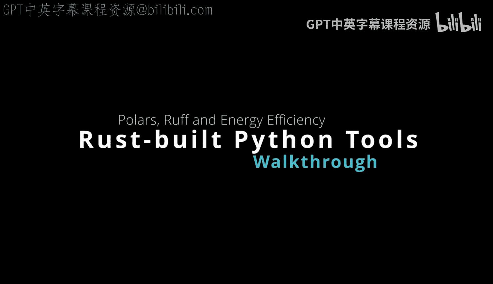
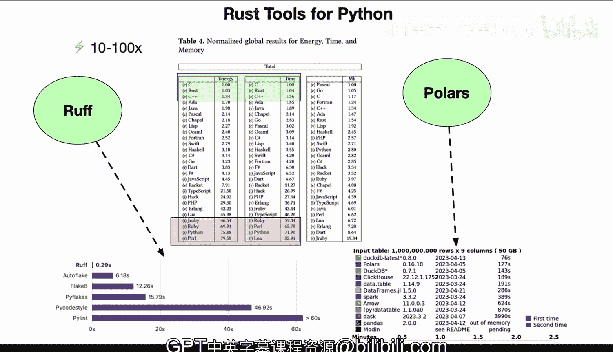

# 杜克大学《Rust编程4-5（Linux命令行工具、LLMOps）｜Rust programming》中英字幕 p61 61_03_01_Rust构建的Python工具链.zh_en -BV1Hy411q7Zm_p61-

Yeah。There are rust tools for Python that can make a really big difference in performance。

 and to start with， let's talk about the data frame tool polars and you can see from this diagram that polars has some of the best performance possible when you're dealing with big data and it has extremely large performance gains when you compare it to things like Sp or even Dask or pandas。

 etc ce。 In fact pandas won't even run for something that has a million rows the 50 gigabyte difference is something that handles easily in rust because of the way the language is developed Now if we take a look at polars here。

 it is a data frame library written in rust is designed for parallel and efficient data processing and it's a key component in big data and distributed systems and it also has advanced multithreaded capabilities。

 which is one of the really advanced features of the rust language and it leverages rust memory safe。

And performance。 And it can often compete with data frame libraries like pandas。

 but with much better performance。 So some of the integrations that are important is that it does actually give you an interface in Python。

 So you can still use it from the Python language。 Now， if we take a look at rough。

 which is a Python a L。Rough is a li designed for coding standard enforcement。

 and it makes your code more readable， maintainable and error free。

 But the performance is amazing because it can go anywhere from 10 to 100 x。

1000 in some scenarios and you can see from the graph here that the rough performance is a third of a second compared to potentially 60 seconds in pure Python。

 So you can see that intuitively when people say the performance doesn't matter。😊。

It actually does matter because if you're going to lnt a large codebase and you can lent it in let's say。

 you know 150 times faster， if it's subsecond， it makes you more prone to to using these tools because you're going to actually integrate them all over the place if it takes a long time it takes a minute to run a tool then you you're going to avoid running that operation and potentially decreasing the power of you know using LintIn tools and safety and so that's really one of the advantages of a tool like rust inside of Python is that you're able to leverage really a modern compiled language that's designed for energy efficiency。

 so kind of moving to the topic of energy efficiency。

 one of the most important things to consider is that language efficiency does correlate with system performance and the environmental impact so we know that there is a change happening in the environment。

And languages that are low energy can have a new role and so one of the things to consider is that Python。

 C++ Java all have their different tradeoffs， but Python in particular in terms of energy efficiency is one of the worst languages and in fact in this particular chart here you can see that it's 75 times more energy used for Python and so really when you're thinking about the energy efficiency it is a big impact as well when you're considering what tools to use and how often these tools run so。

One of the things that is an emerging trend is that even if you are using mostly Python。

 you're going to see more and more rust based tools integrated into your workflow because of these energy time。

 memory efficiency advantages， as well as the safety and the concurrency advantages of the rust language。

