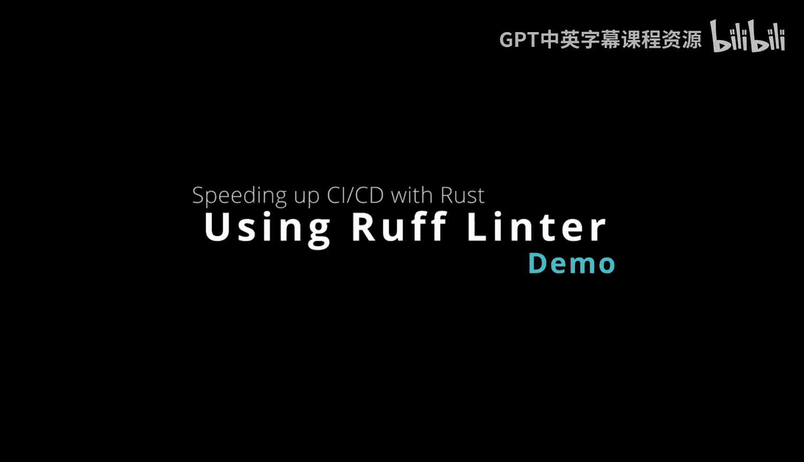
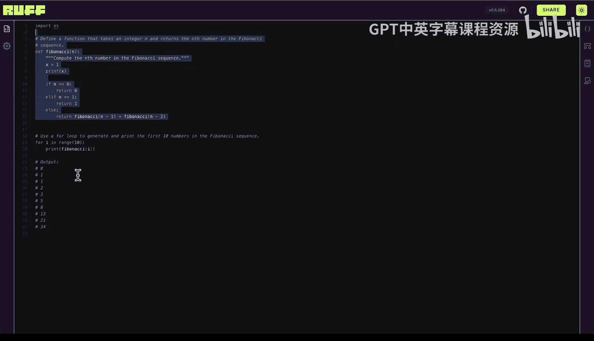
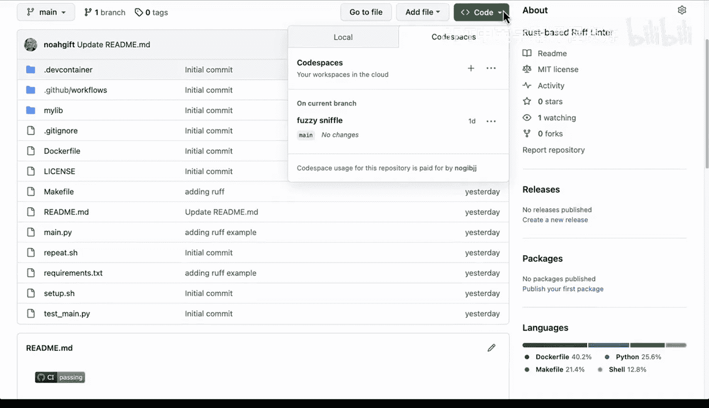
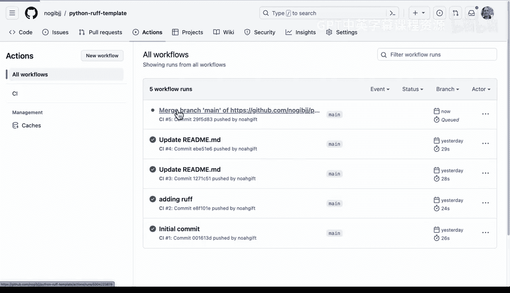
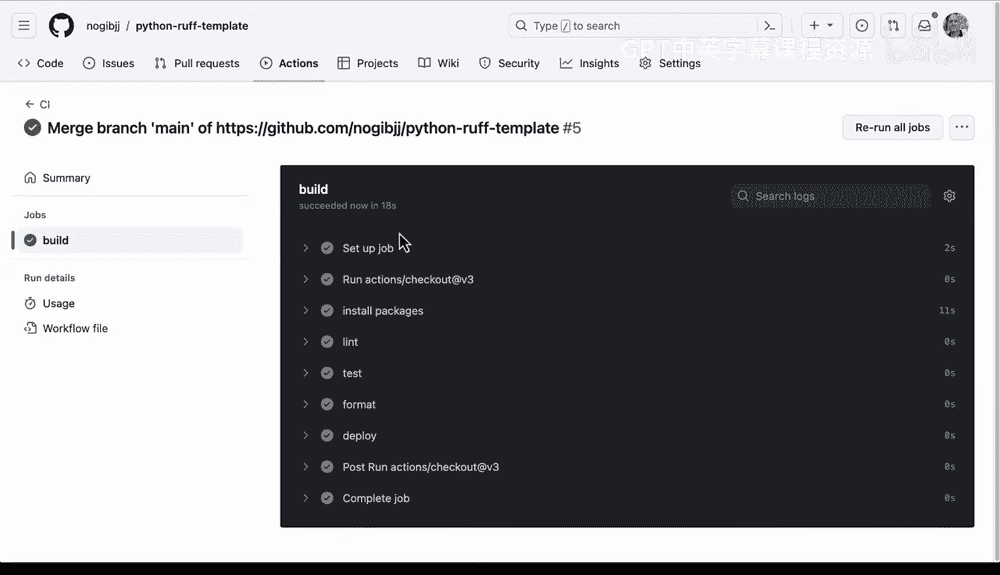
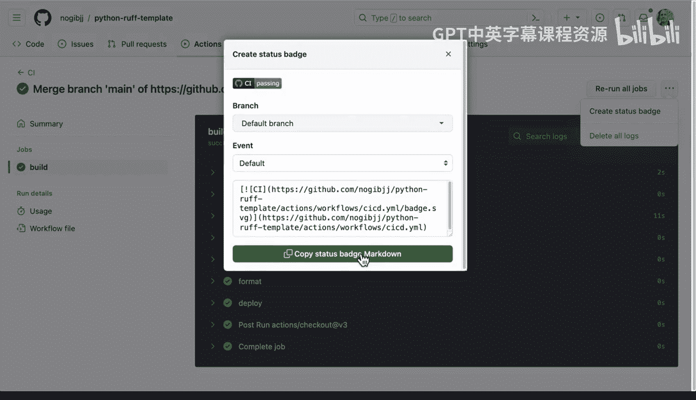
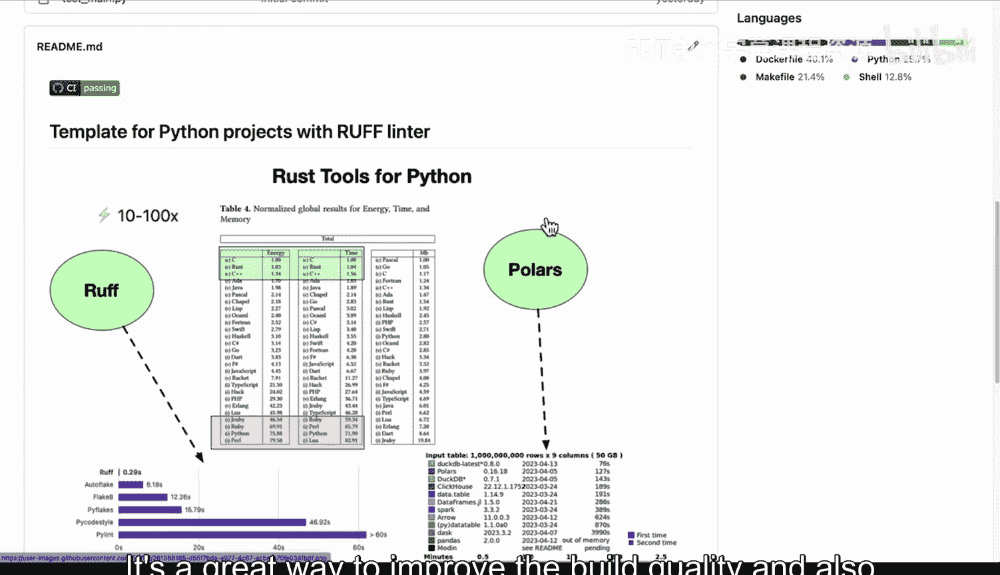

# 杜克大学《Rust编程4-5（Linux命令行工具、LLMOps）｜Rust programming》中英字幕 p62 62_03_02_使用Rust Ruff进行Python代码检查.zh_en -BV1Hy411q7Zm_p62-

Rough is an extremely fast Python L written in rust。

 and it shows how you can write very performant tools in the rust language for Python。

 And here's an example here that this 029 second compared to a 60 second for Pythlint really is so substantial that it's hard to make the case for why you would use a slowerlin。

 And it also has advanced features like caching， etc cetera。 Now。

 how do we actually play around with this。 Well， an easy way to start with this is to go to the playground。

 So let's go ahead and select this link。 And if you go to this link here。

 What's nice is it shows you that right here， I've got a error。

 And I can actually interact with thelin。 So it says remove assignment to unus variable。

 So it's got and change this and we could even say， for example， print X to fix it。

There we go。And we don't need this semicolon as well。

 But the main idea here is that you can actually get realtime feedback because of the speed of formatter as well as Lter。

 And we also have the ability to use it inside of project。 So if I go over to Github here。

 I have a template called Python R template。 and one of the nice things about the Github ecosystem is you can actually create template。

 So if I go to settings right here。 and I wanted to make this a template so that other people could copy it。

 I just select this link there we go。 And now it's a template。

 And if I wanted to create new projects in the future based on this template。

 I could go ahead and do that。 Now let's go ahead and launch this with a codespace。

 here is the project where I have included the rough Lter。

 And if we go ahead and look at the requirements file here。

 notice that I've pinned that requirements file。 and I've also comment it out P Li because the roughbased Lter is so much more performant。

 And if we go。

Over to some code， we can test it out now。I like to put the Li commands inside of a make file so that it's simple。

 so if I have lots of different stanzas here， I don't have to actually remember it or type something and make a typo。

 I just type in make Lint。Now we can actually go ahead and do that。

 let's go ahead and type in make Lint。And， oh， oh， we see that theres an issue。

 multiple statements on one line found one error。 So this would fail the build。

 And if I want to fix it， I could go back to this main file here。And here we go。

 We see from my Lib dot calculator， import， add import click。We have an issue here where in fact。

 we do have two statements on one line here。 In fact， we don't even need this。

 so I can actually get rid of it。 Let's go ahead and comment it out。 And then if I run it again。

 we run make Lnt。There's no issues。 Now， here we have some library code as well。

 So this would be another one to play around with。 So if I wanted to do something that would cause a bug here。

 I could just say var equals and just leave it。Right， and then if I say make L， it's going to say。

 hey， that's a bad syntax here On line 5。 you can't just leave a partially complete statement that will cause a bug。

 And so I can comment it out。 So it's really really fast efficient and a great way to speed up the Linting of your project。

 here we see that Gitthub actions allows us to do classic continuous integration and continuous delivery by making steps like installing our software。

 Linting our software， testing our software， formatting。

 deploying all these are great steps to improve the quality of your code。

 And because we're using as really fast roughbased tool， it's going to speed up our build。

 So in order to trigger this。 all I need to do is just say get push， this will push the code。

 And then if I go over to this actions here， we should see a new action。 There we go。

 So this is going to go through and build the process。

 and we can actually watch it while it's going through and running each of those steps。

 This is a classic component of。

Continuous integration is to make sure that each of the steps in your project are reproducible and that there's logs that show if there was an issue what exactly happened。

 And， of course， the faster it runs。 And you see the li is so fast。

 it's almost not even something you can see that it is basically going to allow us to get quicker feedback。

 So it's really a critical action to do this。 So I also like to create status badge as well。

And if we go over to this template， we can actually see we can put our status badge inside of here and you can see how that works。

 So this in this case is our new status badge perfect。 We commit the changes。

 And then if the build breaks in the future， we can actually go ahead and fix it。 So in a nutshell。

 rough is a great li that improves dramatically the speed of the build。 So again。

 it could take several minutes， potentially in some scenarios。 but with rough。

 itss instantaneous subsecond。 and it's a great way to improve the build quality and also enhance your continuous integration process with Github actions。

😊。

