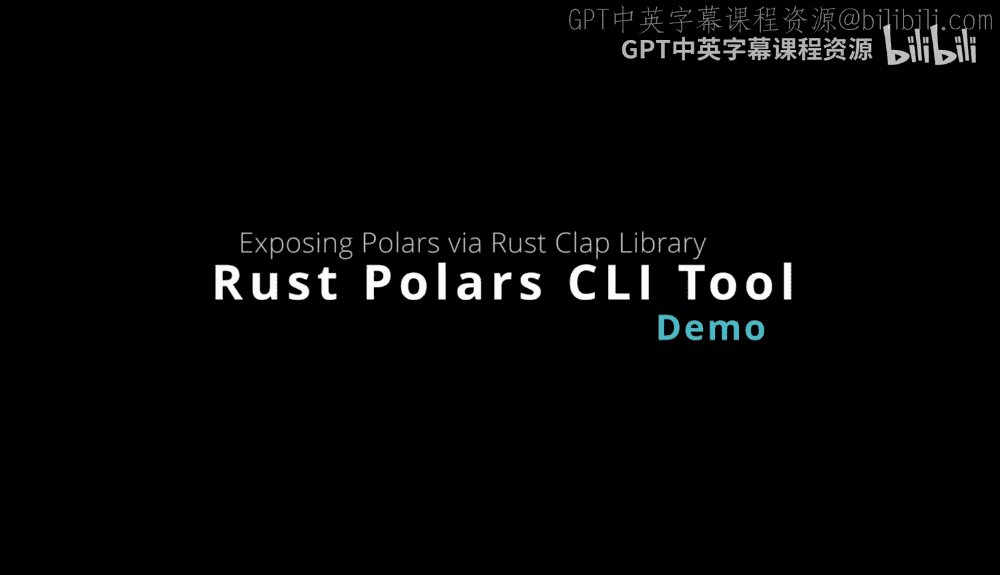
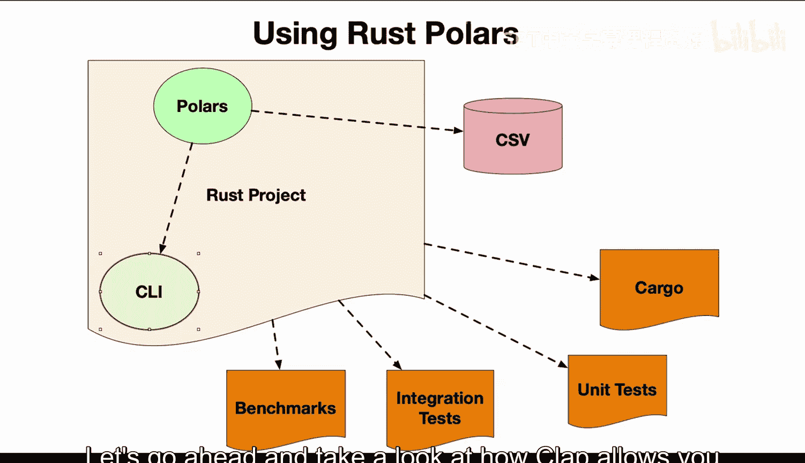
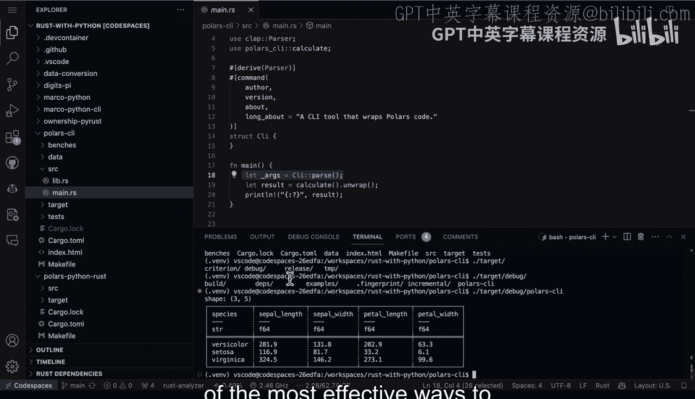
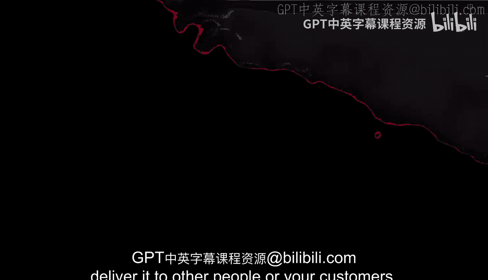

# 杜克大学《Rust编程4-5（Linux命令行工具、LLMOps）｜Rust programming》中英字幕 p64 64_03_04_构建Rust版Polars命令行工具.zh_en -BV1Hy411q7Zm_p64-

Using rust with polars is a great solution because of the performance。

 but even better is to integrate a commandlan interface。 Fortunatelyly。

 rustt has many options for this， including the clap interface that I'm going to use here。

 let's go ahead and take a look at how clap allows you to build a very fast commandlan tool interface。

 All right， let's go ahead and Cd into polars Ci here。

 which has all the code that we're going work with。 So I'm going to seed into polars Ci。 And next。

 I'm going to take a look at the code first in the source directory。

 So a couple things to be aware of here， whenever you're looking at a rustbased project。

 one nice thing that I like to do is do tree dash I and then do target and what this does is shows me a nice structure for what is inside of my project。

 So if you're looking at somebody else's project。 for example， if you run tree dash I target。

 So basically， you exclude that directory， but show me the tree of everything else here。😊。

You can see the structure。 So I've got some benchmarking code。 I've got the cargo2ml file。

 I have my data file that has the Iis data set。 I have a make file。

 and I also have a lib and a main in integration test。

 So I'm going only focus on the2l file right now and also the Lib in the main。 So first up。

 let's go to the cargo2Ml file and we can see here that I have clap and I have pullers installed。

 So clap is the command line interface。Now， if we go to the Lib directory here。

 you can see here that there's a function that does some basic calculation group by aggregation on the Iis data。

 So that part is pretty straightforward。 But what if I want to interact with it or just run it easily from the command line。

 Well， pretty easily， all you have to do is use the clL parser。And put in this boilerp code。

 So in this section here， what happens is I put some information in the long about。

 And that's really all it is。 just about 10 lines of code or so， And then I call in the let as。

 and I do an underscore args because I'm not gonna use them。 I'm just gonna invoke it。

 And so if you want to just execute a function and put it inside of command line tool with a help menu。

 this is probably one of the best ways to do it。 So how do we run this pretty easy to do。

 I just type in cargo run dash。 And then at this point， I can then invoke the command line tool。

 So when it's in this kind of build phase here。 it'll pass the arguments into the command line tools。

 So let's go ahead and do help。And there we go。 It's going to go ahead and compile when it's done compiling。

 we'll be able to see the help menu。 All right， now I've got this help menu， which， again。

 is one of the most powerful parts of using commandline tool frameworks is they put all this together for you。

 And you can say the usage is pretty simple， you just effectively run it。 So in order to run it。

 all I have to do。😊，Is basically do cargo dash dash。 And that's it。

 And then this will actually invoke our interface。 Now。

 one of the other things to be aware of here is that I could even test out the binary now that has been built。

 So in this case， if I went into the target directory here And if we look at this and we say target。

Here。And then I look at the debug。I can also run the binary。Like that。

 So that's one of the nice things about a Ru project， especially one that uses Kamelan tool。

 is that you can actually just invoke the debug binary here， play around with it。

 And then when you build the actual release that's optimized samee thing you can give it to somebody and it's ready to go really a Kamelan tool is one of the most effective ways to package a tool and delivered to other people or your customers。

