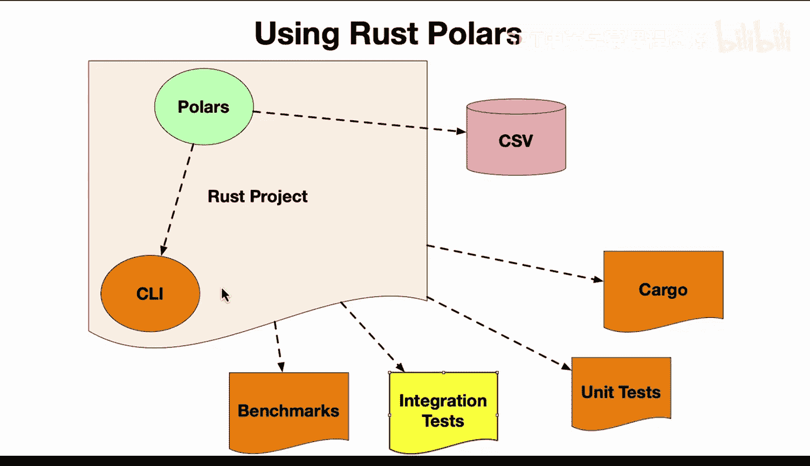

# 杜克大学《Rust编程4-5（Linux命令行工具、LLMOps）｜Rust programming》中英字幕 p66 66_03_06_构建Polars与Clap集成测试.zh_en -BV1Hy411q7Zm_p66-

Here we have a rust pullers project that includes all of the goodies like commandlan tools and benchmarks and etc ce。

 I'm gonna to focus on the integration test component。

 The reason for building integration test is that you can actually test the input that goes into a commandlan tools。

 So this is great for really getting to the last step of a project where let's say it's a customer or maybe it's an open source tool or whatever it is you're building you can verify that what you think will happen when the tool is executing will actually happen and with a safe language like rust that has very good build characteristics and typically there's very few unexpected errors。

 This is kind of the final step here where you're able to actually go through and really build out the final steps of what your tool should do and verify programmatically every time you build it that is actually going to do those steps。

 So let's go ahead and take a look at the code。 So first step here， we have this integration test。😊。

Section this is in， in fact， the tree structure would look like this。 So we have our benchmarks。

 our cargo file， our data files， and we have a lib in a main。 And then inside of a test director。

 we have integration test。 So what I do here。Is I import the function that I'm going to test。

 which is a polars function， and then I use standard library here， process command。

 and I actually prepare a command。 So what I do is I say prepare and run a command。

 So basically make a new cargo command and then go ahead and run it by passing in the flags that are necessary and then finally verify that what comes back is what we expect to come back。

 So this is really powerful because is testing the final result， not just the unit test。

 which are also very helpful。 but the final test of the command and tool itself。

 So let's go ahead and run this and let's go ahead and see what happens。 So if I say， for example。

 cargo run and I just run the tool we can see that that's actually the result。 But if I do make test。

It's going to go through and compile it and verify that both the unit test， which I have down here。

And the integration tests are both working。 So we're really testing the entire surface area of our application。

 and we can see that was， in fact， correct。 And that's the name of the function。

 So if we change it here and we， let's say， change the shape and we look at it again。

We'll see it fail and we can see how this is really a good tool for catching unexpected typos or you logic that you shouldn't have put into the chameleion tool or some kind of unexpected behavior。

 it easily catches that bug and it's like， oh， we have a problem here。

 We need to actually go ahead and you fix it in this case， this is the fix。

 So in a nutshell here integration tests that test the actual chamean tool are a great way to kind of put the finishing touches on a very wellbbu rust project。

 And for chameleion tools in particular， it's always good to include at least one so that when you're doing continuous integration。

 continuous delivery， you have a verification of the fact that your binary is going to behave in the way you think it's going to behave。

