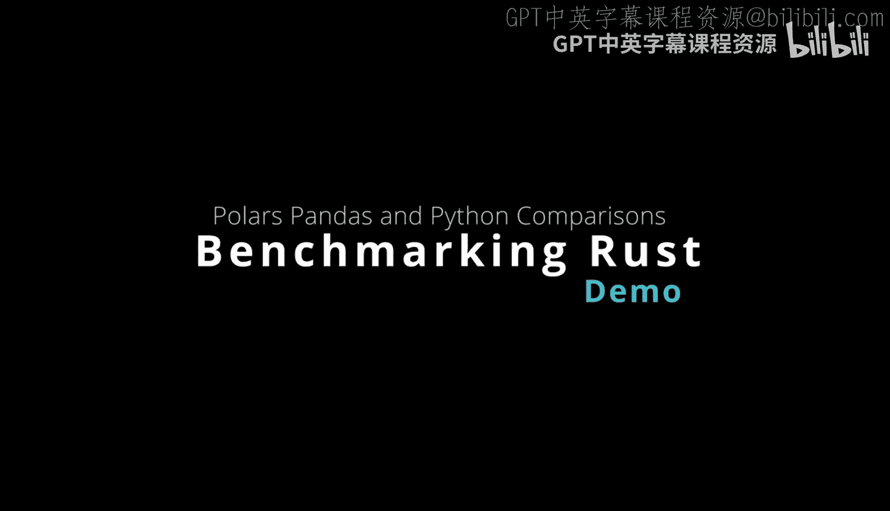
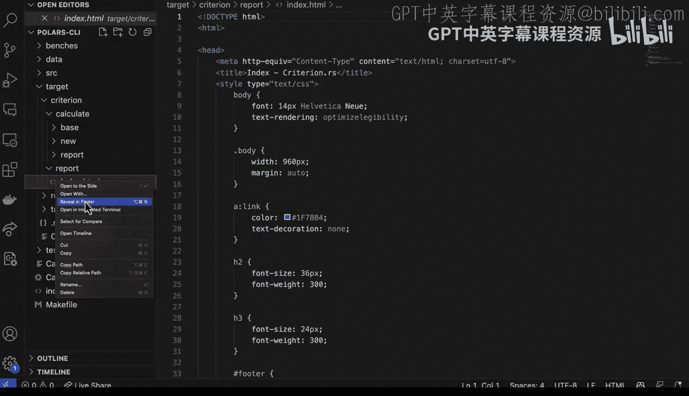

# 杜克大学《Rust编程4-5（Linux命令行工具、LLMOps）｜Rust programming》中英字幕 p67 67_03_07_构建性能基准测试.zh_en -BV1Hy411q7Zm_p67-

Here we have a rust polarers project that includes a bunch of different things。 in this case， though。

 I'm going to focus on benchmarking and we're going to do a couple different kinds of benchmarking。

 First， I'm going to benchmark Python versus rust using the same interface and also a pandasbased interface。

 and then I'm also going bring it out into more granular level and use a benchmark for a library called criterion which goes through and does a bunch of profiling on the code。

 So let's go ahead and take a look at the code here。

 first step I have this polar's Python rust project And inside a few things to look at。

 first step I have a main file here。 that goes through and does some operations including aggregation group by。

 etc。

I've done something pretty similar in pandas here， where I also do some group by operations。

 and I also do a Python based approach as well using the Pollar's library。

 So really we have a few different flavors to test now。

What's one of the best ways to test all this out all at once。 Well， I like make file。

 So I'm going to go ahead and take a look at a make file here。 And if we go down to the make file。

 what I have is I have a rust benchmark， and you can see here。 I say cargo build release。

 and then I time the running of the binary the release binary， which has some optimizations。

 I then go through and I do pandas benchmark。 So I test the Python pandas version。

 I then go through and I test the Python polars version。

 So this would be kind of more should be pretty similar because they're both using the same library。

And then finally， I pulled all together by using make benchmark。

 So I think this is a great way to kind of test out some ideas。 So again。

 maybe you have an idea that Python is always good enough or et cetera。

 Well why don't you just test it out by actually writing the code。

 So let's go ahead and profile this So I'll go ahead and say make benchmark。😊。

And what this will do is it will go through， do an optimization。

 And we see that the rest e eappsse time here was 055 seconds。 The Python eappsse time was 4。

8 seconds， and the polar's eappsed time was 11。6。 So we see that there's。

The pandas version is substantially slower about five seconds and in the case of the rest version。

 it's only about half a second so that's a pretty substantial change there and we also have the Python polars which is also in Python but because polarers has some optimizations here we can see that it was actually only 1。

6 seconds。 so this would be a great way to test that intuition of oh yeah。

 Python performance is always good enough well in the case of let's say this was an Aws lambda。

 this could cost you a lot of money at scale while this could actually be a pretty reasonable approach now a second way to benchmark your code is I'm going to go into a different directory and we'll go into the polars Ci and I've actually used something called criterion so let's go ahead and take a look at how that works and this case we see the criterion is installed and I also have a new part。

Of my cargo2ml file called bench。 and it's gonna to be my benchmark。

 So let's go ahead and look at the benches right here and we see my benchmark do Rs。

 And what this does is it uses the criterion in library it then pulls in that calculate function。

 And what it says is this function benchmarks that calculate function of your project。 So again。

 the idea here isn't to just guess and say Python performance as good enough or rest performance is good enough。

 we're actually going to use data and we're gonna to use data science。

 and we're going to go ahead and benchmark this particular operation and see what actually happen。

 So if we go through and we run that What's nice about this is that it will actually let us do it by just typing in the command make bench。

Once we've gone through a run that， what happens is I go to the target directory。

 I go to a criterion and I go to the report， and we can actually look at what's happening。

 So if I go ahead and I say open。To the side， a reveal finder， etc cetera。

 We can actually say reveal finder。 What's nice about this is I can then go through here and open it up and see what happens It says。

 oh look， there's a benchmark report here。 That's great。 So let's go ahead and take a look at it。😊。

And if we click on calculateulate， we can see that it gives us some nice data science style analysis of what our function is actually doing so we can see that there is the average time here in milliseconds。

 so it's extremely fast we can also look at the actual iterations here and we can also look at additional statistics like standard deviation。

 for example R squared slope of all these kind of cool ways to look at the data。

 but in a nutshell we can see that basically this is in the milliseconds so it's a very fast function so in a nutshell here it is important to do benchmarking for your code。

 something that rust allows you to do very easily with either a make file or also with a more fancy library like criterion。

