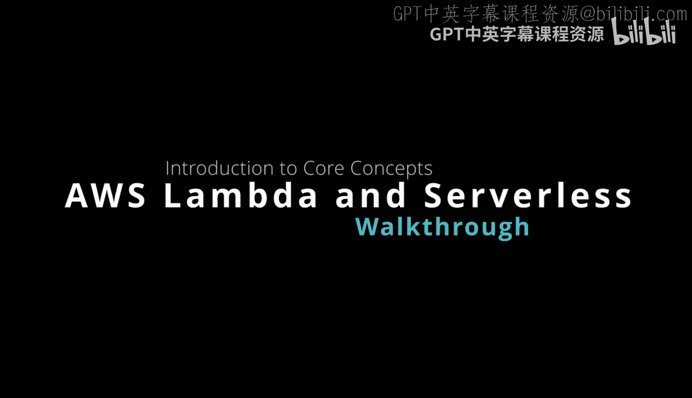
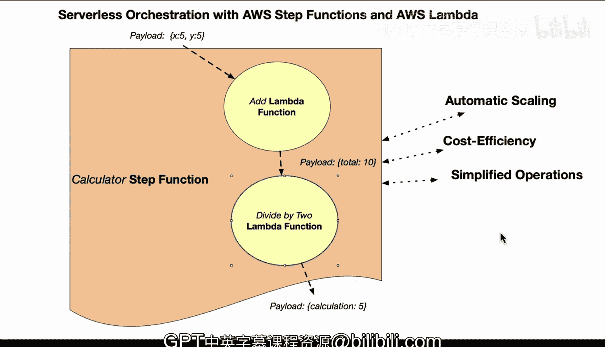

# 杜克大学《Rust编程4-5（Linux命令行工具、LLMOps）｜Rust programming》中英字幕 p68 68_04_02_无服务器与AWS Lambda导论.zh_en -BV1Hy411q7Zm_p68-

Yeah。Here we have a AWS Lambda and serverless ecosystem with two Lambda functions working in coordination of a step function。

 One of the questions that many people have when they first exposed to Lambda is why do we care about this。

 What's the point of it。 Well， first up， let's start with automatic scaling serverless platforms will automatically scale the number of function instances based on the demand。

 So this eliminates the need for manual intervention to provision or deprovision of server。

 So this is a huge one in terms of just putting some code into the cloud and line run。

 This auto scaling capability then allows you to handle many different types of loads seamlessly from let's say a few requests per second to thousands of requests per second and you don't have to change any of other code In terms of cost efficiency as well。

 So you have pay as you go pricing and you only pay for the amount of resources that are consumed。

And not for a preallocated or idle server capacity。

 And this pricing model can lead to significant cost savings because it's event based。

 So if we take a look as well on the language， if you're able to leverage one of the fastest languages in the world。

 which is rust， It has up to 70 times less memory associated with the invocation than Python。

 So you could at bare minimum think about some of the same code running with 70 times less pricing。

 So that's another thing to consider is the choice of language， does it help you out as well。

 And then in terms of operational management， It's a serverless environment where the cloud provider takes care of the server provisioning。

 maintenance patching and capacity planning。 And so this approach with free developers from the need to focus on any kind of infrastructure management。

 So this is。😊，Kind of a realistic type of scenario here。

 If you orchestrated two different lambda functions， let's say that it's in rust or Python。

 It doesn't really matter。 and you have a payload at the very beginning that would go into the step function。

 The next thing that would occur is that that rust code would then process it and then return back another payload。

 So this is typically what you would do is you chain together these lambda now maybe the next function。

 just for simplicity's sake would divide a payload。

 or it would look for key total and then divide by two and then it would return back a calculation。

 So you can chain together these pieces of code and they'll just sit there doing nothing。

 you're not charged until they're actually invoke and also it can be a eventbased as well So it can respond to let's say a change in a S3 bucket or a change in Sqs or some other change and this is really the beauty of using a serverless model is that。

If you do it correctly， you're going to save a tremendous amount of revenue and also from an operational standpoint。

 it's much more simple。

