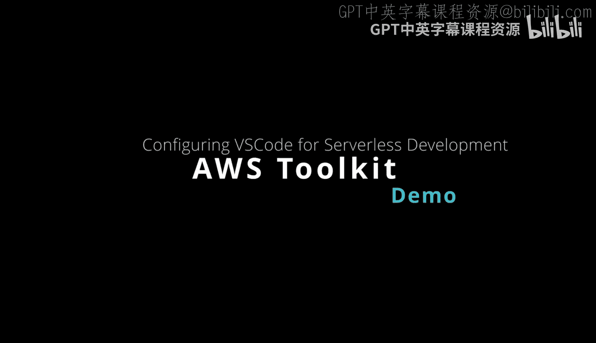
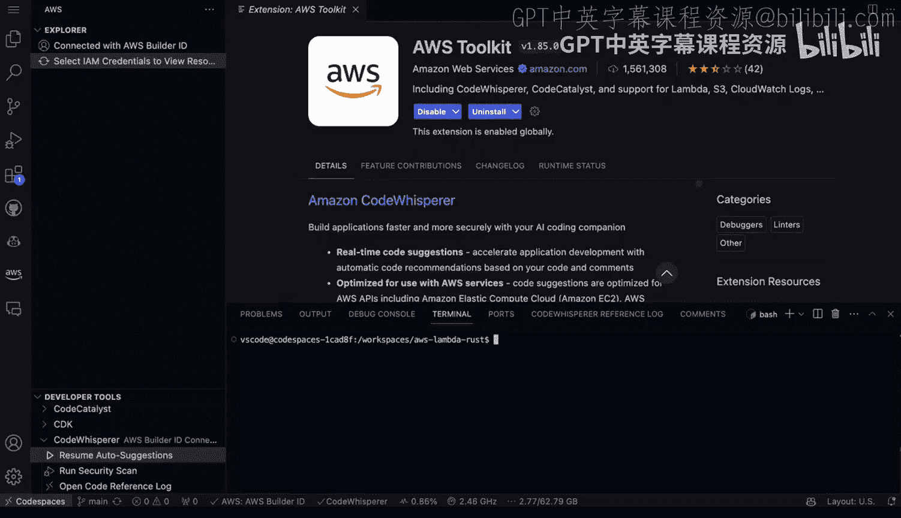
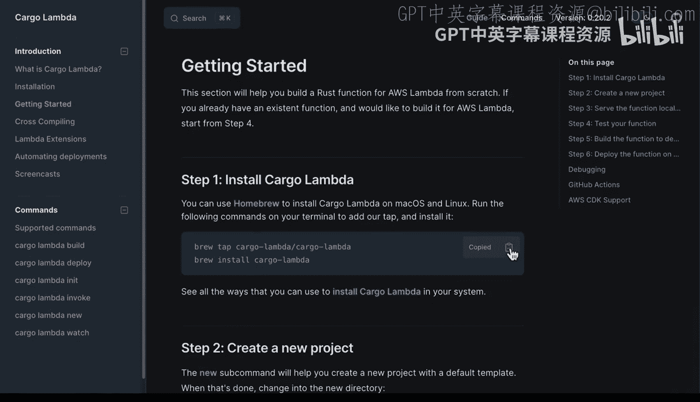
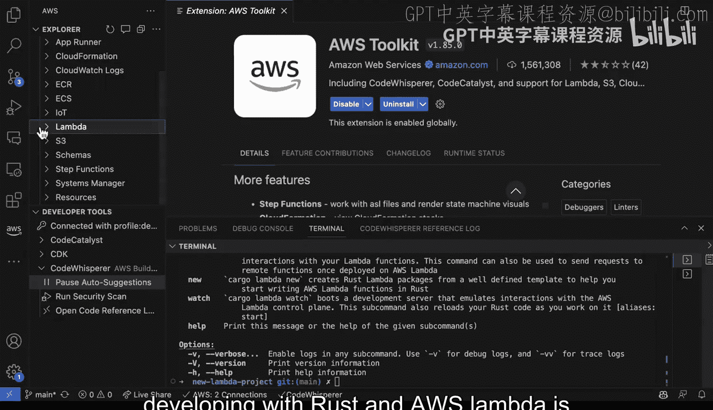

# 杜克大学《Rust编程4-5（Linux命令行工具、LLMOps）｜Rust programming》中英字幕 p70 70_04_04_配置VSCode AWS工具包与CodeWhisperer支持Rust.zh_en -BV1Hy411q7Zm_p70-

。One must have development tool for AWS is AWS toolkit for visual Studio code。

 It allows you to hook into the deep aspects of developing for AWS。

 especially in the serverless world and it allows you to use things like Amazon code whisper。

 which can do generative AI code completion Now let's go ahead and take a look at how this would look like in a repo。

 So if you're using Github codespaces which is a cloudbased development environment that can run in your browser if you went through and created a codespace here。

 then you could actually launch it which we've already done And instead of here。

 you can see that toolkit is already installed Now how did I do this if I go over to extensions here and we look at AWS toolkit。

 you can see that it does integrate with the web-based version of Vi Studio code。

 Now if we look at this， you can see that it also has the code whisperhis installed。 Now。

 how do I see that running Well if we go over to AW。

Here， notice at the bottom is something called developer tools and under codeWhis here。

 we can actually resume auto suggestions， for example。

 or we could even run a security scan So it's got some advanced features here for us that are available so it could work in parallel depending on what your workflow is with for example。

 Github coppit as well， you could also disable it temporarily if you wanted to and then only use codehis so the main takeaway though is that you can actually use both inside of this webbased Github codespaces Now there are other methods as well to be aware of one of them is this cargo Lambda and if we go ahead and we copy this all right perfect so now that we've got this set up we can just type in cargo Lambda。

There we go， and now we've got cargo Lambda build deploy in it。New watch help， etc ceter。 Now。

 we also can do this inside a regular visual Studio code。 In fact。

 I've already got this installed here。 you can go ahead and check this out。

 So this is a local version of visual Studio code Now I also have the AWs code whisperhi here。

 but I also have my I am credentials connected where I'm able to see my whole AWs account。

 So this is typically a great idea is to also integrate with your Aws account。 So again。

 if you just go to the extensions here， you can say AWs toolkit。

 you install this and it can actually set up this entire environment。 Now。

 if we go back here one of the nice things about getting this set up for developing with rust and Aws Lada is that when you've deployed something via cargo Lambda。

 you can actually right click on it and you can invoke it or you can even invoke it from this terminal here。

 So the integration with Aws toolkit inside of visual Studio code and or code whisperhi。

 which we can also get suggestions from。😊。

Could whisper or pause the suggestions is a great interface for developing AWS rest tools。

