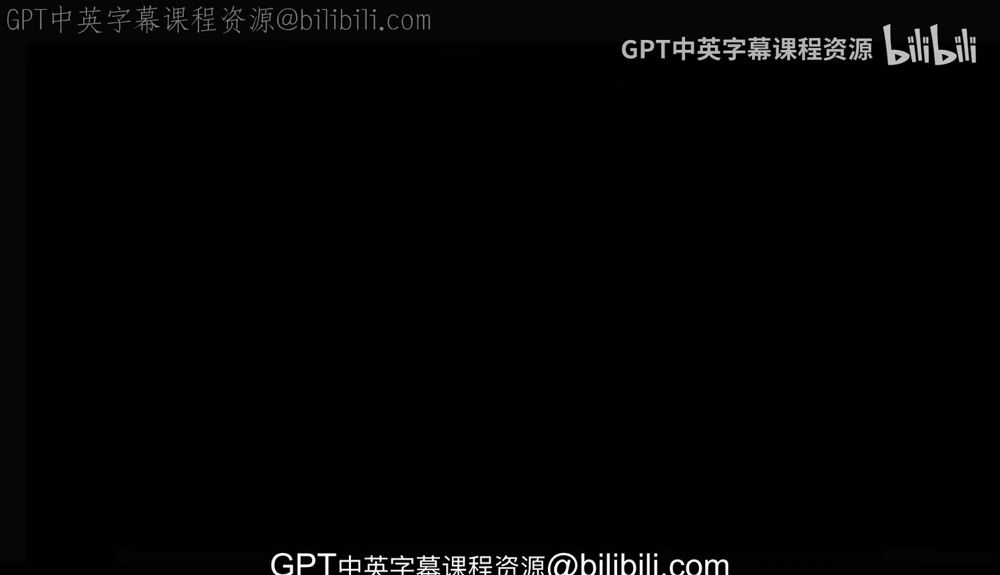

# 005：搭建命令行工具开发环境 🛠️



在本节课中，我们将学习如何为Python命令行工具项目搭建一个独立的开发环境。我们将重点介绍虚拟环境的概念及其创建和激活方法，以确保项目依赖与系统环境隔离。

## 概述

我们当前有一个Python项目，一个用于命令行工具的Python CI项目。虽然我们尚未详细探讨项目中的所有目录和文件（这些内容将在后续课程中介绍），但首先正确配置开发环境至关重要。本节将指导你完成Python虚拟环境的设置，这是Python开发中的核心实践。

## 设置Python开发环境

首先，你需要确保系统中已安装Python。在本例中，我们使用的是Linux系统，并通过运行 `python3 --help` 来验证Python 3已正确安装。请注意，在你的系统中，命令可能是 `python` 或 `python3`，这取决于具体的系统配置。

接下来，我们将为项目创建一个虚拟环境。Python在处理依赖项和将其与系统隔离方面存在挑战。如果不使用虚拟环境，而直接将项目依赖安装到系统中，可能会导致依赖冲突。因此，创建虚拟环境是必要的，它能将项目的依赖隔离在一个独立的空间中，便于开发、更新和移除，而不会影响系统或其他项目。

以下是创建虚拟环境的步骤：

### 1. 创建虚拟环境

我们使用Python内置的 `venv` 模块来创建虚拟环境。命令格式如下：

```bash
python3 -m venv .venv
```

让我们分解这个命令：
*   `python3`：指定Python解释器。
*   `-m venv`：表示运行Python自带的 `venv` 模块。
*   `.venv`：这是为目标虚拟环境目录指定的名称。执行后，会在当前目录下创建一个名为 `.venv` 的文件夹。

运行此命令时，如果系统尚未安装创建虚拟环境所需的依赖，可能会遇到错误。例如，在某些Linux系统上，你可能需要先运行类似 `sudo apt-get install python3-venv` 的命令来安装必要的包。安装完成后，再次运行创建命令即可。

成功执行后，你会在文件管理器中看到一个名为 `.venv` 的新目录，其中包含大量文件，这就是你的隔离环境。

### 2. 激活虚拟环境

创建环境后，必须激活它才能使用。激活后，终端会话将使用虚拟环境内的Python解释器和工具，而不是系统全局的。

在Linux或macOS系统上，使用以下命令激活：

```bash
source .venv/bin/activate
```

激活后，你会注意到命令行提示符前出现了 `(.venv)` 字样。此时，运行 `which python` 或 `which python3` 命令，路径将指向 `.venv` 目录下的解释器，而非系统路径。这至关重要，因为它确保了后续通过 `pip` 安装的所有依赖包都会被安装到这个虚拟环境中，从而实现依赖隔离。

如果虚拟环境因依赖冲突而出现问题，你可以简单地删除整个 `.venv` 目录，然后按照上述步骤重新创建。这是Python开发中一项核心且必须习惯的操作。

### 3. 使用虚拟环境中的工具

激活环境后，你可以使用虚拟环境内的 `pip`。可以通过运行 `which pip` 来确认它指向虚拟环境目录。此时，你可以安装项目所需的依赖。

通常，项目会有一个 `requirements.txt` 文件列出所有依赖。你可以使用以下命令一次性安装它们：

```bash
pip install -r requirements.txt
```

这个命令会读取 `requirements.txt` 文件，并下载安装所有列出的包到当前的虚拟环境中。

相反，如果你**停用**了虚拟环境（通过运行 `deactivate` 命令），那么 `pip` 命令可能不再可用，或者会指向系统的 `pip`。这清楚地展示了系统环境与虚拟环境之间的区别。

## 总结


本节课我们一起学习了搭建Python命令行工具开发环境的核心步骤。我们首先验证了Python的安装，然后重点讲解了如何创建和激活虚拟环境（使用 `python3 -m venv .venv` 和 `source .venv/bin/activate`），最后介绍了如何在激活的环境中使用 `pip` 安装项目依赖。掌握虚拟环境的使用是进行清晰、无冲突的Python开发的基础。