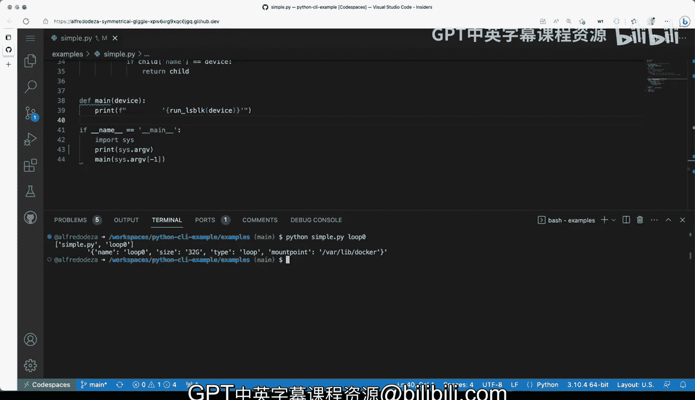

# 006：你的第一个Python命令行工具 🐍


在本节课中，我们将学习如何构建一个简单的Python命令行工具。我们将通过一个实际例子来理解其基本结构和工作原理，这个工具将帮助我们更好地处理`lsblk`命令的输出。

## 概述

我们将创建一个Python脚本，它能够接收一个设备名称作为参数，然后调用系统的`lsblk`命令，并以JSON格式解析其输出，最终返回与指定设备名称匹配的设备信息。整个过程仅使用Python的标准库，无需安装任何外部依赖。

## 问题场景

首先，让我们明确我们要解决的问题。在终端中运行`lsblk`命令可以列出所有块设备及其信息，例如名称、大小、类型和挂载点。然而，在某些环境（例如容器中）直接通过`lsblk <设备名>`查询特定设备可能会失败，提示“不是块设备”。我们的目标是创建一个工具，能够可靠地获取`lsblk`提供的信息，并以更可控的方式呈现特定设备的数据。

## 项目结构解析

现在，让我们来看一个实现此功能的简单Python脚本示例。我们将逐步分析其核心组成部分。

### 脚本入口与参数处理

脚本的底部是执行的入口点。以下代码确保当直接运行此Python文件时，会执行`main`函数。

```python
if __name__ == "__main__":
    main(sys.argv[-1])
```

`sys.argv[-1]`会获取命令行传递的最后一个参数，并将其作为字符串传递给`main`函数。无论你传递的是数字还是其他内容，它都会被视为字符串。

### 核心函数：`run_lsblk`

`main`函数接收设备参数后，会调用`run_lsblk`函数。这个函数负责执行命令并处理输出。

```python
def run_lsblk(device):
    command = f"lsblk -J -o NAME,SIZE,TYPE,MOUNTPOINT"
    output = run_command(command)
    data = json.loads(output)
    # ... 后续处理逻辑
```

它构建了一个调用`lsblk`的命令，要求以JSON格式(`-J`)输出名称、大小、类型和挂载点信息。`run_command`函数执行该命令并返回输出字符串，然后使用`json.loads`将其解析为Python字典。

以下是处理JSON数据、查找匹配设备的逻辑：

```python
    for parent in data["blockdevices"]:
        if parent["name"] == device:
            return parent
        for child in parent.get("children", []):
            if child["name"] == device:
                return child
```

代码首先在顶级设备（父设备）中查找名称匹配项。如果找到，则返回该设备信息。如果未找到，则遍历每个父设备的子设备列表（`children`），继续查找。

### 辅助函数：`run_command`

`run_command`函数使用Python的`subprocess`模块来执行系统命令。

```python
def run_command(cmd):
    parts = cmd.split()
    result = subprocess.run(parts, capture_output=True, text=True)
    return result.stdout
```

它将命令字符串分割成列表，然后使用`subprocess.run`执行。`capture_output=True`和`text=True`参数确保我们捕获命令的输出并以文本形式返回。目前这个版本没有错误处理，我们将在后续改进。

### 标准库的使用

整个脚本的一个关键特点是它只使用了Python标准库：

```python
import sys
import subprocess
import json
```

这意味着只要系统安装了Python，就可以运行此脚本，无需管理额外的包依赖或复杂的打包过程，非常适合快速开发与分发。

## 运行示例

让我们在终端中测试这个脚本。假设脚本名为`simple.py`。

1.  首先，列出所有设备以查看可用名称：
    ```bash
    lsblk
    ```
2.  然后使用我们的Python工具查询特定设备，例如`sdb`：
    ```bash
    python simple.py sdb
    ```
3.  也可以查询子设备，如`sdb1`：
    ```bash
    python simple.py sdb1
    ```
4.  或者查询回环设备：
    ```bash
    python simple.py loop0
    ```

脚本将输出对应设备的JSON信息，例如大小和挂载点，这与`lsblk`的原始数据一致。

## 关键要点总结

本节课中我们一起学习了构建一个基础Python命令行工具的完整流程：

1.  **入口点**：使用`if __name__ == "__main__":`来区分脚本是直接运行还是被作为模块导入。
2.  **参数获取**：通过`sys.argv`列表获取命令行参数。
3.  **命令执行**：利用`subprocess`模块调用并捕获系统命令的输出。
4.  **数据处理**：使用`json`模块解析结构化的命令输出，并实现业务逻辑（如搜索匹配项）。
5.  **依赖最小化**：仅依赖Python标准库，使得工具易于分发和运行。



这个简单的例子展示了Python在创建实用命令行工具方面的强大能力和便捷性。在后续课程中，我们将在此基础上增加错误处理、更复杂的参数解析等功能。