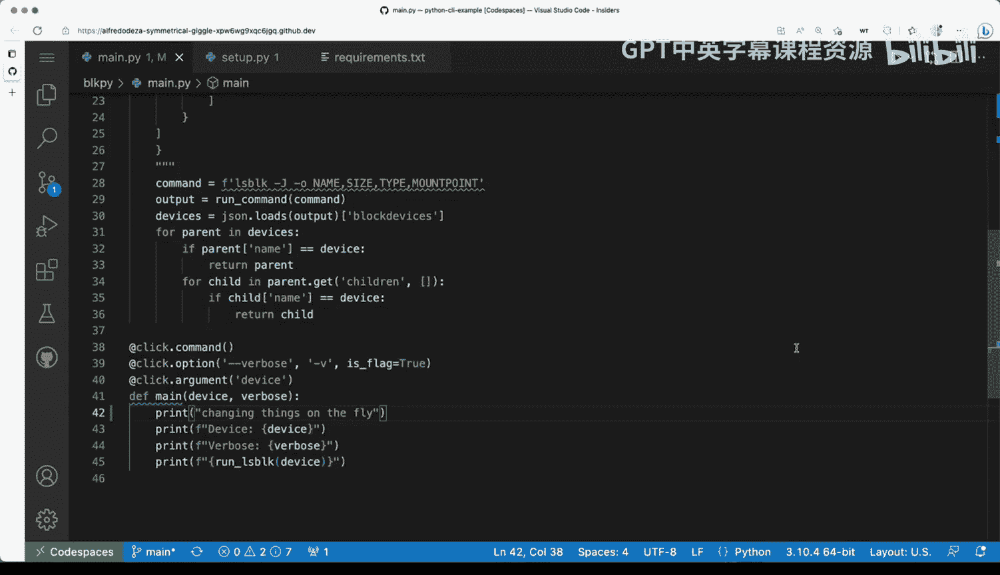

# 007：处理用户输入参数与选项


## 概述

在本节课中，我们将学习如何使用Python的`click`框架来构建一个更高级的命令行工具。我们将从创建一个简单的工具开始，然后通过引入包管理和框架来增强其功能，使其能够处理用户输入的参数和选项。我们将涵盖如何设置项目结构、使用虚拟环境、以及通过`setup.py`进行开发模式安装，最终实现一个功能完整的命令行工具。

---

## 项目结构与框架引入

上一节我们介绍了基础的命令行工具概念。本节中，我们来看看如何通过引入框架和优化项目结构来提升工具的可维护性和功能性。

我们正在开发一个名为`akamelan`的简单工具，它基于`AliceS block`项目。为了使其功能更加强大，我们将使用`click`框架。使用框架的好处在于，它能自动为我们处理许多高级功能，例如生成帮助文档和解析复杂的命令行参数。

首先，我们创建一个名为`blk_pi`的目录，并将主要代码放入其中的`main.py`文件。这种模块化的结构为未来添加更多复杂功能提供了良好的起点。

以下是`main.py`的初始代码结构，它使用了`click`的装饰器来增强函数功能：

```python
import click

@click.command()
@click.argument('device')
@click.option('--verbose', '-v', is_flag=True, help='Enable verbose output.')
def main(device, verbose):
    """A simple command line tool."""
    click.echo(f'Device: {device}')
    click.echo(f'Verbose: {verbose}')

if __name__ == '__main__':
    main()
```

**代码解释**：
*   `@click.command()`：将`main`函数转换为一个命令行命令。
*   `@click.argument('device')`：定义一个名为`device`的位置参数。
*   `@click.option('--verbose', '-v', is_flag=True, ...)`：定义一个名为`verbose`的选项（标志），`-v`是其简写形式，`is_flag=True`表示它是一个布尔值开关。

使用装饰器可以轻松地为函数添加额外的功能，而无需深入理解其背后的复杂机制。

---

## Python包管理与setup.py

为了有效地管理和分发我们的命令行工具，我们需要了解Python的包管理。我们将使用`setuptools`并通过`setup.py`文件来定义我们的项目。

Python有多种打包方式，我们将选择一种相对直接的方法，这种方法也便于将来将工具发布到Python包索引（PyPI）。

首先，我们需要一个`setup.py`文件。以下是该文件的内容：

```python
from setuptools import setup, find_packages

with open('requirements.txt') as f:
    install_requires = f.read().splitlines()

setup(
    name='blk-pi-demo',
    description='A demo command line tool built with click.',
    packages=find_packages(),
    author='Your Name',
    entry_points={
        'console_scripts': [
            'blkpi=blk_pi.main:main',
        ],
    },
    install_requires=install_requires,
    version='0.1.0',
    url='https://github.com/yourusername/blk-pi-demo',
)
```

**setup函数参数解释**：
*   `name`：项目名称，也是在PyPI上注册的名称。
*   `description`：项目的简短描述。
*   `packages`：使用`find_packages()`自动发现项目中的包。
*   `entry_points`：这是关键部分。它定义了如何创建命令行可执行文件。`console_scripts`下的`blkpi=blk_pi.main:main`表示：创建一个名为`blkpi`的命令，该命令会执行`blk_pi.main`模块中的`main`函数。
*   `install_requires`：指定项目依赖，我们从`requirements.txt`文件读取。
*   `version`：项目版本号（必需）。

接下来，我们需要一个`requirements.txt`文件来声明依赖：

```
click==7.1.2
```

这个文件列出了项目所需的第三方库及其版本。每行一个依赖。

---

## 开发环境搭建与工具测试

现在，我们将把所有部分组合起来，在开发环境中安装并测试我们的工具。

以下是设置开发环境的步骤：

1.  **创建虚拟环境**：在项目根目录下，运行`python -m venv .venv`来创建一个独立的Python环境。
2.  **激活虚拟环境**：
    *   在Linux/macOS上：`source .venv/bin/activate`
    *   在Windows上：`.venv\Scripts\activate`
3.  **以开发模式安装包**：运行`python setup.py develop`。这与`pip install .`不同，`develop`模式会创建链接，允许你直接修改源代码并立即生效，而无需重新安装。
4.  **验证安装**：激活虚拟环境后，运行`which blkpi`（或`where blkpi` on Windows）应能显示该命令的路径。

完成以上步骤后，你就可以使用`blkpi`命令了。尝试运行`blkpi --help`，你会看到`click`框架自动生成的帮助文档。

```
Usage: blkpi [OPTIONS] DEVICE

  A simple command line tool.

Options:
  -v, --verbose  Enable verbose output.
  --help         Show this message and exit.
```

现在，让我们测试工具的功能：

*   运行`blkpi /dev/ttyUSB0`，输出将显示设备名称和`Verbose`为`False`。
*   运行`blkpi /dev/ttyUSB0 --verbose`（或`-v`），输出中的`Verbose`将变为`True`。

这演示了如何通过框架轻松处理位置参数和布尔标志。由于我们处于开发模式，如果你修改了`main.py`中的代码（例如更改输出信息），更改会在下次运行命令时立即反映出来，这对于快速迭代开发非常有用。

---

## 总结




本节课中我们一起学习了如何使用`click`框架构建更强大的Python命令行工具。我们首先通过引入框架和模块化目录结构来组织项目。然后，我们深入了解了如何使用`setuptools`和`setup.py`文件来管理项目依赖和定义命令行入口点。最后，我们搭建了虚拟开发环境，并以开发模式安装工具，实现了代码的实时修改和测试。你现在已经掌握了创建、打包和开发Python命令行工具的基础工作流程。在后续课程中，我们将在此基础上添加错误处理、更多类型的选项和参数等功能。