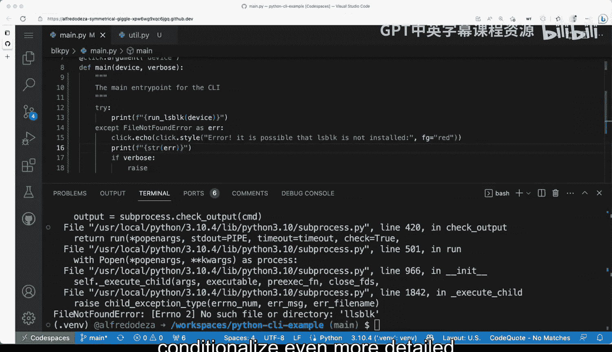

# 009：管理输出、日志、错误与异常 🛠️

在本节课中，我们将学习如何为命令行工具添加有效的错误处理机制。我们将从基本的异常捕获开始，逐步改进错误信息的呈现方式，最终实现一个既能提供友好用户提示，又能为开发者输出详细调试信息的健壮系统。

---

目前，我们的小型命令行工具尚未进行任何错误处理。我们的 `main` 函数盲目地运行，完全信任 `run_lsblk` 函数能够毫无问题地执行。


但在某些情况下，我们可能会遇到麻烦。回顾我们的工具，可以看到我们调用了 `lsblk -J` 并传递了一些参数。这通常没问题。现在，让我们模拟一个 `lsblk` 未安装在系统中的问题。我将通过传递一个不存在的命令来实现这一点。

在终端中，如果我运行 `plot pi sdd1`，会得到一个异常回溯。异常类型是 `FileNotFoundError`，错误信息显示“没有那个文件或目录：llsp 或 llblk”。对于用户来说，看到这样的信息可能非常令人困惑且没有帮助。我们通常会说，工具在终端上“崩溃”了。这并不理想。

因此，让我们尝试改进这个输出，使其变得更好。

---

## 第一步：捕获特定异常

首先，我们需要处理异常。我们可以在 `main.py` 中使用 `try...except` 语句。

开发者有时会直接捕获所有异常（`except Exception`），然后简单地打印“错误”。但这样做并不有用，因为我们不知道具体是什么错误。

更好的做法是明确地捕获我们预期的特定异常。例如，我们预计 `lsblk` 未安装会导致 `FileNotFoundError`。这样我们可以向用户传达更有用的信息。

以下是改进后的代码结构：

```python
try:
    # 尝试运行主要逻辑
    run_lsblk(...)
except FileNotFoundError as error:
    # 处理文件未找到的错误
    print(f"错误：可能是 lsblk 未安装。详情：{str(error)}")
```

这样，当 `lsblk` 未安装时，用户会看到一个更清晰的提示，而不是一长串的 Python 回溯信息。

---

## 第二步：美化错误输出

为了使错误信息对用户更友好，我们可以使用 `click` 框架的样式功能来美化输出。`click.echo` 类似于 Python 的 `print`，但能更安全地在不同平台上工作。`click.style` 可以为文本添加颜色。

我们可以将错误信息设置为红色，使其在终端中更醒目。

以下是使用 `click` 美化输出的示例：

```python
import click

try:
    run_lsblk(...)
except FileNotFoundError as error:
    # 使用红色字体输出主要错误信息
    click.echo(click.style("错误：可能是 lsblk 未安装。", fg='red'), err=True)
    # 输出原始的异常信息
    click.echo(str(error), err=True)
```

这样，用户会先看到一个红色的醒目错误提示，然后是具体的错误详情。

---

## 第三步：根据详细模式控制输出

我们的工具支持一个 `-v` 或 `--verbose` 标志。我们可以利用这个标志来控制错误信息的详细程度。

*   当用户不启用详细模式时，只显示简洁、友好的错误提示。
*   当用户启用详细模式时，则打印完整的异常回溯信息，便于开发者调试。

这可以通过一个条件判断来实现：

```python
import traceback

try:
    run_lsblk(...)
except FileNotFoundError as error:
    if verbose:
        # 详细模式：打印完整回溯
        traceback.print_exc()
    else:
        # 非详细模式：打印友好提示
        click.echo(click.style("错误：可能是 lsblk 未安装。", fg='red'), err=True)
        click.echo(str(error), err=True)
```

现在，用户可以通过是否添加 `-v` 标志来选择看到的信息量。普通用户得到清晰的指引，而开发者或需要调试时可以获得完整的错误上下文。

---

## 总结

本节课中，我们一起学习了如何为命令行工具构建分层的错误处理系统。

1.  我们从捕获特定的 `FileNotFoundError` 异常开始，提供了比通用异常更有用的信息。
2.  接着，我们利用 `click` 库美化了错误信息的呈现方式，使其对终端用户更友好。
3.  最后，我们结合工具的 `--verbose` 标志，实现了错误信息详细程度的可控输出，兼顾了普通用户的体验和开发者的调试需求。



通过这些步骤，我们显著提升了工具的健壮性和用户体验。