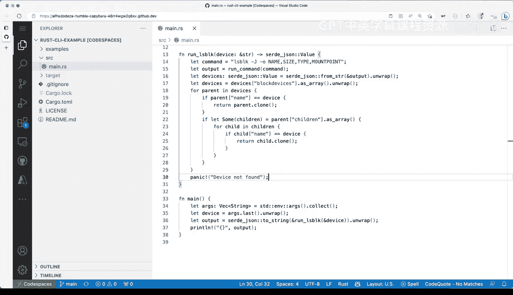

# 013：你的第一个Rust命令行工具 🛠️


在本节课中，我们将学习如何创建一个简单的Rust命令行工具。我们将从环境准备开始，逐步构建一个能够列出块设备信息的工具，并了解Rust项目的基本开发流程。

## 环境准备与工具安装

在开始构建我们的第一个命令行工具之前，我们需要确保开发环境已正确配置。我们将在一个Ubuntu 20.04 LTS环境中进行操作。

首先，我们运行以下命令来查看当前的操作系统信息：

```bash
cat /etc/os-release
```

接下来，我们安装Rust工具链。使用`rustup`命令可以方便地完成安装：

```bash
rustup install stable
```

安装过程会下载包括`cargo`和`clippy`在内的多个组件。安装完成后，我们需要配置环境变量，以便在终端中直接使用`rustc`和`cargo`命令：

```bash
source $HOME/.cargo/env
```

现在，我们可以验证Rust是否安装成功：

```bash
which rustc
which cargo
rustc --version
```

如果一切顺利，你将看到类似`rustc 1.68.2`的版本信息。

## 问题定义与目标

我们的目标是创建一个`lsblk`命令的替代工具。在容器化环境中，标准的`lsblk`命令可能无法正确识别块设备。例如，运行以下命令可能会失败：

```bash
lsblk /dev/sdb
lsblk /dev/sdb1
```

为了解决这个问题，我们将利用`lsblk`的JSON输出格式。通过传递`-J`标志，我们可以获取结构化的设备信息，然后解析这些数据来提取所需内容：

```bash
lsblk -J
```

## 代码结构与解析

现在，让我们深入分析实现这个命令行工具的Rust代码。代码的主要入口点是`main.rs`文件中的`main`函数。

以下是代码的核心组成部分：

1.  **`run_command`函数**：这个函数负责执行外部命令。它接收一个命令字符串，将其按空格分割成向量，然后使用`std::process::Command`来执行。函数会捕获命令的标准输出，并以字符串形式返回。
    
    ```rust
    fn run_command(cmd: &str) -> String {
        let parts: Vec<&str> = cmd.split_whitespace().collect();
        let output = Command::new(parts[0])
            .args(&parts[1..])
            .output()
            .expect("Failed to execute command");
        String::from_utf8(output.stdout).unwrap()
    }
    ```
    
2.  **`run_lsblk`函数**：这个函数专门用于运行`lsblk -J`命令，并解析返回的JSON数据以查找特定的块设备信息。它目前使用`panic!`来处理错误，这在生产代码中是不推荐的，但对于示例来说是可以接受的。
    
3.  **`main`函数**：这是程序的入口点。它从命令行参数中获取设备名称，调用`run_lsblk`函数，并打印结果或处理错误。

## 项目构建与运行

我们将使用`cargo`来管理我们的Rust项目。首先，检查项目的依赖和代码是否有错误：

```bash
cargo check
```

我们的项目依赖一个名为`serde_json`的库来处理JSON数据。你可以在`Cargo.toml`文件中看到这个依赖项。

接下来，我们可以编译项目以生成可执行文件：

```bash
cargo build
```

编译完成后，可执行文件将位于`target/debug/`目录下，名称由`Cargo.toml`中的配置决定（例如`block-rs`）。我们可以直接运行它：

```bash
./target/debug/block-rs /dev/sdb
```

然而，更便捷的开发方式是使用`cargo run`命令，它会自动编译并运行程序：

```bash
cargo run -- /dev/sdb1
```

## 当前实现的局限性

虽然我们的工具已经可以工作，但它存在一些需要改进的地方：

*   **错误处理**：代码中大量使用了`expect`和`panic!`，这会导致程序在遇到错误时突然崩溃。在生产环境中，我们应该使用更优雅的错误处理机制，例如`Result`类型。
*   **功能单一**：目前工具只实现了最基本的功能，缺乏帮助菜单、参数验证等命令行工具常见的特性。
*   **代码结构**：随着功能增加，代码可能需要更好的模块化组织。

在后续的课程中，我们将学习如何使用命令行解析框架（如`clap`）来增强工具的功能和健壮性。

## 总结



本节课中我们一起学习了如何从零开始创建一个Rust命令行工具。我们完成了环境配置，定义了一个实际问题（替代`lsblk`），并逐步实现了核心功能。我们了解了Rust项目的基本结构，学会了使用`cargo check`、`cargo build`和`cargo run`命令来编译和运行程序。虽然当前实现比较简单，但它为我们后续学习更复杂的Rust编程概念和工具开发打下了坚实的基础。