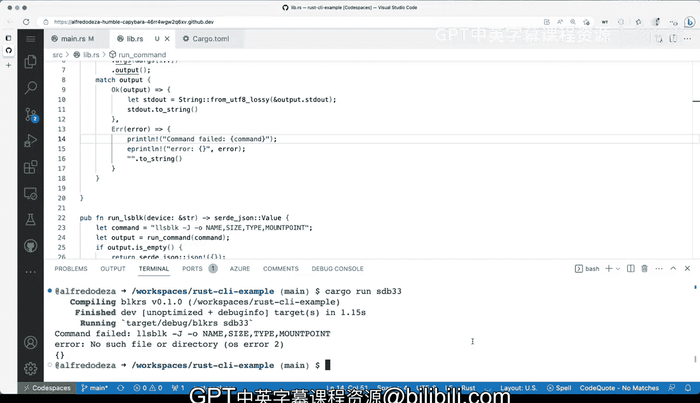

# 016：管理输出、日志、错误与恐慌 🛠️


在本节课中，我们将学习如何改进命令行工具的错误处理。目前，我们的工具假设一切都会顺利进行，但如果出现问题，就会导致许多麻烦。我们将逐步修复这些问题，使工具更加健壮和用户友好。

## 概述

目前，我们的Rust命令行工具在遇到错误时会直接触发`panic`，这会导致程序崩溃并输出对用户不友好的信息。本节中，我们将学习如何优雅地处理错误，例如命令执行失败或数据解析问题，而不是简单地让程序崩溃。我们将通过返回空值、捕获并打印错误信息等方式来改进代码。

## 修复JSON序列化错误

上一节我们指出了代码中存在的多个`panic`点。首先，我们来处理当找不到设备时触发的`panic`。在`run_lsblk`函数中，如果`blockdevices`不存在，`unwrap()`会引发恐慌。

我们不希望程序因此崩溃。相反，返回一个空的JSON对象是更合理的做法。这样，任何使用此库的工具都能接收到一个明确表示“未找到”的结果，而不是遭遇一个中断。

以下是修改方法：

```rust
// 修改前：如果找不到会 panic
let devices = output["blockdevices"].as_array().unwrap();

// 修改后：返回一个空的JSON数组
let devices = output["blockdevices"].as_array().unwrap_or(&vec![]);
```

但更精确的做法是，当整个输出无效时，直接返回一个空的JSON对象。我们可以使用`json!`宏：

```rust
if output.is_empty() {
    return json!({});
}
```

经过此修改后，当指定设备（如`sdb33`）不存在时，程序将输出一个空的JSON对象`{}`，而不是崩溃。这暗示着没有找到任何设备，对调用者更加友好。

## 处理命令执行失败

接下来，我们处理`run_command`函数中的错误。当前，如果命令执行失败（例如命令不存在），`.expect()`会导致程序`panic`并打印出一堆对终端用户无用的调试信息。

我们的目标是捕获这个错误，将其打印到终端（最好是标准错误输出`stderr`），然后让函数继续执行并返回一个空字符串，而不是让整个程序崩溃。这样可以将错误处理逻辑隔离在函数内部。

以下是实现步骤：

1.  移除`.expect()`。
2.  使用`match`语句对`Command::output()`的结果进行模式匹配。
3.  成功时，解析输出并返回字符串。
4.  失败时，将错误信息打印到`stderr`，并返回一个空字符串。

修改后的核心代码如下：

```rust
pub fn run_command(cmd: &str, args: &[&str]) -> String {
    let output = Command::new(cmd).args(args).output();

    match output {
        Ok(output) => {
            // 命令执行成功，解析输出
            String::from_utf8_lossy(&output.stdout).to_string()
        }
        Err(e) => {
            // 命令执行失败，打印错误并返回空字符串
            eprintln!("命令执行失败: '{}' - 错误: {}", cmd, e);
            String::new()
        }
    }
}
```

## 整合错误处理逻辑

现在，我们已经分别处理了命令执行和JSON解析的错误。但是，当`run_command`返回空字符串（表示命令失败）时，后续的`serde_json::from_str`解析会再次失败。

因此，我们需要在`run_lsblk`函数中添加一个检查：如果`run_command`的返回结果是空字符串，则直接返回空的JSON对象。

```rust
pub fn run_lsblk(device: &str) -> Value {
    let output = run_command("lsblk", &["-J", "-o", "NAME,SIZE,TYPE,MOUNTPOINT", device]);

    // 检查命令是否返回了有效输出
    if output.is_empty() {
        return json!({});
    }

    // 尝试解析JSON
    let json_output: Value = serde_json::from_str(&output).unwrap_or(json!({}));
    json_output
}
```

此外，为了提供更多上下文，我们还可以改进错误信息：

```rust
eprintln!("命令失败: '{} {:?}' - 错误: {}", cmd, args, e);
```

现在，当运行一个无效命令时，用户将看到清晰的错误信息（例如“命令失败: ‘lsblk …’ - 错误: No such file or directory”），并且程序会输出`{}`而不是崩溃。

## 总结

本节课中我们一起学习了如何管理Rust程序中的输出、日志和错误。

1.  **避免不必要的`panic`**：在生产级代码中，应谨慎使用`panic`，仅用于处理不可恢复的错误。
2.  **优雅的错误处理**：使用`Result`类型和`match`或`unwrap_or`等方法来安全地处理潜在错误。
3.  **提供清晰的用户反馈**：将错误信息打印到标准错误输出（`stderr`），并与正常输出（`stdout`）分离，方便用户和脚本处理。
4.  **保持函数健壮性**：通过返回默认值（如空字符串、空JSON对象）来防止错误在调用链中向上传播。



通过这些改进，我们的命令行工具变得更加健壮和用户友好，能够更好地适应生产环境。