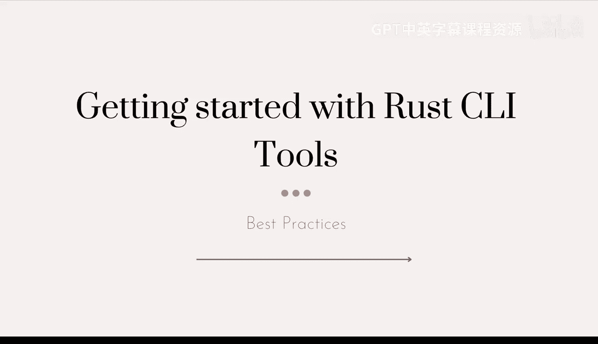
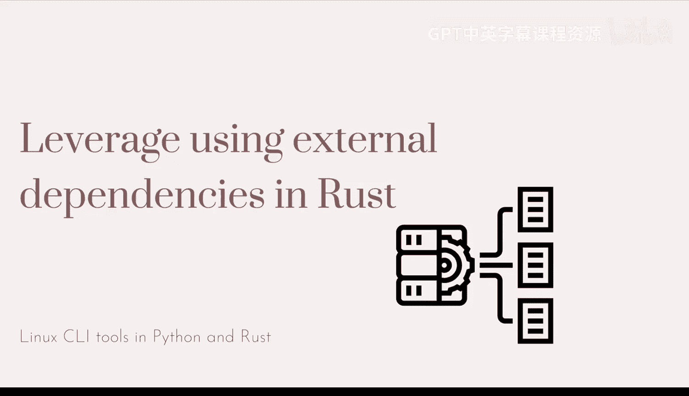
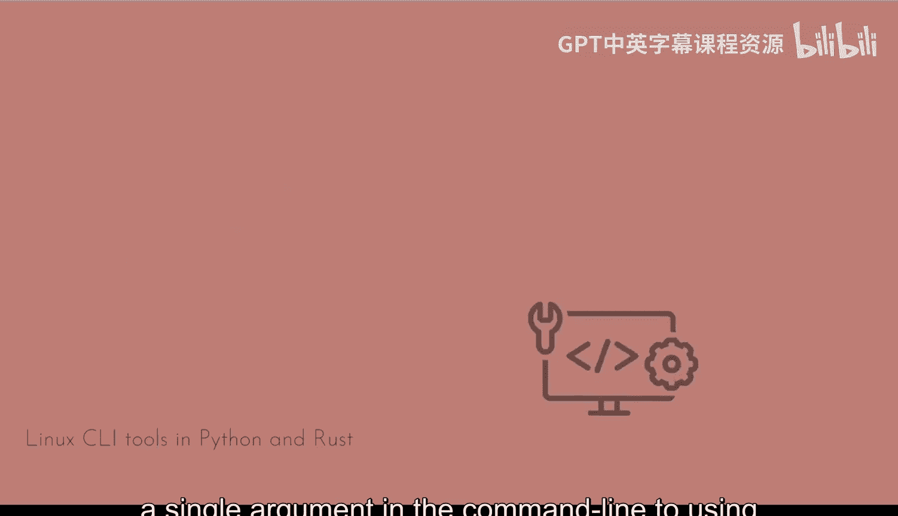
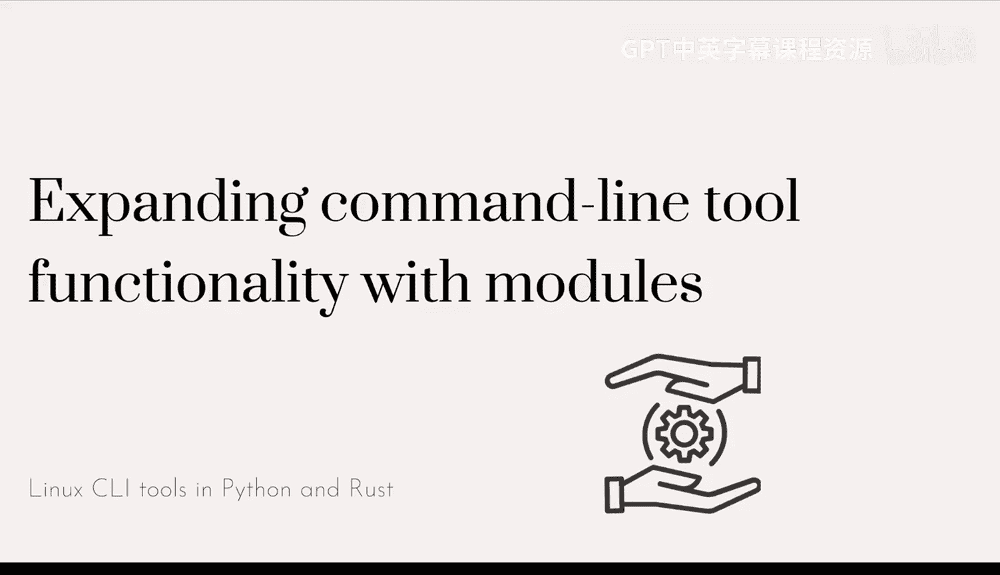

# 017：优化命令行工具性能与最佳实践 🚀

在本节课中，我们将探讨使用Rust构建命令行工具时的一些关键模式、最佳实践和性能优化建议。我们将对比Rust与Python等语言在构建工具时的差异，并介绍如何利用Rust生态系统的优势来创建高效、健壮的工具。

---

## Rust与Python构建命令行工具的差异

上一节我们介绍了Rust构建命令行工具的背景，本节中我们来看看Rust与Python等语言在构建工具时的核心差异。

Rust是一种静态类型、编译型语言，而Python是一种解释型语言。这种根本差异导致了在构建和分发命令行工具时的不同做法。

*   **二进制分发**：Rust编译后生成独立的二进制可执行文件。用户无需安装Rust工具链即可运行。公式表示为：`rustc main.rs -> ./main`。
*   **单文件脚本**：Python工具通常以脚本形式分发，需要用户系统安装Python解释器和相关依赖。代码表示为：`python script.py`。

使用Rust的主要优势在于其极致的执行速度和便捷的部署方式，避免了目标系统环境配置的复杂性。

---

## 命令行工具框架选择

在Rust生态中，有多种框架可用于构建命令行工具。虽然我们从最基础的参数解析开始，但使用成熟的框架能带来显著好处。

以下是Rust中一些流行的命令行工具框架：

*   **clap**：功能强大、社区活跃，是本教程推荐使用的框架。它提供了参数解析、验证、帮助信息生成等完整功能。
*   **structopt**：基于clap构建，通过派生宏提供更声明式的参数定义方式。
*   **quick-cli / quicli**：旨在简化简单CLI工具的创建过程。

对于大多数项目，特别是需要复杂参数和子命令的工具，**clap**是一个可靠的选择。如果clap显得过于复杂，可以尝试structopt或quick-cli。

---

## 依赖管理的优势

使用Rust的另一个显著优势是其依赖管理方式，这与Python等语言形成对比。

在Rust中，通过Cargo管理的依赖会被静态链接到最终生成的二进制文件中。这意味着：
1.  最终用户无需单独安装或管理这些依赖库。
2.  解决了“依赖地狱”和跨平台、跨架构的编译兼容性问题。
3.  分发时只有一个独立的可执行文件，简化了部署流程。

使用像clap这样的框架，你不仅能获得参数解析的功能，还能自动获得输入验证、错误报告、帮助菜单生成等“重型任务”的支持。

---

## 错误处理最佳实践

在构建健壮的命令行工具时，恰当的错误处理至关重要。Rust提供了多种处理错误的机制，与某些语言中通过异常“快速失败”的模式不同。

需要避免在代码中随处调用`panic!`。虽然`panic!`在示例或快速原型中很方便，但在生产级工具中，它会导致程序突然终止，无法提供友好的错误信息或进行清理操作。

我们应利用Rust的`Result`类型进行错误传播，并为用户提供清晰、具体的错误上下文。这样即使操作失败，用户也能明白原因，工具也能以可控的方式退出。核心模式是使用 `Result<T, E>` 和 `?` 操作符进行错误传播。

---

## 开发工作流与工具

遵循Rust开发的最佳实践能显著提升代码质量和开发效率。这涉及到在开发流程中集成一系列工具。

以下是开发过程中应频繁使用的Cargo命令：

*   `cargo fmt`：自动格式化代码，保持风格一致。
*   `cargo clippy`：运行Clippy lint工具，捕捉常见错误和改进建议。
*   `cargo check`：快速检查代码能否编译，而不生成可执行文件，节省时间。

此外，为你的编辑器（如VS Code）安装**rust-analyzer**扩展至关重要。它能提供实时的代码补全、类型提示和错误检查，将这些反馈融入开发工作流可以持续改进代码质量。

---

## 工具的可扩展性与模块化

从处理单个命令行参数到使用完整框架，你的工具在处理用户输入时会变得更加灵活和健壮。框架能帮助你防范常见错误，并为未来功能扩展奠定基础。

随着工具功能增长，将其拆分为模块是很好的做法。我们之前通过添加`lib.rs`文件浅尝了模块化的方法。你可以创建更多模块来组织不同的功能域。

同时，引入外部库来处理复杂功能（如我们使用的`clap`和`serde_json`）是非常直接且被鼓励的。通过`Cargo.toml`文件管理依赖非常简单。这与Python中需要谨慎选择兼容性依赖的情况不同。

需要注意的是，引入的库越多，项目的编译时间可能会相应增加。但在发布和分发时，Rust生成的二进制文件通常仍然非常紧凑，这是Rust的主要优势之一。

---

## 总结

本节课中我们一起学习了使用Rust构建命令行工具的核心要点。我们对比了Rust与Python的差异，强调了Rust在性能和分发上的优势。我们探讨了clap等框架的选择，以及Rust依赖管理带来的便利。在错误处理上，我们应避免滥用`panic!`，转而使用`Result`提供更好的用户体验。集成`cargo fmt`、`cargo clippy`和rust-analyzer等工具能优化开发流程。最后，我们了解了通过模块化和引入外部库来保持工具的可扩展性，同时认识到Rust在最终二进制文件大小上的优势。掌握这些最佳实践，将帮助你构建出高效、健壮且易于维护的Rust命令行工具。