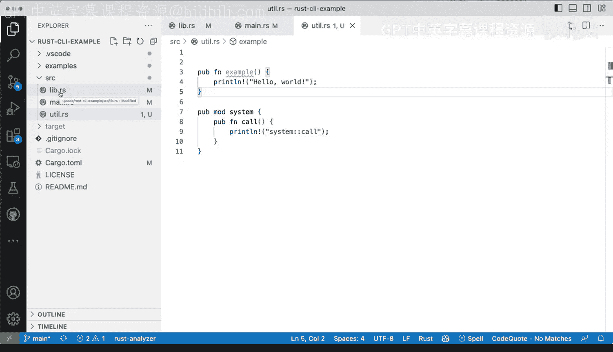

# 023：高级模块使用指南 🧩


在本节课中，我们将学习Rust中模块系统的一个高级特性：如何将代码组织到独立的文件中，而非全部放在默认的 `lib.rs` 中。我们将了解如何声明和引用这些外部模块，以及控制其可见性（公开或私有）。

到目前为止，我们的所有模块定义都位于 `lib.rs` 文件中。`lib.rs` 在Rust中是一个特殊的文件，其中声明的所有内容都会自动成为包的一部分。但是，如果我们希望将代码放在其他文件中，例如 `utils.rs`，该如何操作呢？

## 从其他文件导入模块

以下是如何从 `utils.rs` 这样的外部文件导入模块的步骤。

首先，假设我们在 `src/utils.rs` 文件中定义了一个模块：

```rust
// 文件：src/utils.rs
pub fn example() {
    println!("This is an example from utils.");
}
```

如果我们直接在 `main.rs` 或 `lib.rs` 中使用 `use crate::utils;`，编译器会报错，提示“unresolved import”。这是因为，与某些语言（如Python）不同，Rust不会自动引入项目中的所有文件。

## 在 `lib.rs` 中声明模块

要让Rust识别 `utils.rs` 文件，我们需要在 `lib.rs` 中显式声明它。这是最直接的方法。

在 `lib.rs` 文件中，添加以下声明：

```rust
// 文件：src/lib.rs
mod utils;
```

这行代码告诉Rust编译器：“请将 `utils.rs` 文件的内容作为一个模块引入到当前包中”。声明之后，我们就可以在库内部使用这个模块了。

## 模块的可见性与使用

模块的可见性由其声明和内部项的 `pub` 关键字控制。

*   **在库内部使用**：即使在 `utils.rs` 中函数没有标记为 `pub`（即它是私有的），我们仍然可以在 `lib.rs` 内的其他函数中使用它，因为它们在同一个包内。
    ```rust
    // 在 lib.rs 的某个函数内
    fn some_function() {
        utils::example(); // 可以调用，因为同属一个crate
    }
    ```
*   **对外部代码公开**：如果我们希望其他crate（比如在 `main.rs` 中）也能使用 `utils` 模块，需要做两件事：
    1.  在 `lib.rs` 中，使用 `pub mod utils;` 将其公开声明。
    2.  在 `utils.rs` 中，将需要公开的函数或结构体标记为 `pub`。

    ```rust
    // 文件：src/lib.rs
    pub mod utils; // 公开声明模块

    // 文件：src/utils.rs
    pub fn example() { // 公开函数
        println!("Public example.");
    }

    // 文件：src/main.rs
    use your_crate_name::utils; // 现在可以从外部引用了
    fn main() {
        utils::example();
    }
    ```

## 核心要点总结

本节课我们一起学习了Rust模块系统的高级用法，主要涵盖以下两点：

1.  **文件即模块**：在Rust中，每个 `.rs` 文件都可以被视为一个模块，但必须通过 `mod` 关键字在父模块（通常是 `lib.rs`）中声明，编译器才会将其纳入编译。
2.  **可见性控制**：使用 `pub` 关键字精细控制模块、函数、结构体等是否对包外代码可见。在 `lib.rs` 中声明为 `pub mod` 是模块对外公开的必要步骤。



记住，仅仅把代码放在不同的文件里并不会自动生效，必须在 `lib.rs`（或通过模块树向上追溯的某个文件）中进行声明。通过 `mod` 声明引入，再通过 `pub` 控制暴露范围，你就能灵活地组织大型Rust项目的代码结构了。