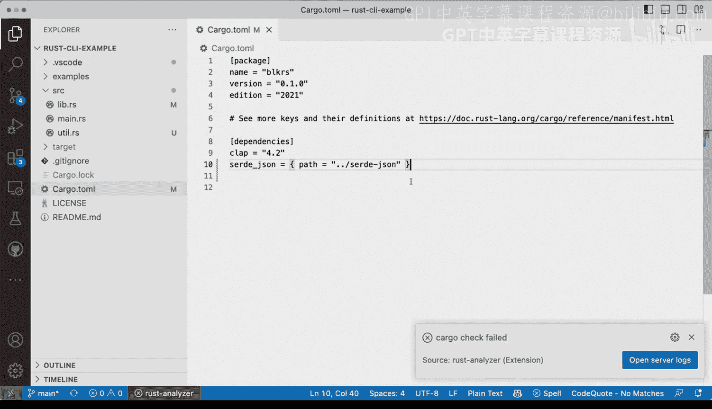

# 024：处理Rust依赖项与库


## 概述

在本节课中，我们将学习如何使用Cargo创建和管理Rust库，以及如何更精细地控制项目依赖项。我们将探讨二进制包与库的区别，并深入了解在`Cargo.toml`文件中指定依赖项的各种方法。

## 创建库与二进制包的区别

到目前为止，我们已经了解了如何使用Cargo创建二进制包。然而，您可能还需要创建库，以便发布并在其他二进制项目间共享代码，从而避免重复编写相同功能。

让我们看看它们之间的区别。默认情况下，当我们使用`cargo new cli`命令时，会创建一个二进制应用程序包。但我们可以使用`cargo new --lib`命令来创建库。

主要区别在于输出类型从二进制变为库。具体来说，在源代码结构中，二进制包会包含`src/main.rs`文件，而库则包含`src/lib.rs`文件。库没有`main`函数或程序入口点，因为它的组件将被其他项目复用。

## 配置Cargo.toml文件

除了项目类型，我们还需要讨论依赖项的配置。我们已经见过基本的依赖项列表写法，例如`依赖项名称 = "版本号"`。但还有更多配置选项值得了解。

值得注意的是，`[package]`部分下的`edition`字段定义了您将使用的Rust版本。例如，您可以设置为`2018`，但当前最新版本之一是`2021`，因此我们通常保留此设置。

在定义部分，您还可以添加作者信息，这在发布项目时尤为重要。例如：

```toml
authors = ["Your Name <your.email@example.com>"]
```

## 指定依赖项版本范围

回到依赖项配置，除了固定版本，您还可以指定版本范围。这与其他包管理器（特别是Python的pip）的做法相似，可能更容易理解。

例如，您可以这样写：

```toml
依赖项名称 = ">=0.8, <0.9"
```

这表示允许使用从`0.8`到小于`0.9`的任何版本。这种方式让您能更精确地约束所使用的依赖项版本。

## 从Git仓库安装依赖项

另一个有趣的选项是直接从Git仓库安装依赖项。例如，假设您想从GitHub仓库获取`serde_json`，而不是已发布的版本。

您可以这样配置：

```toml
serde_json = { git = "https://github.com/serde-rs/json" }
```

您甚至可以指定特定分支：

```toml
serde_json = { git = "https://github.com/serde-rs/json", branch = "develop" }
```

## 使用本地路径作为依赖项

还有一种有用的方法是指定本地路径作为依赖项。假设您是`serde_json`的作者或贡献者，正在本地修复一个尚未发布的bug。

您可以这样配置：

```toml
serde_json = { path = "../serde_json" }
```

这表示从上一级目录安装`serde_json`。这种方式非常适合在本地开发和测试依赖项时使用。

## 总结



本节课中，我们一起学习了如何创建和管理Rust库，以及多种配置项目依赖项的方法。我们探讨了二进制包与库的区别，了解了如何指定版本范围、从Git仓库获取依赖项，以及如何使用本地路径作为依赖项。这些技能将帮助您更灵活地管理Rust项目及其依赖关系。